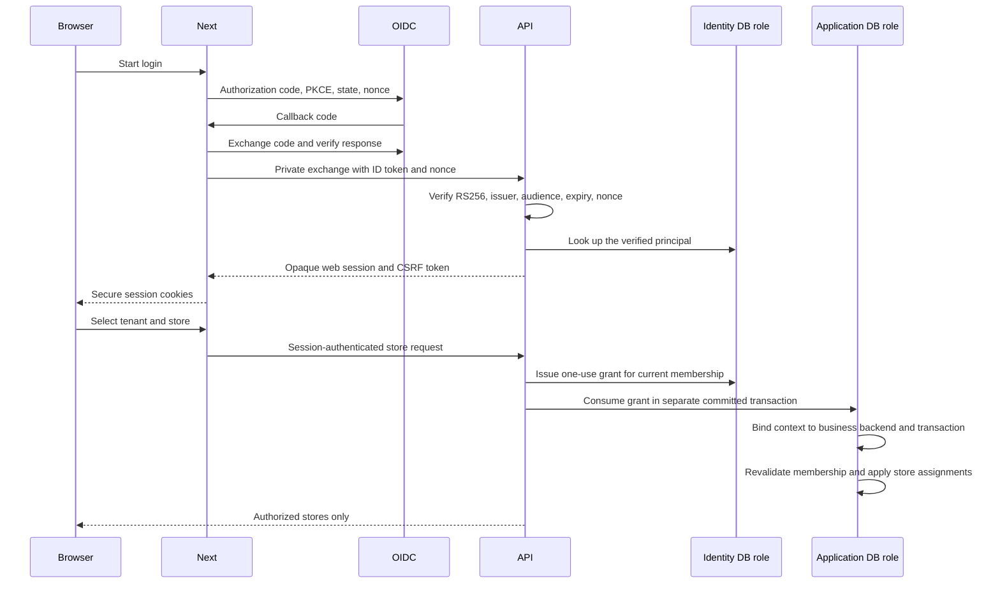

# Web authentication and protected tenant scope

Implementation decision: 2026-09-30. React/Next.js serves the web interface;
Python/FastAPI verifies the web identity and authorizes database operations.
This identity is separate from a TVT account or device session. The APK parity
plan's TVT login and token lifecycle remain W05 work.

## Request flow

## Database trust boundaries

| Role | Permitted purpose | Excluded access |
| --- | --- | --- |
| `wso_identity_bootstrap` | Verified issuer/subject lookup and membership grant issuance | Tenant business tables, session rows, grant/context rows |
| `wso_app` | Grant consumption and authorized tenant business transactions | Grant issuance, direct protected context changes, web session rows |
| `wso_web_session` | Dedicated session functions before tenant selection | Tenant business tables and membership bootstrap |
| `wso_migrator` | Explicit schema administration | Ordinary runtime request credentials |

The old caller-settable `app.tenant_id` value cannot establish authorization.
RLS reads a private database-issued context. A grant is short-lived and bound
to verified membership; its random value is never a public DTO. Consumption
commits on a separate short-lived application-role connection before the
business transaction reads its context. Rolling back a business transaction
does not restore the consumed grant. The context binds to the current backend
and transaction; pool reuse requires fresh authorization. Membership changes
are rechecked and locked in the business transaction.

Apply migrations in order: `0001_tenants` → `0001b_tenant_grants` →
`0001c_auth_sessions`. The portable development runtime creates the initial
roles, then `Provision` assigns passwords to additional migration-created
roles. Production must configure separate role URLs; the API never falls back
to an administrator URL.

## Web session contract

Next uses maintained `openid-client`; FastAPI independently uses maintained
PyJWT with cryptography for RS256 verification. The private exchange requires
`X-WSO-Auth-Key`. Missing or invalid configuration fails closed. Only principal
metadata and opaque-session/CSRF digests are persisted; provider tokens are not
persisted. Session expiry is bounded by the verified ID-token expiry.

`__Host-wso-session` has Secure, HttpOnly, Path=/ and SameSite=Lax.
`__Host-wso-csrf` has Secure, Path=/ and SameSite=Strict. Logout requires the
session, matching CSRF token and exact configured public Origin. Personalized
responses use `Cache-Control: no-store`. Tenant/store identifiers from a URL
are checked against the current membership and assignments.

## Verification gates

The implementation report must prove real PostgreSQL migration round trips,
raw app-role GUC forgery rejection, grant replay/expiry/rollback, membership
changes and connection-pool reuse. Auth tests must prove signed-token failure
paths before identity lookup, session expiry/revocation, CSRF/origin rejection
and tenant/store scoping. HTTPS browser tests must exercise login and store
navigation before T03 is marked complete.

Use `scripts/verify.ps1 -WithPostgres -WithBrowser -WithAuthBrowser` after runtime and auth-role
provisioning. The PostgreSQL option loads only the ignored local runtime
environment and rejects skipped integration tests. A local passing gate does
not establish any APK-versus-web `MATCHED` case; those require the separate
parity evidence ledger.

The HTTPS browser suite starts the real Next application against an isolated
signed test OIDC issuer and independently validating API fixture. The real
FastAPI authorization/session code is verified separately against PostgreSQL.
This split does not prove a deployed Next → real issuer → FastAPI → PostgreSQL
end-to-end login. The fixture certificates and runtime credentials stay ignored.
