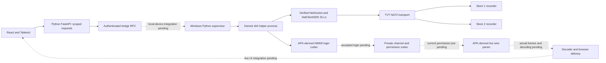

# TVT native runtime options for a Windows service

Research date: 2026-10-03 (Asia/Seoul), refreshed after static recovery of the official NVMS Windows payload. This report covers official downloadable software, verified Windows DLL evidence, and Android hosting choices. It is a research result, not acceptance evidence for connection, authentication, channel enumeration, or a decoded frame.

The source baseline is the W04 Windows SDK research and extraction briefs, the retained initial version of this report, and the existing `apk-audit/08-native-abi-jni.md` and `tvt-local-serial-transport.md` reports. The initial research brief identifies the source baseline as code `756` / docs `36`; these research tasks did not independently inspect Git. The extraction refresh verifies the root-provided MSI identity and selected payload bytes, then compares the Windows code with retained Android NAT bootstrap/connect bodies. The APK audit identifies ARM64 and ARMv7 Android ELF/JNI libraries, including `libNatTraveral.so`, `libNetClientProtocal.so`, and `libProtoSDK.so`. Those Android binaries require the matching Android runtime; they cannot be loaded directly into a Windows x64 process. Existing static and synthetic host verification does not establish a working device session.

## Current Windows execution update — 2026-10-03

The retained research sections below describe the earlier static baseline. The
subsequent implementation now selects the recovered Windows AMD64 transport
instead of requiring an Android runtime for the server transport. Fifteen raw
NetSocket functions and the bounded observer ABI have been recovered and
independently reviewed. The Python ctypes provider runs them in a separately
owned Windows process with pinned14-file dependencies, two exact disclosed
Microsoft runtime substitutions, protected private staging and retained callback
lifetimes. Actual provider load, initialization and connection to both supplied
stores pass; both return status1/connected and a64-byte structural greeting.
The independent APK helper confirms type20001 for both stores.

Two supplied-credential attempts on store1 currently stop on separate pre-login
notifications2563 and2561. Neither establishes credential acceptance/rejection,
channel authority or video. The first receive correction and its caller are
independently reviewed; the additional exact2561/2562/2563 startup correction
has also passed independent review. Its Windows caller binding and local live
packet implementation are in progress. Native quiescence and production
runtime qualification remain unproved. A physical phone is not required.

Continuation2026-10-04: a third store1 attempt returned a success-form257 reply.
The initial parser wrongly treated an ignored success-body integer as rejection;
the independently reviewed correction and Root's zero-Send private replay now
accept the reply, extract the key and match the QR serial. Actual security0 does
not verify a credential proof. The channel tail has auxiliary1 where the helper
had required0, although APK consumers ignore it; correction is in progress.
Same-session metadata/provider review and separate Windows decoder Fix1 remain
open. No actual CCTV frame or public live UI acceptance is established.
See [canonical current service analysis](../service-analysis.md),
[verified Windows ABI](tvt-windows-socket-abi.md) and
[Windows provider](tvt-windows-socket-provider.md) for implementation evidence.
No binary redistribution or deployment acceptance is inferred from availability.

### Selected runtime architecture and implementation boundaries

Solid transport arrows below have actual load/connection evidence. Dashed
arrows require service integration or subsequent device/media acceptance.

The existing FE/API/account-directory RPC path is implemented. The Windows
provider currently has private load/initialize/connect/handshake modes. Its
integration with protected enrollment, the persistent media lease and public
live UI remains work; the diagnostic commands are not a complete web flow.
The actual recorder connections use the Windows DLLs without an Android guest.
Password/session/key material stays in the private backend/helper boundary.

Primary-source recheck2026-10-03: TVT's [NVMS Standard product page](https://www.tvt.net.cn/products/1172.html) explicitly lists Windows Server2022 or above and serial-number device addition with TVT private protocol. This supports selecting a Windows transport route; the page's platform capacity claims are not measurements of this Python service. The actual raw DLL compatibility conclusion comes from the retained local provider execution, not from that product description. Python's [ctypes reference](https://docs.python.org/3.12/library/ctypes.html) and Microsoft's [LoadLibraryExW reference](https://learn.microsoft.com/en-us/windows/win32/api/libloaderapi/nf-libloaderapi-loadlibraryexw) were rechecked for the interop/load method.

## Decision and next executable route (retained research baseline)

Continue the authorized Windows development proof with the official Google APIs Android 11 / API 30 x86_64 image and its ARM translation support. Keep that VM designated for application development/debugging. The separate runtime task owns installation, boot and native-load verification; no such runtime receipt was reviewed for this report. The official NVMS payload now supplies concrete AMD64 TVT NAT, protocol and decoder candidates for the required Windows library route. Prioritize recovering their complete callback and authentication contracts and an isolated Windows helper around those contracts. The static recovery below supports that engineering route; it does not establish a callable production integration.

The primary production requirement is a Windows-hosted runtime. Direct use of the recovered TVT AMD64 DLLs is now a concrete candidate, subject to complete ABI, dependency, redistribution and actual device/frame acceptance. QEMU `qemu-system-aarch64.exe` using TCG and an official AOSP Cuttlefish ARM64 image remains a separate Android hosting candidate. AOSP's QEMU backend provides the compatible guest/virtual hardware reference, but its Linux host services and launch assembly must be reproduced or ported to Windows. This research has not established a turnkey Windows boot, compatible backend set, TVT library load or usable video throughput. Do not describe either candidate as implemented Windows support.

A Linux VM on the same Windows x64 server can instead retain AOSP Cuttlefish host tools and run its ARM guest in TCG mode. This keeps the compute on the Windows server but adds a Linux runtime layer. A remote Linux ARM64/KVM worker is a separate alternative topology, requiring acceptance of remote compute; it is not implementation of the primary native Windows requirement. Both alternatives avoid reliance on proprietary ARM translation if built from AOSP without it, but require actual TVT connection/frame acceptance and review of the TVT binaries' separate permissions. Empty public SDK catalogs and incomplete recovered Windows contracts do not require a physical phone or halt the authorized development proof.

## What TVT actually makes available

TVT's [English SDK catalog](https://www.tvt.net.cn/download/index1191.html) uses a dynamic catalog rather than embedding entries in its HTML. Inspection of the page's own JavaScript identified `POST /downloadFile/page` with a JSON body containing `categoryId`, `pageNum`, `pageSize`, `keyword`, and `status`. An actual request with category `1191`, page 1, page size 100, blank keyword and status 0 returned `total: 0` and an empty list. The [Chinese device SDK catalog](https://cn.tvt.net.cn/download/index1149.html), category `1149`, returned the same empty result. This proves the observed catalogs were empty on this date; it does not prove that TVT has no private SDK.

The raw [Chinese site](https://cn.tvt.net.cn/contactSale/index44.html) navigation labels device SDK access as requiring sales contact. This is vendor availability evidence, not an instruction to stop development or contact the vendor.

The [NVMS Professional product](https://cn.tvt.net.cn/products/1120.html) describes platform software Windows/Linux SDK, Android SDK and OCX, plus an H5 media gateway using RTMP/HLS/RTSP. These are platform integration capabilities. They do not establish the downloadable device SDK's x64 ABI, headers, licensing, remote SN/NAT2 login interface, or callback contracts. The product lists Windows Server 2022 Standard or later as its server recommendation. The [NVMS platform product with NAT2](https://www.tvt.net.cn/products/1180.html) explicitly lists TVT private protocol, ONVIF, RTSP, NAT2.0 and SDK device access, and serial-number addition. That establishes an advertised Windows platform route for SN access, not a verified standalone DLL API.

The software catalog's category `1188` returned ten actual entries. The relevant official package is:

| Property | Observed value |
| --- | --- |
| Product | NVMS Lite x64 |
| Version / original filename | `2.1.4.50806` / `NVMS Lite x64 Ver2.1.4.50806.exe` |
| Direct download | [Official TVT NVMS Lite installer](https://en.tvt.net.cn/file/other/99b2bfcf821f717e6aa86bbe732acc69.exe) |
| Catalog file ID / size | `3436` / `485702176` bytes |
| HEAD result | HTTP 200, `application/octet-stream`, byte ranges advertised |
| Server Last-Modified / ETag | `2026-01-28 02:58:25 GMT` / `"69797b51-1cf33a20"` |
| Downloaded SHA-256 | `b3b35fc18cfc94fc13fa84a8b2b4ee3abfc99af5475fa87296cd11e710308846` |

The Chinese software catalog also lists that same package under its own official host. The full English-host download was saved privately and inspected as bytes. Its executable bootstrap has DOS `MZ`, PE signature, and machine `0x014c` (i386). A 32-bit installer bootstrap does not determine the architecture of the advertised x64 payload. The initial byte scan found no plain Microsoft CAB, ZIP or 7z container and recovered no payload DLLs. That was the initial research limit. Subsequent bounded static InstallShield container decoding recovered the actual MSI and its embedded CAB, without executing the installer. The new payload evidence below supersedes the initial absence of DLL evidence. SDK integration readiness remains unverified.

## Recovered official Windows payload and ABI evidence

The decoded MSI is `485584384` bytes, SHA-256 `fdf4ee597c3cced8cec17647afead71edf47333a84f4fa3d859464c53260d64f`. The root-provided decode receipt connects it to the official installer hash above. [Windows Installer's read-only database API](https://learn.microsoft.com/en-us/windows/win32/api/msiquery/nf-msiquery-msiopendatabasew) enumerated only `File`, `Component`, `Directory`, `Media` and `_Streams`: 539 payload files, 347 components, 72 directories, one media row and 33 streams. `Media.Cabinet` identifies `#Data1.cab`. Its extracted bytes are `385287941`, SHA-256 `3d4ddecc40027b2c04b67eef28de5a3809da89d0c8e77925d5c2af21dee866dd`.

Static CAB inspection validated 127 MSZIP folders, all member keys/sizes against the MSI File table, and all present CFDATA checksums. A bounded decoder wrote 21 selected files (`91898880` bytes) to fixed generated `.bin` names. Independent Windows `expand.exe` extraction of the exact NatClientSDK and client NetClientSDK members produced identical sizes and hashes. No MSI installation action or custom action was called. Every selected PE has machine `0x8664` and PE32+ format: the recovered libraries themselves are AMD64.

The MSI logical layout uses `NVMS Standard Edition/Client` and `Server` even though the catalog product is NVMS Lite. Preserve the matched library family when forming a helper package. Client and server NetClientSDK files have equal sizes and 234 named exports each but different hashes; equal names/sizes do not make them interchangeable. Selected NAT, network, crypto and decoder duplicate files are byte-identical.

| Recovered file / selected MSI sequence | Bytes | Named exports | SHA-256 |
| --- | ---: | ---: | --- |
| `NatClientSDK.dll` / client 101, server 440 | 632832 | 19 | `f884bb14a1d8b2bf9bd2e79e05c86636d27332859308665423783b6712754510` |
| `NetClientSDK.dll` / client 102 | 2429440 | 234 | `5164d8906a820b7346cfac60b50293c6c1e2ffa32356380114f7957d9d32f9ed` |
| `NetClientSDK.dll` / server 442 | 2429440 | 234 | `9355cf0232208763e41628e98e56307441a8f3094b70bb7f015c4bb7b6ca7c95` |
| `NetSocket.dll` / client 20 | 462848 | 39 | `ebcfcadc7763086418c26490774c5ce36688fc6d4d2187dd6aae264e84f8806d` |
| `Network.dll` / client 103, server 451 | 14848 | 22 | `ae6bf53a6f40e5cb758d13baee07fc2dc7a2bc3aff8e4745eb1b51ff0265fadb` |
| `OpensslSDK.dll` / client 107, server 464 | 1897984 | 62 | `55371c6bb25bc2dfc024fb8d01973babe3d4ec20c8d172414d7a865f0f84b42d` |
| `VTDecoder.dll` / client 137, server 494 | 94720 | 14 | `694f389bb4bbe045ff0f16e4a7b941174e9919b018c708b1561d831eb80936fe` |
| `MediaPlay.dll` / client 93 | 1872896 | 144 | `d24b5e0842e477fde9d050a1854ce92d2f8c6726dbfdc6f07d49ea356976e993` |

The full PE inventory retains every selected file's dependencies, export ordinals/RVAs and MSI component/directory provenance. NatClientSDK imports `Network.dll`, `ShareLib.dll`, `OpensslSDK.dll`, Winsock, OLE and Visual C++ 2010 runtime DLLs. NetClientSDK imports `NetSocket.dll`, `NetCommon.dll`, `NodeManager.dll`, `UserManager.dll`, `ScheduleSDK.dll`, `TriggerManager.dll`, `EMapSDK.dll`, `MemPool.dll`, `CommonFileSDK.dll`, `LIBEAY32.dll` and Visual C++ 2015+ runtime/API-set DLLs. MediaPlay and VTDecoder import packaged FFmpeg DLLs; MediaPlay additionally depends on SDL and graphics/window APIs. Imports establish dependency edges, not successful loading or use inside a Windows service.

### SN/NAT2 transport: verified code, incomplete public contract

NatClientSDK exports `NAT_CLIENT_Init`, `Start`, `Stop`, `ConnectDev`, `DestroyNatSocket`, `SendToDev`, `SendToDevEx`, `SetNotifier`, `RemoveNotifier`, `SetNatServerNotifier`, `GetDevInfo`, `GetConnInfo`, `GetNatAccessToken`, `GetDataEncryptKey`, `QueryDevInfo`, `ConnectNatServer`, `DisConnectNatServer`, `SendTransDataToNatServer` and `Quit`. Targeted Ghidra static analysis decompiled all 19 entry bodies and selected underlying functions. Address anchors below are PE RVAs, with analysis image base `0x180000000`; generated decompiler types are not vendor declarations.

`NAT_CLIENT_ConnectDev` at RVA `0x1a4e0` forwards a request pointer, one byte selecting synchronous/asynchronous behavior, and a 32-bit timeout argument. Underlying code copies `0x1004` request bytes; offset zero is a 32-bit type and text starts at offset four. Nonzero mode waits using timeout multiplied by 1000; zero mode queues completion and immediately returns a generated 32-bit socket identifier. A returned identifier does not establish device authentication. `NAT_CLIENT_Start` at RVA `0x1a720` passes a configuration copied as `0x148` bytes to its helper, then unconditionally writes `AL=1`. That return byte cannot serve as a startup-success gate. Null Init generator handling has an internal locked 32-bit identifier counter.

The recovered NetSocket supplies a concrete Windows P2P2 caller. Its decorated export establishes the primitive type signature `int NET_SOCKET_AddConnectByP2P2(unsigned int, const char*, unsigned short)`; its wrapper at RVA `0x1bf30` calls the body at `0xf250`. That body constructs the startup configuration, registers notifier pointers at manager and manager+8, transforms the supplied device string into a 32-character uppercase digest, writes a zero-type `0x1004` request, and calls `NAT_CLIENT_ConnectDev(request, 0, 25)`. The unsigned-short argument is stored by this exported wrapper but not passed to the body. Static digest routines use the four MD5 initialization words and a 16-byte digest/hex formatter. Comparison with the retained Android `ConnectDeviceBySN` hashing/ConnectDev call supports interpreting this as the Windows SN/P2P2 transport route; no serial number was supplied or tested.

`void NET_SOCKET_SetP2PServerAddr(const char*, unsigned int, bool, const char*, unsigned int)` is also verified by decorated-name demangling and its body at RVA `0x1bd10`. Its fourth/fifth inputs configure the NAT server host/port; a nonempty fourth string initializes NAT with a null generator. The P2P2 caller fills startup host text at offset `0`, 16-bit port at `0x40`, generated client GUID text at `0x42`, type `5` at `0x104`, and application label at `0x108`. Other fields and supported enum meanings remain incomplete. Retained Android startup/connect bodies share the Init/Start/ConnectDev architecture, but their C++ layouts and Android `long` widths cannot be transplanted to Windows.

The C export names conceal a C++ callback boundary. `SetNotifier` stores a caller object pointer; dispatch code dereferences its vtable and calls slots at byte offsets `0x8`, `0x10` and `0x20`, including 32-bit identifiers/status and temporary text/data pointers. It copies the notifier list while locked and invokes the copy after unlocking. `RemoveNotifier` removes matching registration nodes without deleting the caller object; removal alone does not establish that previously copied callbacks have finished. Full notifier interfaces, all callback slots, quiescence rules, send-buffer ownership and valid state transitions remain unresolved. Do not synthesize a runnable `ctypes` signature from these observations.

### Authentication, live command and decoded-frame boundary

NetClientSDK exports MSVC C++ interfaces whose type signatures are recoverable from decorated names, including `NET_CLIENT_Initial(unsigned int, Interlocked*, const char*, const char*, unsigned int, unsigned int)`, two `NET_CLIENT_LoginServerUnit` overloads with user/password strings and `CLoginStateObserver*`, and `NET_CLIENT_RequestOpenLiveStream(unsigned int, unsigned char, unsigned char, void*, CWaitObserver*)`. `AddLiveStreamObserver` takes `CStreamCaptureObserver*`; those are C++ object interfaces rather than plain C callbacks. The server-unit login symbols establish a platform login surface, not a verified standalone DVR SN/password entry point. Node types, input semantics and complete observer layouts still need recovery.

The live wrapper at NetClientSDK RVA `0x1264a0` passes internal command `0x501` to the stream controller; that controller resolves a registered channel/CPU node and pairs it with `0x502` for control. Its first unsigned input is therefore an NVMS registered node identifier, not a demonstrated raw channel number. `NET_CLIENT_RequestAllChannelsInfo` and live-observer registration are also present. These findings do not establish the final device-specific packet framing or a valid authenticated handle sequence.

VTDecoder's decorated exports verify primitive signatures such as `int TVT_Dec_CreateDecoder(int&, int)` and `int TVT_Dec_DecodeVideo(int, unsigned char*, int, unsigned char*, int&)`; MediaPlay exports stream input and decode callback interfaces. Required output capacities, pixel format, buffer ownership, callback definitions, codec initialization and service/session graphics behavior are unverified. The complete 539-file payload inventory contains no `.h`, `.hpp`, `.lib`, `.cs`, `.cpp`, `.c` or `.chm` SDK file. Two PDFs are application user manuals, not identified SDK declarations. Source-path/PDB strings in DLLs are build breadcrumbs; the referenced headers/PDBs were not acquired. No reusable-device-SDK redistribution grant was recovered from payload files; embedded installer UI/terms were not exhaustively inspected. Downloadability does not establish redistribution permission.

## Methods and constraints

| Method | Concrete available route | SN-only fit | Evidence and remaining limit |
| --- | --- | --- | --- |
| Windows x64 TVT library candidate | Statically recovered official NVMS AMD64 DLLs | Actual P2P2 device-string transport code recovered | NAT, NetSocket, NetClient and decoder files/exports acquired. Complete SN authentication, callback/observer ABI and redistribution contract remain unverified; both standalone SDK catalogs were empty. |
| NVMS Windows platform | Official NVMS Lite installer; NVMS platform SDK/H5 capabilities are advertised | Platform explicitly advertises serial addition and NAT2 | Installer availability verified. Platform SDK package, API contract and helper integration are unverified. |
| Google Android VM on Windows | `system-images;android-30;google_apis;x86_64` through SDK Manager; ARM libraries translated in a compatible image | Preserves the Android/NAT implementation | Suitable for development proof. Actual library behavior and device success need separate runtime evidence. SDK terms provide development scope, not a production hosting grant. |
| AOSP Android on Linux ARM64 | Cuttlefish `aosp_cf_arm64_only_phone-userdebug` images and same-build `cvd-host_package.tar.gz` from Android CI; KVM | Preserves ARM Android/JNI without ARM translation | Official host/image route exists. Device protocol and production throughput are unverified; Windows orchestrates a Linux runtime worker. |
| AOSP Android emulated on Windows x64 | Windows QEMU `qemu-system-aarch64`, TCG, plus matching AOSP virtual hardware; preferably Cuttlefish host tools inside Linux VM | Preserves ARM guest ABI | Foreign-architecture QEMU route exists in AOSP source. No Windows Cuttlefish host tools or ready-made Windows command was validated. Boot/HAL/device/backend assembly and media performance remain work. |
| ONVIF/RTSP | Reachable device endpoint, credentials, actual device support and stream URI | Insufficient from SN alone | TVT advertises these access protocols. They do not by themselves resolve an SN or perform TVT NAT2. No IP or RTSP URL was supplied or invented. |

## Google development image and license boundary

The [official Google APIs image repository](https://dl.google.com/android/repository/sys-img/google_apis/sys-img2-3.xml) currently offers API 30 x86_64 revision 16: `https://dl.google.com/android/repository/sys-img/google_apis/x86_64-30_r16.zip`, size `1438186618`, SHA-1 `6ae21030eaadc041078444d3798e4b399f3e787d`, minimum emulator `30.8.0`. Its current repository entry references `android-sdk-license`. The separately defined `android-sdk-arm-dbt-license` adds an explicit development/debugging restriction for ARM ISA execution on x86 desktops, laptops, customer on-premises servers and customer-procured cloud environments. That license is also present in the official [API 34 x86_64 package metadata](https://android.googlesource.com/platform/prebuilts/android-emulator-build/system-images/+/refs/heads/main/generic/system-images/android-34/google_apis/x86_64/package.xml), whose package references it.

The exact limiting phrase in section 4.7 is “application development and debug only”. Do not claim that the current API 30 catalog itself references the ARM DBT license; it does not. The general SDK license section 3.1 also restricts its grant to developing applications for compatible Android implementations. The inference for this service is that these standard grants do not authorize using Google SDK images/translation as a production CCTV hosting backend. Commercial application development is not synonymous with production service operation. This report records the terms and engineering implication; it is not commercial or legal assurance. The [current SDK terms page](https://developer.android.com/studio/terms) is dated April 28, 2026, while the captured repository license texts retain their January 16, 2019 date.

Google's [ManagedVirtualDevice API](https://developer.android.com/reference/tools/gradle-api/8.11/com/android/build/api/dsl/ManagedVirtualDevice) confirms that certain Google/Google Play image sources support NDK translation and allow ARM64 APKs on x86_64 images. It does not guarantee every native instruction, JNI library or Android version. Google's [acceleration documentation](https://developer.android.com/studio/run/emulator-acceleration) states that ARM images on Intel/AMD cannot use the described VM acceleration. An x86_64 Android image translating app libraries differs from full ARM system emulation.

## Production AOSP/QEMU route

For the separate Android hosting candidate on Windows, use the official AOSP ARM64 Cuttlefish image family below, rather than treating an arbitrary ARM64 GSI as bootable on QEMU. The implementation path is: select and freeze one CI build/image; take the same build's firmware, kernel/boot/vendor/system data and the AOSP QEMU manager's `virt`/CPU/device/disk/console configuration; provide Windows equivalents for its socket, input, graphics and host service dependencies; launch `qemu-system-aarch64.exe` with TCG; expose a private ADB/control channel; then verify Android boot, exact ARM JNI load, NAT2 discovery, authenticated sessions and decoded frames. A bare `-M virt -hda system.img` command is insufficient because `system.img` is not a complete virtual-machine disk. No matching guest archive was downloaded or booted here, so the compatible image family is source-supported and its Windows port is unverified. This is a concrete next implementation scope, not a deployable command or acceptance claim.

The official [Cuttlefish quick start](https://source.android.com/docs/devices/cuttlefish/get-started) provides a downloadable ARM64 build route: visit `ci.android.com`, choose `aosp-android-latest-release`, target `aosp_cf_arm64_only_phone-userdebug`, select a build, download its image archive and `cvd-host_package.tar.gz` from that same build. The page specifies Linux/Debian host tooling and verification of `/dev/kvm` on ARM64. No individual CI build ID was downloaded or frozen by this research task. The [host utilities repository](https://github.com/google/android-cuttlefish/blob/main/README.md) provides source builds and a Google Artifact Registry apt repository for Cuttlefish packages. The [on-premises guide](https://source.android.com/docs/devices/cuttlefish/on-premises) also documents a container and Cloud Orchestrator route for remote instances. A local Windows service can use a private worker API to control that runtime; such an API is planned here, not implemented by this report.

The current [AOSP QEMU manager source](https://android.googlesource.com/device/google/cuttlefish/+/refs/heads/main/host/libs/vm_manager/qemu_manager.cpp) chooses `qemu-system-aarch64` for ARM64, uses the `virt` machine, and adds native KVM/HVF acceleration only when guest and host architectures are compatible. Its incompatible ARM branch selects GICv2 and limits CPUs to eight. Its compatible-host code is conditioned on Linux/macOS and errors on unknown host OS. Thus source supports an ARM guest on a foreign Linux host, while a direct Windows Cuttlefish host remains a porting task. The source's comment about TCG GICv3 is an implementation comment, not a current claim about QEMU's complete feature set.

[QEMU's ARM documentation](https://www.qemu.org/docs/master/system/arm/emulation.html) describes ARMv5 through ARMv9 TCG instruction emulation. Its [Windows Hypervisor Platform documentation](https://www.qemu.org/docs/master/system/whpx.html) supplies native x86_64 and ARM64 host examples; it does not make x86_64 hardware accelerate an ARM64 guest. Use TCG for that cross-architecture case. QEMU's [download page](https://www.qemu.org/download/) points Windows users to MSYS2 and Stefan Weil builds; these are downstream binary distribution routes linked by QEMU, not a QEMU-produced Windows installer. The official [source index](https://download.qemu.org/) currently contains `qemu-11.1.2.tar.xz`, `141815216` bytes, dated 2026-09-29, and its detached signature. No QEMU binary was installed or run by this task; cited master documentation identifies a development version and must be checked against the chosen release during implementation.

Most AOSP userspace is Apache 2.0, with exceptions including the GPLv2 Linux kernel, as explained by the [AOSP license guidance](https://source.android.com/docs/setup/contribute/licenses). A self-built AOSP image without GMS or proprietary ARM translation avoids relying on their SDK runtime grants. It still requires a component/license inventory, TVT binary permissions and a reproducible patched image. QEMU's [security policy](https://www.qemu.org/docs/master/system/security.html) treats TCG as the non-virtualization use case and does not provide the same untrusted-guest isolation expectation. Keep TCG inside a separately isolated host/VM; do not use it alone as a tenant security boundary.

## Verification limits and priorities

Executed for initial research: explicit primary-source web search; official HTML/JavaScript/catalog retrieval; both SDK catalog POSTs; NVMS HEAD and complete download with hash; static installer architecture/container/string inspection; current Google image/license metadata parsing; AOSP source inspection; source page capture. Executed for this refresh: verified root-provided MSI hash; read-only MSI table/stream queries; CAB structure/member/checksum inspection; bounded selected extraction; independent Windows expand byte cross-check of both core SDK DLLs; static PE exports/imports/architecture; OS symbol demangling; targeted Ghidra decompilation/disassembly; retained Android NAT source comparison. No application installer, emulator, TVT DLL, Android APK or QEMU guest was executed by either research task. No vendor was contacted. No user QR, password, device endpoint, live session or credentials were accessed. This refresh changes only this existing report and new private extraction/review evidence.

For the direct Windows route, next recover the remaining native object/structure and callback contracts, package a matched dependency family and C++ helper/shim, then distinguish actual library load, NAT discovery, device authentication, channel enumeration and first decoded usable frame. Each stage needs its own evidence. Android VM boot and ARM library loading remain separate development gates. The existing transport manager's close path requires process replacement where native cleanup is unproved, so the runtime worker also needs a watchdog, private native logs, bounded resources and generation ownership. Production choice still requires measured media capacity and permission to host/redistribute the chosen TVT binaries; Android alternatives additionally depend on Linux placement and TCG capacity. Those open choices do not remove the authorized development proof.

Private frozen initial evidence and the research manifest remain under `.superpowers/sdd/2026-09-27-superlive-plus-web-parity-implementation-plan/`, prefix `W04-windows-tvt-sdk-research-`. This refresh's packet uses prefix `W04-windows-tvt-sdk-extraction-`; its report, manifest/READY, exact document preimage/delta, readsets, acquired bytes and command receipts freeze the scoped update for independent review. Working extraction evidence is under `.superpowers/verification/nvms-sdk-static/`. Root review and actual native/library/device use remain pending. Their URLs, retrieval dates, sizes and SHA-256 values support rechecking this report as downloads and terms change.
