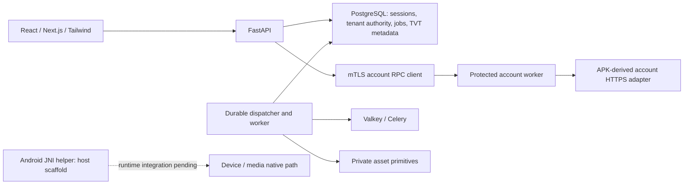

# Service implementation and remaining work

Analysis date: **2026-10-04 (Asia/Seoul)**. Retained implementation/probe evidence
below is dated2026-10-03 unless a later update is explicitly identified.

## Continuation update — 2026-10-04

### Git hygiene and checkout synchronization

At the user's follow-up cleanup request, remote `main` was at `bd70738` while
the primary local checkout was49 commits behind. Its24 local Markdown files
were copied to a hash-verified ignored backup before fast-forward pull. The
modified tracked plan already matched remote main; duplicate/older audit copies
were replaced by current tracked versions. Three previously untracked historical
reports were preserved for source control, retaining their original analysis dates.

The remaining asset-process code, dependency declaration/lock, diagnostics and
tests are source changes and are included in the cleanup commit, rather than
ignored. Fresh focused verification passed247 tests in31.69 seconds; this does
not establish native Linux acceptance or resolve the full-suite failures below.
Next's generated `next-env.d.ts` is removed from tracking but kept locally;
`typecheck` now runs `next typegen` first so fresh checkouts regenerate it.
Conversation attachments, accidental `%SystemDrive%` cache output, local TLS
material and native binary artifacts are explicitly ignored. Existing runtime,
APK, capture and environment exclusions remain. No stash or destructive reset
was used; the private backup remains under the primary checkout's `.superpowers`.

### Requested main publication checkpoint — 2026-10-04

The user explicitly requested committing and pushing the current service work
to `main`. Publication is a source checkpoint, not full implementation or release
acceptance. The selected117 files exclude unrelated asset-process work, its
dependency edits and generated Next environment declarations; private runtime
data, credentials, certificates, DLLs and APKs remain outside the commit.
Known database/device secret scanning passed for the selected source.

Fresh pre-publication verification on the Windows working tree:

- `pnpm test`:355 passed across16 files; `pnpm typecheck` and `pnpm lint`:exit0.
- `python -m pytest -q --tb=short`:5634 passed,599 skipped,3 failed,138 setup
  errors in461.62 seconds. This run included the separate uncommitted asset
  changes and is not an isolated test of the staged tree.
-16 account fixture and98 directory gate setup errors arise from historical
  approved-source hashes no longer matching the extended API/protobuf sources.
  Those gates were not silently repinned. Another24 setup errors require actual
  Linux S3/HTTP or Celery/Valkey acceptance, unavailable in this Windows run.
- Three failures remain: account-flow and directory loopback requests exceeded
  deadlines; the account-process blocked-write test observed an unsettled child.
  These are unresolved execution outcomes, not proven harmless flakes.
- A focused codec check also passed169 cases; `git diff --cached --check` passed.

Previous actual Chrome8/4 inventory acceptance remains valid for its recorded
source/run, but does not override the full-suite failures. Release readiness
remains false. The original `main` checkout contains separate local changes;
publication advances remote `main` without overwriting that checkout.

### Actual Chrome OWNER-to-CCTV inventory acceptance — 07:50–07:53 KST

Root directly controlled Chrome with the GPT browser tool against trusted
`https://localhost:3543/api/auth/login`. No certificate interstitial or validation
bypass occurred. After normal signed login as the synthetic OWNER, the actual
connection-management page verified the two user-authorized recorders through
Next, FastAPI, scoped SQL tickets, mTLS RPC and the Windows native provider:

- Store1: **8 channels** displayed after device verification.
- Store2: **4 channels** displayed after device verification.
- After an actual page reload, both **Saved channels** actions read back8/4
  through the service. Device credentials remained outside browser DTOs.
- Run `local-devices-9e7306d5c44147679eadc16b86311733`: original coordinator,
  runtime and Next exited0; API/worker settled; private context and the owned
  database were removed. Source database snapshots and tested source hashes
  were unchanged. Captured Root evidence had zero known private-value hits.

The first failed browser run below led to a narrowly reproduced launcher fix:
the direct base Python child now restores its admitted venv prefix. Next now
exits after awaited app closure, and the test login text accurately distinguishes
the synthetic OWNER from real devices. Root independently ran22 focused tests
(all passed); independent Fix3 review returned C0/I0/M0. The exact54-file Root
browser approval is `67d5e57013dfa5bec90565d5f75333f2e77950b7e7989fe0b470d1c7e87b7c41`.

Evidence: `.superpowers/verification/local-device-browser-root/` contains the
run's `chrome-proof.json`, two screenshots and original-process receipt; the
matching `local-device-browser-runtime/` folder contains database, source and
coordinator receipts. Fixture guide: [OWNER browser runtime](integrations/tvt-local-device-browser-runtime.md).
The successful screenshot was independently viewed by Root. Full-page capture
timed out; the saved viewport capture clearly shows both channel lists.

This establishes real Windows-backed web inventory and saved readback. It does
not establish continuous browser video, playback, audio, control, mobile layout
for this new panel, or full APK parity. The general connection card still shows
its separate NOT_VERIFIED status while the inventory panel shows confirmed
channels; unifying these user-facing status descriptions remains a UI follow-up.
M3/M4 local media lifetime, signaling and browser playback remain next in the
approved integration plan. `MATCHED=0`; `release_ready=false`. Test server was
stopped after successful lifecycle verification; no commit/push was performed.

### Real OWNER SQL to Windows inventory — 2026-10-04

After independently reviewed Windows pipe error109 handling, Root executed both
user-authorized devices through encrypted ConnectionService creation, current
OWNER SQL admission and the actual Windows native provider. Run
`e7ad4bbcfb19412fbd25a719521f81b2` returned AVAILABLE with8 channels for store1
and4 for store2. Current-authority checks ran38/39 times on the original caller
thread. No native owners remained; the owned database was removed, the source
database remained unchanged, and captured output contained zero known private
values. Corrected M1 source receipt is
`06aea3adedc19e179aac515e9c962baf6a525ee36dad9b480ad18dde32410483`.
The earlier post-publication protocol failure remains historical evidence.
This execution proves the core/SQL/native path, not API/RPC/browser acceptance
or persistent video playback. Normal OWNER Chrome testing is the next gate.

The first normal OWNER Chrome run, `local-devices-fbeb291abe8c414ca9cb5158531737f5`,
loaded trusted HTTPS without an interstitial, completed signed login, rendered
both linked connections, and returned the correct empty saved-inventory view.
Store1 verify returned a fixed service-unavailable error. Its native staging
receipt remained empty; no successful SDK result or saved inventory was claimed.
The fixture launched the worker with the base Python executable but did not
restore the admitted virtual-environment prefix; the native interpreter gate
requires that prefix. This difference was reproduced and corrected in Fix3;
the successful retry above supersedes the current blocker, retaining this failure.
API/worker and runtime settled, private context was removed, sources were stable
and Root output scan found zero private values. Coordinator exit1/abnormal Next
termination remains a failed shutdown outcome despite resource retirement.

### Both stores: fresh capture and Windows decode — 04:50–04:57 KST

Both supplied stores completed fresh, inventory-bound capture and decoding:
store1 position2 and store2 position1 each produced4 usable HEVC1280x1936 frames.
Each attempt accepted one live-open response, sent one close and reaped its
original native process. Each separate decoder produced batches1,1,1,1,0,
preserved source timestamps/ordinals, exited0 and was reaped. Root independently
viewed a fresh decoded PNG from each store and confirmed distinct clear store
interiors. Store1 position1's earlier heartbeat-only attempt is retained as an
unresolved channel outcome, not a credential failure or whole-store failure.

[The native acceptance report](integrations/tvt-windows-live-acceptance.md)
records exact source/proof references and the remaining limits. These are bounded
four-frame captures followed by decoding, not persistent sessions or browser
streaming. A zero-Send private historical roster export retains actual8/4 channel
mappings; it explicitly carries no current SQL service authority.

The public local-device milestone is now being implemented across core SQL
admission, [API/RPC](integrations/tvt-local-device-api.md), and React connection
views. The frontend adds store selection, explicit verify/saved-channel reads,
safe inventory rendering, cancellation and stale-response fencing;18 focused
frontend tests pass, with independent review and actual integration still pending.
Native M1 must enforce the service's current-authority callback and cancellation
in its original process before this path can be enabled for real OWNER requests.

Subsequent M0 review: API/RPC11 and frontend7 passed independent C0/I0/M0 source
review. The API body-budget coroutine ordering issue was corrected and38 focused
independent checks passed without warnings. Frontend verification now totals37
passing tests including existing registration/connection cases. Core/SQL review
found two Important issues: committed ticket redemption could lose cleanup
ownership on postcommit cancellation/expiry, and the SQL expiry test setup could
violate its own timestamp constraint. The core author is correcting both before
Root runs the10 gated PostgreSQL cases. No current SQL/native/web integration is
claimed from these source reviews. The pre-existing auth/session/tenant database
connect/pool waits do not yet have a proven20-second hard wall-clock bound;
post-expiry dispatch is fenced and the browser proxy has a25-second abort budget.

Core Fix1 closed both review findings (C0/I0/M0). Root then executed the guarded
owned SQL suite:9 passed,5 failed,0 skipped; the owned database was removed and
the source database content/owners were preserved. The initial Root summary
misread the structured source-preservation field as a boolean; a separate
correction preserves that original observer result and confirms preservation.
A second two-case diagnostic run reproduced the common failure as PostgreSQL
42702 at the `wso_tvt_local_use` call before credential decryption/provider use.
The new PL/pgSQL table-return function has a column/output-variable name
collision. The author is qualifying that predicate before another owned run.
No real-device verification was attempted through this failed SQL path.
The new frontend production build and TypeScript compilation also pass.

The single-line SQL qualification Fix2 passed independent C0/I0/M0 review.
Root's fresh run `a56b11e8d32b4411b520a9880e2d6583` then passed all14 selected
cases with0 failures/errors/skips. Original child retirement, owned database
removal, source database preservation and zero known-private output hits were
confirmed. This includes real encrypted credential roundtrip, safe channel
projection, cancellation, expiry, current scope and stale inventory after
membership/link/store restoration. It uses an inert native provider; current
real-device authority still requires M1. A new owned OWNER browser runtime is
being assembled for the actual registration-to-verification UI path, using the
same trusted local TLS and dedicated disposable database custody.

### First actual Windows CCTV decode — 04:46 KST

The accepted isolated Windows decoder successfully decoded one real store2
archived HEVC keyframe at1280x1936 into7,434,240 RGB bytes. Root and the native
integration owner visually inspected the private PNG: clear store aisles,
shelves/freezers and the camera overlay are present. This used zero additional
device Sends. The original source device timestamp and ordinal were preserved;
the separate original decoder process exited0 and was reaped.

This confirms a real Windows-native TVT receive-to-image path using the supplied
device, with no phone or Android runtime in that path. It is an offline decode
of the captured frame from the earlier route0-rejected attempt, not successful
continuous live capture. Four-frame fresh-session verification, store1 imagery,
public media delivery and APK native presentation-time parity remain pending.
The image/proof remain in the private original store2 capture directory outside
Git. The browser service tests below used synthetic vendor responses and are
not evidence of browser CCTV playback. `MATCHED=0`; release readiness is false.

The next public integration is specified in
[the local service integration design](integrations/tvt-local-service-integration.md).
Root authorized the bounded OWNER/store-linked verification milestone using a
separate local UUID scope, purpose-bound tickets and generation-scoped inventory.
Contract, migration and core admission/worker implementation is in progress;
existing generic credential leases and cloud identity tables remain separate.
Actual native inventory export, API/RPC/FE wiring and real public acceptance are
still required. An injected inert provider is test evidence only and must never
be enabled as production success.

### Executed service browser acceptance — 04:13–04:18 KST

Root ran the accepted TLS Fix2 source with the persistent trusted localhost
certificate and controlled Chrome directly. Normal signed OIDC login succeeded
without a certificate interstitial. STAFF could enter SuperLivePlus from the
stores menu for the selected tenant, and the newly published test identity was
visible. All six readonly directory paths executed through the actual Next,
FastAPI, PostgreSQL ticket/admission, mTLS RPC and worker transport: device list,
channel list, device detail, channel detail, sent shares and received shares.
The synthetic upstream supplied native channel indices7 and42; selecting42
retained that index in its detail. Sent/received fields remained distinct.

Root additionally injected the fixture's controlled upstream503 response,
observed the fixed error with the previous list retained, restored the upstream,
and observed successful refresh. The390px Chrome viewport had375px document
width and no horizontal overflow; the private marker was absent from visible
page text. Three actual screenshots and a Root browser receipt are retained in
`.superpowers/verification/directory-current-root/` for run
`472e59554d2542539fa8c1e2e493b230`.

The coordinator, Next and API/runtime settled successfully with exit0. The
owned database and private state were removed, source database rows/owners were
unchanged, and source/implementation snapshots matched. Runtime receipts record
six decoded paths and9 requests. Known-private output hits were0. TLS Fix2 source
receipt is7f7c0d68b8c2815108f31deb6b42b03f4d2ff6053389728db9fe4ff1e148c9b5;
TLS Fix2 and STAFF navigation independently passed C0/I0/M0 review.

This is actual service execution with an invented identity and synthetic vendor
responses. It does not establish real CCTV browser playback or APK functional
parity. Both-store native video acceptance remains a separate ongoing task.
The following subsections preserve the correction history leading to this run.

### Trusted Windows development TLS

The user explicitly requested a durable fix for the test certificate warning.
The previous fixture generated an untrusted test-ca/server chain with about one
hour of validity for every owned run. Root added
`scripts/dev/setup-local-https.ps1`, using official mkcert1.4.4 and the SHA256
published in Microsoft's winget manifest. The dedicated CA/key/server files
remain outside Git under a Windows ACL limited to the current user and SYSTEM.
Only that CA certificate was added to CurrentUser/Root; no machine-wide trust
store or browser validation flag was changed. The localhost leaf also covers
127.0.0.1 and ::1, expires2029-01-03 UTC, and passes Windows chain verification.
Root directly opened fresh Chrome tabs at HTTPS localhost and127.0.0.1 port8765;
both rendered the certificate-check page without a warning. The latter address
had no previous manual warning exception. A screenshot records the check.
This is actual TLS/browser acceptance; the full service fixture is being updated
to consume these same persistent files through an explicit test-only setting.
Its internal bridge mTLS certificates retain their separate ownership.

The optional TLS/publication Fix1 passed independent C0/I0/M0 review and Root
verification of6 sources plus57 new artifacts (receipt71dc188e03106178f31f836828bdb2e57ea16a6df48fecad855241f7c43105ee).
Fresh owned startup then exposed a compatibility error before browser readiness:
the helper required the optional BasicConstraints extension on an end-entity
leaf. Official mkcert omits it; its CA has BasicConstraints and both signatures,
SANs and Windows/Chrome trust remain valid. The scoped correction accepts absent
leaf BasicConstraints while continuing to reject a CA leaf and require a valid
CA. This follows [RFC5280 section4.2.1.9](https://www.rfc-editor.org/rfc/rfc5280#section-4.2.1.9).
Failed run75dacc180db549edbc5aa86dca24bb2e fully settled with exit1, removed
owned state/database and zero known-private output hits; it is not service
acceptance. The original author is adding the missing regression before retry.

Sources: [mkcert official documentation](https://github.com/FiloSottile/mkcert),
[pinned Windows release checksum](https://github.com/microsoft/winget-pkgs/blob/master/manifests/f/FiloSottile/mkcert/1.4.4/FiloSottile.mkcert.installer.yaml),
[Chrome locally managed certificate support](https://chromium.googlesource.com/chromium/src/+/main/net/data/ssl/chrome_root_store/faq.md).

### Native and browser implementation status

Current accepted device execution: both Windows-native store sessions accepted
login and three metadata replies; the original processes were reaped. The
source-bound rosters contain8 and4 channels respectively. Both user replies have
an empty authGroupId element; the next source correction follows the APK's
legacy three-read branch. That correction and the bounded first-keyframe/four-frame
capture implementation have since passed source review and reached the actual
live attempts described next. One archived store2 CCTV frame has now decoded as
documented above; continuous browser playback remains unproved. The registration16-file slice
has independently passed source review and Root acceptance as detailed below.

Later native execution reached a concrete media boundary. Reviewed live provider
Fix1 removed admin-only group eligibility and requires the selected GUID's actual
live permission for group-present sessions; the exact empty-group legacy branch
for both supplied stores remains source-bound. Store1 accepted its live-open
request but delivered heartbeats only until the60-second deadline; its original
process was reaped. Store2 accepted the same staged flow and delivered97007 bytes,
including a96483-byte HEVC media payload for the requested channel at1280x1936,
before the helper rejected source route0. The current codec supports route2 only.
The native owner is implementing the APK-derived taskless route under an exclusive
first-open original connection, matching channel and current authorization; it
will replay the archive before further requests. Actual received media is now
established for store2; successful decode and continuous browser video remain
unproved. Root does not duplicate the native owner's device requests.

The independently reviewed exclusive-first-task route0 correction subsequently
replayed that same store2 archive with zero new Sends. It admitted one matching
keyframe: h265,1280x1936,96483 payload bytes. Bounded structural inspection found
Annex B at offset0 and VPS32/SPS33/PPS34/IDR19 NAL units, with one VCL first slice;
both original source timestamp fields were retained. This establishes a concrete
source-validated encoded frame, not yet decoded pixels. The native owner is
rebinding the fresh-session provider and preparing bounded offline decoding.

The following paragraphs preserve the chronological correction history; earlier
pending statements describe their recorded stage, not the current summary above.

Root reused the same managed Windows worktree and rechecked HEAD/current status.
HEAD remains36fc954e4754d69721596e190c35f9cf14de3e4c; all current native/media
changes are unpublished. At that earlier checkpoint, the device artifact was store1's archived
success-form response, structurally replayed without another credential Send:
key extracted and serial matched, security0 proof unverified, original connection
closed. The source-ignored tail auxiliary correction passed independent review
and Root189-file custody/166-text scanning. A second zero-Send replay of the
same response now admits8 channels with matching serial and supported tail;
user/permission metadata and current service authority remain absent. Actual
metadata reads on either device and CCTV video remain pending. The new
same-session Windows inventory provider4 has one Important review correction:
recheck deadline/current admission after ctypes buffer preparation immediately
before metadata Send. An inert reviewer probe confirmed dispatch after expiry
during preparation. Fix1 and the auxiliary codec dependency rebind are in progress;
Fix1 passed same-reviewer C0/I0/M0 and Root571-file custody/566-text scanning.
Root executed its actual store1 inventory mode on2026-10-04 01:05:35–36 KST:
the direct interpreter/Job, DLL load, transport and login succeeded, one BASIC
query was sent, and the original process was reaped. The receive loop then
stopped unsupported on a known2561/sequence0/encoding0/body92 notification
after the accepted login. It committed no metadata reply. Fix2 is adding exact
source-supported notification dispatch during the diagnostic query phase,
without another login, query resend, deadline reset or authority grant. Fix2
subsequently passed C0/I0/M0 and Root641-file custody/635-text scanning. Its actual
store1 retry at01:29:10–12 KST accepted login, handled known notifications and
received the BASIC response, then stopped at XML parsing with0 committed replies.
The original process was reaped. Private offline diagnosis found a116-byte prefix
before the XML declaration in the5970-byte response body. The APK explicitly
removes that prefix; the helper had omitted the rule. The actual response uses
cmdUrl/cmdId attributes, includes a types catalog and has no content@id. A scoped
source-fidelity correction is reconciling all four metadata readers and joins
before another device request. XMLFix3 is implemented with29 focused passes and
is under review correction: without an original login channel roster, a detail
reply must not mark the complete roster known. The separate source roster path
is not implemented by the detail query. The known8-channel tail case remains
the actual store1 baseline. The native integration owner coordinates the scoped
fix and rereview before archived replay or another device call. The composite
XML correction then passed C0/I0/M0; the integration owner verified274 custody
files and251 bounded private text files and issued receipt2b8b158ef441ec374dc237c21157562c4fe02ce8fdcd76dadfe78cf8df686e9e.
Its replay of the same7590-byte store1 capture made0 new Sends, handled10
notifications and successfully parsed1 BASIC reply with8 channels retained.
The original connection remains closed; proof/current authority remain false.
The provider dependency/fixture rebind is now in progress before actual further
metadata reads.
The reply body stays private; only tag/attribute
names and fixed structural diagnostics were recorded outside the capture folder.
The decoder's Job-release/reaper interruption custody and ordinary-checkout
test dependence were corrected in Fix1. Same-reviewer spec/quality C0/I0/M0 and
Root842-file custody/753-text scanning passed; its source is accepted unpublished.
Preserved synthetic H264/HEVC proofs and one changed-close native cancellation
proof remain distinct from CCTV acceptance. No parity/release gate or
direct Chrome acceptance advanced in this continuation.

### Web connection integration findings — 2026-10-04

The existing connection API and React form already support the TVT_DEVICE kind,
OWNER/CSRF/tenant/store checks and encrypted credential storage. Their current
credential payload contains only username/password; no private serial/country
or QR-image input is connected to that flow. Saving a TVT_DEVICE row therefore
does not yet provide the Windows adapter's complete input or verify the device.
The next W07 slice adds a private device selector, canonical encrypted local
credentials and browser-local QR-image decoding through the existing form.
Public connection metadata/status remains unchanged until real verification.
This slice now has16 frozen implementation files and has passed independent
review with no Critical, Important or Minor findings. Root accepted the unchanged
source after176-file custody verification and a bounded private-value scan;
receipt SHA256 is1cf7d4c3530e65f2e0ddf2e4fc9f5594aef94fd0bd2ffde541c7af245d4e9780.
It remains unpublished. Final author evidence records102 portable Python passes,21 focused
frontend passes, scoped lint/types and a Next production build. Root's final
dedicated SQL run repeated3 passes with0 skips after the private codec change;
its owned database was removed and the source database was unchanged. Actual
browser PNG decoding and direct Chrome visual acceptance remain pending.
The selected registration SQL tests
will run through the existing guarded disposable-database owner with private
role URLs, exact database identity cleanup and a source-database preservation
check. No existing database is migrated to test this new slice. Root executed
the dedicated3-case SQL acceptance on2026-10-04 02:45 KST:3 passed,0 skipped,
canonical encrypted credential/worker readback and public/audit redaction,
protected kind/legacy metadata behavior, and owner/CSRF/tenant/store cases.
The owned database was removed, source database unchanged and known-private
output scan had0 occurrences. An initial helper import-path error occurred
before database creation and was corrected separately. The final owned SQL run
at02:54 KST also passed3 cases with0 skips and verified database cleanup/source
preservation. Browser acceptance is now being prepared using an isolated inert
component fixture importing the unchanged production form and QR decoder. This
will test actual Chrome image acquisition and form behavior, separately from the
full HTTPS/auth/API flow, whose earlier certificate interstitial was not bypassed.

The current full-service Chrome run exposed an orchestration issue: the execution
tool's stdin EOF immediately triggered the Root launcher's cooperative shutdown
after readiness. Both API/runtime and Next exited0, and the owned database/state
were removed. The settled Node coordinator retained its open stdin; Root verified
the exact original process identity and completed-resource receipt before retiring
that otherwise idle coordinator. The attempt is recorded as a failed browser run,
not acceptance. The ignored Root launcher now supports explicit file control and
closes coordinator stdin on shutdown. A fresh owned run stays ready; Chrome
reports its local certificate privacy interstitial. Root requested the tool-required
human handoff and made no trust-store change or warning bypass. The independent
inert component test remains separate from that authenticated service run.

Root subsequently executed direct GPT-controlled Chrome acceptance against the
unchanged production ConnectionForm/jsQR imports on an isolated loopback fixture.
The normal Chrome file chooser selected the accepted inert PNG (no synthetic
File/DataTransfer helper button was used). Actual browser ImageBitmap/canvas/jsQR
filled the device number and username; submitting the inert password produced
all11 expected boolean checks, including canonical selector, QR match, retained
human location, cleared private DOM inputs and empty browser storage. An invalid
PNG produced the fixed error and cleared fields; subsequent manual lowercase
device input submitted successfully with canonical uppercase and no QR payload.
This proves the browser component path, not an HTTP credential save or device
connection. A desktop screenshot is saved in the ignored component evidence
folder. The attempted390px viewport override did not affect the existing tab
(actual innerWidth1701), so mobile acceptance is not claimed.

The user completed the local certificate handoff in a fresh tab. Root then
executed the normal signed OIDC test login and reached the real stores page.
The prepared tenant has its synthetic store and accepted-consent state, but the
device screen reports no linked TVT account. Source investigation found that
the unchanged vault publication grants expire after5 minutes; the certificate
handoff consumed that interval before the signed login. Store membership and
consent remain, matching the observed UI. The fixture correction will publish
the same synthetic identity through protected issuance after a valid one-use
OIDC exchange, preserving the production five-minute TTL and rejection filters.
Root did not accept new terms, inject cookies, change trust settings or alter
the live fixture database. STAFF access to `/connections` correctly displayed
the owner-required page. The run was cooperatively stopped before fixture edits:
Next exited0, runtime exited1, owned state/database were removed, and the
known-private output scan found0 occurrences. Its final source guard detected
concurrent changes only to windows_socket.py and windows_socket_worker.py; this
is a source-stability failure, separate from the account-expiry finding. The
component server also stopped cleanly and all16 accepted registration source
hashes still match; Root saved two screenshots and a browser receipt. Full
service browser acceptance remains incomplete.

A separate browser navigation gap is confirmed in current source: StoresView
derives `connectionTenant` only from OWNER membership, while ServiceShell also
uses that same property to show the SuperLivePlus entry. A STAFF actor can reach
the authorized TVT route directly but has no menu entry on the stores page.
Selected-tenant TVT navigation must be separated from owner-only connection
management navigation; direct route acceptance does not close that UI gap.
Root implemented that separation in the existing shell and store view: selected
membership supplies a separate TVT tenant, explicit null suppresses an unknown
selection, and other shell callers retain their prior default. Owner connection
management and backend authorization are unchanged. Three causal regression
cases failed before the fix; afterward the store and TVT-shell suites passed36
tests, scoped ESLint and web TypeScript passed. The exact three-file change is
under independent review before the next browser run.
Sources: `apps/web/src/components/stores-view.tsx` and `service-shell.tsx`.

The existing TVT domain identity FK is specifically bound to TVT_ACCOUNT, while
generic connection storage already supports TVT_DEVICE. Local SN/password access
must use that device connection and a scoped worker capability; it must not
manufacture a cloud USER token or TVT account identity. Native diagnostics and
the future public actor/store admission remain separate integration layers.
Sources inspected: `infra/migrations/versions/0002_connections.py`,
`0004_tvt_domain.py`, `packages/core/src/wso_core/connections.py`,
`services/api/src/wso_api/connections/router.py`, and
`apps/web/src/features/connections/connection-form.tsx`.

### Actual two-store metadata — 2026-10-04

The integration owner executed the reviewed Windows provider source
8504601902f757b0795d02aba0db47b45c8f57f41349b3ef4710e2eb51e70771
after695 custody-file and688 private-text checks. Store1 ran02:49:03–05 KST;
store2 ran02:49:55–57 KST. Both accepted login, sent and committed3 metadata
queries, then stopped unsupported before the permission-group query. Both
original processes were reaped. Private zero-Send replay confirmed matched
serials, complete observed channel rosters of8 and4 respectively, and current
user metadata. Neither response supplied authGroupId; default_admin was false.
The final SafeResult intentionally withholds projection on incomplete attempts,
so its zero counts do not mean the devices lack channels.

APK e8 calls the group query only when a group is present. The selected helper
had required four reads unconditionally. The source legacy permission branch
is being traced before changing completion/live eligibility; no group or admin
grant will be invented. Both stores have working Windows login and metadata
transport; actual live capture, decoded CCTV frames and web playback remain
unverified. No genuine credential rejection or password-guessing occurred.

## Latest implementation continuation — 2026-10-03

Current published executable baseline: **`756946ca73cff31d7ebb23141873088b470a96b4`**;
documentation HEAD: **`36fc954e4754d69721596e190c35f9cf14de3e4c`**,
branch `codex/superlive-web-service`. The existing managed Windows worktree is
the development environment. GitHub Actions runs separate Ubuntu 24.04 jobs;
these jobs do not imply Linux/WSL installation or local service acceptance.

Report reuse: the current continuation read the shared analysis policy, project
AGENTS.md and this existing report before updating it. Git HEAD and working-tree
status were inspected again. The initial tree already contained unpublished
local transport/bootstrap/QR/SID/runtime work and separate private-asset changes;
those changes are not covered by the published CI baseline. Root retains the
private-asset batch and generated next-env.d.ts outside this native publication.

- At `e216133`, reviewed W06 registration/recovery core/SQL/RPC/API/React and
  the private six-read directory adapter were published. At `d1ce6b1`, reviewed
  browser fixture/source docs and the exact generated-protobuf lint configuration
  were published. Current `756946c` publishes the reviewed61-file directory
  protected core/RPC/API/UI/navigation/CI/browser-source integration and private
  profile/contact/password adapter, including three explicit consumed-preimage
  overrides. Every task has a clean final C0/I0/M0 source review.
- Six directory reads are reachable through explicitly opted-in /tvt/devices:
  device list/channel list/device detail/channel detail/sent shares/received shares.
  Current SQL actor/session/member/consent/profile/USER-generation authority,
  committed one-use tickets, shared verified mTLS, contained HTTPS, safe presence
  projection and UI denial/context/generation ownership are implemented. The
  source-derived fields never grant commands or assert inventory completeness.
- [Current foundation at `756946c`](https://github.com/himangga01/wisdom-super-observer/actions/runs/37083395408)
  succeeded: **4,930 Python passes and one optional private source-vector skip**,
  10 actual recovery passes,315 frontend passes and26 HTTPS authentication browser
  passes. Selected PostgreSQL has zero skips. Static/type/build/contract/evidence
  checks, actual Valkey persistence smoke and owned database cleanup pass. Expected
  outage messages and existing development-certificate/color warnings are retained.
- [Current account-browser run](https://github.com/himangga01/wisdom-super-observer/actions/runs/37083395314)
  succeeded after the two stale source pins were corrected:45 host passes,
  desktop1 pass16.6s and mobile1 pass15.8s in separate owned lifetimes. It uses
  synthetic accounts/precreated session entrance and the real account API/RPC/
  HTTPS path. It does not establish real vendor/APK equivalence or direct root
  GPT-controlled Chrome testing. Current directory Chrome coverage is still pending.
- Private W06 security adapter8 Fix1 provides exact profile/contact/password/
  inventory/dynamic-code protocols, SID/native AES helpers and typed private results.
  Original83 passes include eight contained verified HTTPS methods; malformed
  JSON-text review defect has causal4 failures then29 focused passes and clean
  re-review. No public security routes or current protected SID/key persistence
  are implemented by that private slice. Successful login/renewal SID capture5
  is independently reviewed and root accepted as unpublished source; its 70 scoped
  tests pass. Protected write/vault/API/React integration remains pending.
- Windows directory browser runtime5 is independently reviewed and root accepted.
  Root actually started its signed synthetic issuer, real API/session entrance,
  independently owned0011 database and six-read pipeline. GPT-controlled Chrome
  reached the local HTTPS certificate warning, which prevented UI acceptance.
  Root did not bypass the warning or change certificate trust. The original
  coordinator was cooperatively stopped to release resources for native work;
  exit1 and its generic failure were retained, with the state folder removed and
  owned directory database absent. This is startup/cleanup evidence, not a passing
  Chrome flow. A current read-only local observation found 18 public base tables
  at `0003a_assets`; historical source36 shorthand is not a fresh table-count claim.
- Both supplied CCTV QR records parse through the reviewed SN_USER parser. Their
  distinct device identities and user-supplied common credential remain outside
  Git under current-user Windows DPAPI. Root has now connected to both requested
  serials through the independently reviewed Windows raw primitives and received
  their64-byte initial responses. The separate APK-derived Android helper has
  since confirmed type20001 for both stores. Two supplied-credential attempts
  on store1 reached the login receive loop but stopped on pre-login events;
  accepted/rejected authentication, channel authority and video remain unproved.
  A physical phone is not a runtime prerequisite.
- Separate local NatTraveral transport8 Fix1 and bootstrap3 are independently
  approved C0/I0/M0 and root accepted, unpublished. The transport has 175 scoped
  host checks; negative NAT2 status preserves the APK's independent polling path.
  Bootstrap has 69 cases and 248 resource-country comparisons. KR selects the
  source AP region; the final JNI identity is private SINGLE_ID, not Build.MODEL.
  Static sourceDoc1 Fix2 corrects that provenance and retains complete X7 DEX
  control flow. These results do not establish a credential handshake or frame.
- Two actual Windows-owned Android guests booted: API30 x86_64 with ARM translation
  for development/debug, and official API24 ARM32 under the installed Windows ARM
  engine with nativeBridge0. The latter needs no separate Linux host or translator,
  but has a 2016 security baseline and no ARM64 proof. Neither is production-ready.
  The permissionless local JNI probe6 is reviewed through Fix1; root built the
  exact signed APK with both pinned NatTraveral ABIs. Root's actual install tests
  exposed Windows artifact-path and ADB status-output compatibility defects;
  explicit ASCII staging successfully installed and removed the package with UID
  guards. Root then directly ran the unchanged reviewed APK on both guests:
  **ARM32 and ARM64 library loading, descriptor matching, JNI bootstrap and handle
  allocation all passed**, with callback removal and interrupt/destroy requested.
  Both packages were force-stopped/uninstalled under UID guards and confirmed
  absent. Native callback quiescence remains unproved. These permissionless runs
  contained no device serial/password, discovery, authentication or media.
  Controller Fix2 then passed independent C0/I0/M0 review and actual execution on
  both guests: staging/install/UID/result/package removal and verified-file cleanup
  passed. The Python Windows diagnostic controller is implemented and executed;
  the distinct network-enabled serial discovery helper now has an implemented
  six-file candidate and 46 recorded offline passes. Its independent review found
  one Important defect: default runner ownership can be lost after an unreaped
  child or unfinished pipes. Fix1 adds retained supervision and fifteen affected
  passes; its rereview keeps I1 open for initial drain/feed thread admission failure
  after successful spawn. Fix2 and the actual package-history adapter Fix3
  subsequently passed C0/I0/M0 review. Root verified912 custody files and575
  bounded private textual scans, then built the signed helper. Actual Google30
  install/UID admission now passes, but context-only `am start -W` timed out at
  both15 and30 seconds. A fresh escalated Fix4 task is replacing UI launch waiting
  with bounded private readiness observation. Packages and own staged APKs were
  confirmed removed; no serial request or credential was submitted in those
  failed context attempts.
  Actual execution then exposed private request delivery failure despite adb
  exit0. Fix5's literal argv plus exact UID-scoped readback passed C0/I0/M0 and
  Root1032-file custody/693-text private scanning. Root built the reviewed helper
  and actually ran both supplied serials: type20001, transport open, initial80
  bytes and structural greeting6/security0/capability0 all passed. Both packages
  and staged APKs were confirmed absent/removed. Native cleanup is quarantined/
  unproved; these are discovery/greeting results, not credentials/live.
- Static extraction of the official Windows NVMS package recovered 21 AMD64
  binaries, including NatClientSDK, NetClientSDK and NetSocket. Source evidence
  establishes a Windows SN/P2P2 transport and live command0x501. The scoped physical
  observer ABI and fifteen primitive bindings are now independently reviewed;
  device authentication and persistent live sessions remain unexecuted.
  Separate Root DLL attachment, initialization and two-serial transport probes
  have passed. Start's
  constant success byte and callback lifetime hazards are explicitly recorded.
  The extraction document passed independent static review C0/I0/M1 and root
  custody/private scanning. The ABI/header task resolves those warnings with
  claim-specific original-byte evidence and its final Fix1 review is C0/I0/M0.
  Root verified 293 custody files and scanned 232 textual files against the bounded
  known private values. Fourteen exact client AMD64 dependencies were staged in
  a protected private Windows package and every copied identity matched.
  The Windows Python ctypes provider has a four-file candidate with49 recorded
  inert passes. Independent review C0/I2/M2 requires acquired-child interruption
  custody and atomic callback failure/success sealing, plus bounded result/history
  corrections. Those findings and the fixture regression were closed through
  final Fix2 C0/I0/M0 review. Root verified244 custody files and241 textual private
  scans and issued a protected source receipt. Actual provider load then failed
  the mapped-runtime gate: its system/architecture/crypto import sequence also
  preloads CPython VCRUNTIME140_1. A narrow fixed-runtime Fix3 is active; this
  failure precedes initialization or device input. Fix3's fixed two-runtime gate
  passed independent C0/I0/M0 review and Root313-file custody/310-text private scan.
  Root rebound protected receipts and actually executed the four-file provider:
  **load, initialize, connect-store1 and connect-store2 all passed**. Each safe
  result is complete/failure-none/reaped, with two disclosed runtime substitutions.
  Both store connections have status1, transport=true and greeting64. Subsequent
  supplied-credential execution is recorded separately below; accepted login
  replies, channel authority and live frames remain unproved.
  Root's isolated device-free LoadLibrary probe passed with13 exact package
  dependencies plus the one pinned Microsoft runtime, all15 decorated exports
  resolved, child exit0/reaped and empty stdout/stderr. No Initial, serial,
  observer, credential or media function was called. Public SDK catalog
  emptiness is no longer the only Windows library availability evidence.
  A subsequent separate Root initialization probe also passed: first
  Initial(0,0,NULL,0) returned true, one Quit call returned, and the original
  isolated child exited0/reaped without a deadline kill. Native logs106/222 bytes
  are retained privately; stderr contains log4cxx initialization diagnostics.
  Callback quiescence is unproved. These device-free ABI probes do not execute the
  new four-file provider or establish real transport/authentication.
- The pure Python ordinary N9000 login codec3 is independently approved through
  Fix1 C0/I0/M0 and Root accepted as unpublished source. Exact greeting/framing,
  legacy257 and newer261 requests/replies, source RSA parameters and safe provider
  exceptions are implemented. Historical 56 cases and ten focused Fix1 cases are
  recorded evidence; this continuation did not rerun unchanged suites. Root's
  212-file custody and 190-file bounded private scan passed. Real credential
  validity, returned serial/channel identity and authority remain unproved.
- Root subsequently executed one actual QR-derived serial connection attempt for
  each supplied store using the accepted Windows primitive ABI and exact private
  package. Both original hidden children exited0/reaped without a deadline kill.
  Both had PopConnectResult out1 AND CheckConnectState true, then received exactly
  64 cached greeting bytes once. The approved N9000 greeting parser admitted
  version6/security0/capability0 for both. This is compatible greeting evidence,
  not GetVersionType confirmation. Destroy and Quit returned; native quiescence
  remains unproved. No credential, Send, caller observer, channel or media command
  executed. Both diagnostic connections are closed, not persistent live sessions.

### Current login receive evidence — 2026-10-03

Root ran two store1 supplied-credential attempts through the independently
reviewed Windows provider. Each submitted one legacy257 request of260 bytes and
reaped its original helper process. The first,11:17:20–11:17:21UTC, received68
bytes: heartbeat8 plus ordinary60, peer6/command2563/sequence0/flags0/encoding0/
body36. It stopped in the original strict parser, with no accepted or rejected
login result. Complete APK receiver evidence established that this command is a
separate notification. The receive codec3 and caller adaptation4 passed separate
independent C0/I0/M0 reviews and Root custody/private-value scans; the caller binds
the greeting and continues on a nonterminal notification without another Send,
deadline reset or permission grant.

The second,12:52:38–12:52:40UTC, received124 bytes: heartbeat8 plus ordinary116,
peer6/command2561/sequence0/flags0/encoding0/body92. It stopped with unsupported,
again without an accepted/rejected credential result. The complete APK Z9 switch
has29 keys and command2561 follows its default return with no body parser/login
effect. The narrowly scoped source correction now passed independent spec and
quality review, C0/I0/M0: exact2561 opaque92,2562 parsed40 and2563 parsed36 return
nonterminal notification results only in the bounded startup context. Root
verified403 custody files and358 bounded private textual scans and issued the
new immutable source receipt. The caller is being rebound to its exact codec
identity before further execution. Author evidence records53 focused passes
and three caught mutants; the reviewer inspected without replay. The92-byte
bound is observed interoperability evidence,
not an invented APK body schema. Other unknown shapes remain unsupported.
No alternate/default password was tried; no credential rejection has been
observed, and store2 credential execution has not occurred.

The new caller then passed independent C0/I0/M0 review, Root425-file custody and
422-text private scanning; its protected source receipt was rebound. Root's third
store1 attempt,14:06:48–14:06:50UTC, sent260 once and received372 bytes, with its
original process reaped. Saved provider output says rejected/code5121, but the
actual raw header is success0x10000101/sequence1/peer6/flags0/encoding1/body340
plus heartbeat8. Source investigation found the codec had incorrectly treated
the parsed int at body offset16 as a mandatory zero success status. Complete
APK Z9's257 success branch does not test this field; it is not a proved rejection
code. This is a source-semantic defect, not evidence of a wrong password. The
saved erroneous classification remains immutable, with this qualification.
The correction passed independent C0/I0/M0 review and Root524-file custody/
462-text scanning. Root replayed that same archived response privately, with
zero submitted wires: reply accepted, key extracted, peer6 and returned serial
matching the supplied store1 QR. Proof remains unverified under actual security0;
the original nonce was not saved and was not recovered or represented as verified.
The original connection is closed, and replay grants no current service authority.
No further credential submission was made for that replay.
Actual key/serial/channel acceptance is still not established by a success header
alone. The current inventory parser reports unsupported tail and zero admitted
channels, rather than an empty device. Numeric-only tail inspection found208
bytes: serial extension kind2/aux1/width32/count1; channel extension kind1/aux1/
width20/count8, with normal source scalar type/window/raw/reserved fields. The
parser's conservative aux0 requirement conflicts with the observed aux1, while
the selected APK C7/t7 consumers ignore that field. Its source handling needs a
scoped correction; no GUID, serial, password or payload was forwarded. Store2
credentials have not been submitted.

Both sanitized observations and the unique private binary captures are retained.
Root changed diagnostic summary names to include the attempt generation so
future runs cannot overwrite the archived summary. The existing fixed latest
summary is only an index. An unbound-parser diagnostic in the stored header
summary reports a stricter error than the bound production parser; it is not
the production attempt outcome. Device identities, password and captured bodies
remain outside public documentation and Git.

The private read-only inventory codec3 exists; its first independent review
found an actor-revocation gap after XML parsing. Fix1 adds a final guard before
evidence/state commit, with4 focused passes and a causal guard-removal failure.
Independent rereview accepted spec and quality, C0/I0/M0. Root verified130 custody
files and112 bounded textual scans, including the owned3 current/frozen hashes,
and issued the immutable unpublished source receipt. Its records cannot grant
live authority; BASIC
child ID has no proved mapping to the login device GUID. The separate live wire
codec now implements source-proven1281/1282/1285 requests and a bounded65537→X7
unencrypted video path. Independent review accepts its R96 stream1 source scope
with an evidence qualification: final-source57 tests and40 Java request
comparisons have captured receipts, but early exploratory reads and two initial
nested JVM receipt identities are incomplete. Root retains that Important
historical-custody qualification rather than claiming a fully reproduced TDD
history. Root verified228 custody files and167 bounded textual scans and issued
an immutable qualified source receipt retaining the reviewer C0/I1/M1 counts and
their dispositions. No blocking final-source defect was found. A Minor fragment-boundary
coverage follow-up is recorded before receive-policy expansion. Raw SHFL magic,
strict echoed correlation/empty ACK fields and index limits are conservative
helper bounds, not observed universal device behavior;1285 replies and encrypted/
audio/playback media remain unsupported.
No admitted real channel inventory, permission join, live acknowledgement or
decoded CCTV frame is established by these source tasks. A separate Windows
PyAV19.0.1/FFmpeg9.0.2 decoder candidate has43 recorded scoped passes and real
synthetic H264/HEVC four-picture proofs each with RGB/PTS/ordinal/reap checks.
Independent review is assessing its cleanup-interruption custody and test
portability; this candidate is not yet source accepted. The decoder uses a
separate actual interpreter and owned Job, keeping its DLLs out of the TVT
process. No camera bytes or production throughput were tested.

Update log2026-10-03: refreshed published/current source boundaries and Windows
provider/helper execution; froze both nonterminal credential observations;
closed inventory Fix1 and startup notification source reviews; started the
reviewed-caller binding and independent live wire implementation. The owned
Google30 and AOSP24 diagnostic guests were cooperatively stopped by their
original supervisors at13:12:43UTC, with emulator exit0 (AOSP ADB exit0). Their
retained boot/helper evidence remains historical; no guest runtime is required
by the Windows DLL provider. No MATCHED/release gate
was advanced by these findings.

### Windows implementation decision and executed limits

Android APK libraries cannot be loaded as Windows DLLs. Two concrete local routes
are now available: the already executed Windows-owned Android diagnostic runtime,
and the recovered Windows AMD64 raw transport package. The selected Windows
provider uses precise ctypes bindings inside one separately owned helper process.
The Python [ctypes documentation](https://docs.python.org/3.12/library/ctypes.html)
supports calling DLL functions and requires retaining callback objects. Microsoft's
[LoadLibraryEx documentation](https://learn.microsoft.com/en-us/windows/win32/api/libloaderapi/nf-libloaderapi-loadlibraryexw)
defines the restricted dependency-search flags used in the implementation brief.
These primary references verify the interop method; they do not establish vendor
compatibility or real device success.

The current CPython process already maps Microsoft vcruntime140.dll14.42.34438.0,
which differs from the exact SDK14.28 package payload. Root read the existing
mapped module identity and verified all26 vendor-imported symbols through that
existing module handle, without loading/calling vendor code. A single immutable
runtime-override receipt permits this exact Microsoft runtime for development
probes; no vendor DLL or generic same-name replacement is allowed. Microsoft's
[v14 compatibility guidance](https://learn.microsoft.com/en-us/cpp/porting/binary-compat-2015-2017?view=msvc-170)
supports newer runtimes for earlier v14 components but requires qualification
against the newest tools used. The Python MSC1943 banner versus runtime14.42
does not establish that final production qualification; actual transport calls
and deployment runtime validation remain required. DLL attachment passed using
that exact runtime. Package files have protected
explicit current-user/SYSTEM ACLs; installed Python runtime ACLs were not changed.

Actual product-worker tracing found an additional existing CPython
VCRUNTIME140_1.dll14.42.34438.0 (49776 bytes) before the TVT load. Its name/path/hash
differs from the packaged runtime and was correctly rejected. A new immutable
two-runtime receipt preserves the original evidence and pins both Microsoft
files;26 plus1 required vendor imports resolve on those existing modules. Only
these exact runtime identities may be admitted. All original fourteen package
bytes remain required and TVT/vendor substitutions remain rejected. No installed
runtime or global ACL was changed. Development-only and unproved production
toolset qualification remain explicit.

Native callbacks must only copy bounded bytes into a private queue. The physical
observer and DLLs remain alive until helper-process termination because vendor
callback quiescence is unproved. The parent owns the original child handle and
pipe capture through confirmed completion; it must fence further attempts on
uncertain cleanup. Credentials are admitted privately once and login responses
are interpreted through the approved APK-derived codec. Transport connected,
greeting64, positive Send, code0 and extracted key are separately recorded stages;
none alone grants device/channel commands or claims a usable frame.

New verification in this continuation: read-only Git baseline/status inspection;
full independent discovery and ABI Fix1 review reads; the scoped Root
`close-windows-socket-abi-root.py` custody/private closure (exit0); protected private
directory creation with current-user/SYSTEM rules; and `stage-windows-sdk-root.py`
exact fourteen-file copy/hash checks (exit0). The two existing guest supervisors
were observed alive, with no cooperative stop request. No installer,
protocol-family discovery, login, channel command, media or additional
Chrome acceptance was executed in this continuation.

Additional new Windows check: existing Microsoft CRT pathname/size/SHA and PE
AMD64 identity, file versions and26 import resolutions passed. The check did not
invoke a CRT/vendor function beyond the standard Windows module-query APIs and
does not constitute native transport acceptance. Subsequently Root executed
`run-windows-load-root.py`: the isolated original child completed in under one
second, exit0, no deadline kill, mapped13 exact package dependencies and
one fixed Microsoft runtime, resolved15 exports and produced zero stdout/stderr.
Only DLL attachment/export lookup executed; native shutdown quiescence and device
transport/authentication remain unproved.

Root subsequently executed the reviewed primitive initialization-only probe:
`run-windows-load-root.py --initialize`, exit0. It verified physical argument
widths, called Initial with no NAT/device configuration and attempted one Quit.
The safe result records true initialization and returned Quit; it does not claim
callback joining. Full private logs and their identities are retained. A bounded
private-value scan and encoding-aware classification found log4cxx setup output
in UTF16 stderr; these diagnostics are disclosed rather than described as empty
or warning-free output. Device serials, credentials and observer objects were
absent from this probe.

Actual Windows transport probes: `run-windows-load-root.py --store store1` and
`--store store2`, each exit0. Private QR serials entered through bounded stdin,
never argv/environment/public logs. Each uses a separate original child and
source KR NAT2 resource selection, and receives only the first64 bytes. Safe
receipts record connected status1/state=true, greeting64, compatible parser
version6/security0/capability0, attempted cleanup returns, original reap and
authenticated/live=false. Full native logs and raw greetings remain private.
These direct primitive probes are separate from source-review acceptance of
the candidate four-file product provider, whose fixes are still pending.

Actual integration failures: provider4 load returned custody at mapped
VCRUNTIME140_1 identity; parent review/package/ACL checks passed, the original
worker was reaped and no device input was used. Safe fail-site tracing isolated
the mapped module without recording inputs. The Android helper initially rejected
unrelated package history; reviewed Fix3 fixes that exact real fixture. Its next
signed-helper attempts time out at context launch, with original child/package/
staged-file cleanup confirmed. These are separate from the earlier direct Windows
two-device transport/greeting results; none is authentication/media acceptance.

The corrected product provider4 now has actual acceptance for load/initialize and
both private store connect modes. This exercises real source receipt and Windows
ACL checks, exact package/runtime loading, initial transport, cached greeting,
custom observer registration/start/close attempts and original-worker reap. No
post-login callback data was received in these connect-only modes, so real callback
delivery, credential reply parsing and media remain unproved. Safe results keep
authorized/live/quiescence/production-ready false. These are implemented product
module results, distinct from the earlier Root direct-primitive diagnostics.

One actual supplied-credential Windows handshake was attempted for store1 after
source helper confirmed type20001. It sent the legacy257 packet260 bytes and
received68 callback bytes, then terminated with codec failure and original-worker
reap. The private capture consists of one heartbeat plus a complete unsolicited
command2563/action0/sequence0/body36 with peer inner-version6. The current strict
login-only/version3 receive parser rejects that legitimate pre-login event before
an accepted login reply. No password rejection or authentication success was
observed, and no alternative/default password or second-store credential attempt
was made. The original codec author is implementing a source-derived bounded
receive variant and exact notification skip; provider adaptation and executed
acceptance remain pending. Raw payload, username/password and GUIDs stay private.

Update log, 2026-10-03: adopted the shared read-before/update-after analysis policy;
refreshed discovery review status, accepted Windows ABI/dependency evidence,
N9000 codec source acceptance, actual DLL attachment/initialization and concrete Python helper
architecture. Remaining
real-device acceptance is preserved as pending.

Remaining W07 enrollment/sharing writes, W06 protected security/provider/avatar/QR/
removal, native device/media and later W08–W25 domains remain incomplete. Earlier
full14/native failures and the canceled d1 automatic asset run remain historical
open evidence. **MATCHED=0**, six G-P1 families blocked, `release_ready=false`.

### Earlier 2026-10-03 integration snapshot (preserved history)

This snapshot precedes `756946c`; its pending states are superseded above.

- Reviewed account-flow core/SQL, eight-method RPC, authenticated API/proxy,
  registration/recovery React forms, the exact lost-lease test actor correction
  and six-method private directory adapter were published together at `e216133`.
  The UI Fix2 review closed stale/uncertain-final-state regressions; its 48
  focused tests pass. API evidence includes one actual restricted PostgreSQL →
  verified mTLS → contained verified HTTPS fixture, using synthetic upstream data.
- Two successive source-guard reviews corrected the Linux fixture inventory:
  exact canonical0010 roster65, plus only the structurally validated optional
  recovery table. Partitioned/foreign/extra tables fail before any row read.
  Guard Fix2 was published at `b25df5`; the new uncommitted directory0011 extends
  the canonical roster to66. The unchanged local source remains Windows36 at
  `0003a_assets`; acceptance databases are independently owned and removed.
- [Actual foundation at `b25df5`](https://github.com/himangga01/wisdom-super-observer/actions/runs/37024579799)
  passed **4,462 ordinary PostgreSQL cases and 10 actual Linux recovery cases**,
  with the required zero-skip guard passing. It then failed Ruff on the pinned
  generated protobuf pair (UP009/I001/F401). Owned database cleanup passed;
  later static/frontend/browser/Valkey gates did not execute. A narrowly scoped
  generated-pair discovery exclusion was independently approved and published
  at `d1ce6b1`. This older run is not a passing overall CI result.
- [Actual foundation at `d1ce6b1`](https://github.com/himangga01/wisdom-super-observer/actions/runs/37078288152)
  completed successfully: **4,487 PostgreSQL cases,10 actual recovery cases,213
  frontend tests and26 HTTPS authentication browser cases**; strict skip gates,
  static/type checks, contract/evidence checks, build and real Valkey persistence
  smoke passed. Owned database cleanup passed. Expected outage-test messages and
  existing development-certificate/color warnings remain in the logs. This is
  the published source baseline; uncommitted W07/security work is not covered.
- W07 protected directory10 Fix1 is independently approved C0/I0/M0 and root
  custody accepted, but unpublished. Historical evidence includes 20 owned
  database attempts with preserved source36; overlapping SQL selections are not
  summed. Fix1 records two causal terminal-race failures followed by39 worker
  passes. Current authority is checked again at publication; source projection
  never grants device operations.
- Directory RPC9 Fix1 and API/proxy9 are independently approved C0/I0/M0 and
  root accepted, unpublished. RPC canonical UTF8→ASCII size rejection is fixed
  with two causal failures then19 focused passes. The API's single actual
  six-read restricted PostgreSQL→verified mTLS→contained verified HTTPS case
  passed18.63s; subsequent real session revocation rejected a seventh call.
  Root verified the owned database absent, current source36 identity unchanged,
  131 paired readsets,191 packet artifacts and21 deterministic exports.
- Readonly React own8 Fix1 retains denial/recovery above tab disposal after a
  review found ordinary navigation reset the guard. Causal15 failures then63
  focused passes, typecheck/lint clean; same-reviewer follow-up is pending.
  A separate startup/navigation author is adding only a trusted third exact
  menu tuple and guarded /tvt/devices route composition; final frozen verification
  waits for UI Fix1 approval. The accepted API generated pair is its consumed
  preimage; only startup-menu schema evolution is permitted.
- W06 post-login source docs2 Fix1 is independently approved and root accepted,
  and published at `d1ce6b1`, with124 frozen source snapshots and12 precisely
  bound inherited captures.
  It resolves SID/AES derivation, profile/contact/password/provider payloads,
  multipart avatar and user QR contracts. These are implementation references;
  the remaining security workflows are not implemented merely by documenting them.
  A separate private profile/contact/password protocol/crypto/client author is
  implementing exact source-derived methods; that candidate is not yet accepted.
- Browser fixture6 Fix1 and the exact two-byte workflow EOF correction were
  independently approved and published at `d1ce6b1`. Historical desktop/mobile
  proof used older consumed frontend checkpoints. [Dedicated browser run at
  `d1ce6b1`](https://github.com/himangga01/wisdom-super-observer/actions/runs/37078288088)
  passed25 host contracts then failed coordinator startup; no browser case ran.
  Inspection confirms current source does not match the fixture's old main/RPC-fixture
  pins. Current-source pin integration and runtime validation remain required.
- The root pyproject lint change automatically triggered the unchanged private
  asset workflow. Root canceled exact-head run37078288075; cancellation reached
  the execute14 step, so partial execution is possible. Owned database cleanup
  passed; the result checker was skipped. This is neither a new full14 acceptance
  nor proof the workflow never started. Earlier accepted failure history remains.
- Root connected GPT web-control to Chrome and inspected the public design
  reference only. Current Windows servers and direct Chrome service acceptance
  have not run. A remote automated browser result does not replace that requirement.

Remaining work includes W07 route/UI/composition and device enrollment/sharing
writes, W06 security workflows, working Android device/media transport, and the
later W08–W25 feature domains listed below. Unchanged native/full14 failures remain
open. **MATCHED=0**, six G-P1 family gates blocked, `release_ready=false`.

### Historical continuation — 2026-10-02

The following continuation is preserved as a dated historical record; its pending
statuses are superseded by the 2026-10-03 section and refreshed current tables.

The earlier assessment below is a dated snapshot at `4df15be`. The current
published source is **`850e19692f15efd6bc6531dbeebdaf7ae2a22c8c`**. Four reviewed
batches published the account-flow APK reference, strict native-test selection,
private registration/recovery adapter and public models, account-menu opt-in,
the closed test-selection inventory correction and forward asset read-denial
migration, source-country phone login, two runtime activation flags and strict
Windows/Git-LF migration identity checks, and an operation diagnostic callback
repair. None declares the full service complete.

- A fresh handset extraction is saved privately as
  `C:/wso-private/superliveplus/1.18.1-2026-10-02-handset/base.apk`, 170,064,551
  bytes. Version 1.18.1/code 20267 and SHA-256 exactly match the original analyzed
  APK. Static evidence therefore uses the same source; runtime equivalence is
  still unexecuted.
- Source comparison found an actual phone-login gap: APK country code plus `+`
  plus local number was rejected by the old web input. Ten-file correction adds
  separate inputs, all 196 source countries and private native `userName` binding.
  Original 64 Python/91 frontend results are retained. Independent review found
  late aborted cleanup could erase replacement inputs; Fix1 has eight meaningful
  RED cases and 57 passing account tests. Fix1 re-review is clean and the ten
  files are published at `1e9cd00`.
- Protected registration/recovery worker/SQL integration is independently
  source approved, with
  current session/actor/consent checks, key commitments, durable uncertain-final
  holds and private registry ownership. Its final original checkpoint records
  64 focused passes. Review found post-lock ticket expiry checks were missing;
  Fix1 adds them and records two meaningful expired-lock RED cases plus 14
  focused PostgreSQL passes and offline emission. Re-review is clean. Eight-method
  RPC/worker composition has a clean independent source review, 59 owned and 57
  affected bridge passes with synthetic verified TLS proof. Both remain unpublished.
- API/proxy/typed client implementation has a frozen nine-file review packet:
  73 Python passes / one explicit opt-in skip, 71 proxy passes, type/lint checks,
  21 deterministic exports and 19 unchanged exports. One actual restricted SQL
  issuer → verified mTLS worker → verified loopback HTTPS case passed, including
  shutdown key/config cleanup. The original incorrect test-clock attempt is
  retained; the same case was repeated for clock synchronization and cleanup.
  Three owned databases were dropped and source36 stayed unchanged. These are
  synthetic upstream results, not vendor acceptance. Independent API review is
  clean; the separately owned Register/Recover React forms are in progress.
- Parent read-denial migration Fix1 is independently approved at SHA-256
  `3a2fc52bb33a86058d5f13d36f6112986f1ef4117032c64cc268e2e88f61572e`.
  Offline SQL emission, actual emitted SQL execution, exact roundtrip, ordinary
  revalidation and 16 drift rejections are captured. Native HTTP/provider
  acceptance remains separate.
- [Linux foundation at `1e9cd00`](https://github.com/himangga01/wisdom-super-observer/actions/runs/37003051975)
  produced **10 failures / 4,060 passes**. Activated account RPC/operation cases
  now run. The operation error callback attempts to write to an absent ignored
  evidence directory; FileNotFoundError replaces expected permission-denial SQL
  errors. The narrow callback fix has 16 focused passes and a clean independent
  review; it is published at `850e196`. Changed-source Linux run37008112989 is
  in progress, with no passing conclusion yet. Cleanup of the earlier run passed;
  downstream gates did not run. Earlier `93f8183` produced 4,004 passes / 32 skips
  then failed the strict skip guard. Historical failed results remain retained.
- Pending W06 SQL/API acceptance is locally guarded to the approved Windows
  source database. Linux CI portability is being implemented with the existing
  managed container guard and exact platform-specific source metadata before
  activating those cases. Actual inspection confirms all four parent/protected
  source raw hashes already equal their Git LF hashes; no API pin repair is needed.
- During an initial stopped-development-DB connection error, a local admin URL
  and password appeared in private tool output. The incident is retained without
  values; later captures use private files and 18-value redaction. No source DB
  reset, credential rotation or prepared account mutation occurred. This report
  does not claim all historical output was secret free.

The next integration chain remains React forms → device directory
→ live media, alongside the specific CI fixes. The user requires final server
startup and direct Chrome interaction through GPT web-control tools after
implementation. This acceptance has not yet run. **MATCHED=0** and
`release_ready=false`; source comparison and synthetic checks are not live APK
comparison. W07's six readonly source contracts are reviewed with four small
precision corrections retained for follow-up, and no directory adapter is
implemented yet. Later functional packages remain as listed below.

## Source baseline and purpose

The intended service provides the complete functional behavior of SuperLive Plus
as a React/Next.js and Tailwind frontend with Python/FastAPI backend, protected
workers and a managed gateway where the APK uses device-native communication.
The supplied APK analysis is the implementation authority. A separate vendor SDK
or API document is not a prerequisite for continuing development.

This refreshed review uses branch `codex/superlive-web-service`, published baseline
`756946ca73cff31d7ebb23141873088b470a96b4`, and the inspected uncommitted changes
in the existing `superlive-web-service` worktree. The earlier `4df15be` assessment
and subsequent failed runs remain dated historical evidence. The APK baseline is
SuperLive Plus **1.18.1**, SHA-256
`f57ff98226fcc7a0ec3587b077d5538facb57cc5b713a0938d1ee02b0f72f281`.
The [implementation plan](superpowers/plans/2026-09-27-superlive-plus-web-parity-implementation-plan.md)
contains 26 work packages, W00–W25, and a frozen seed of 77 comparison cases /
199 candidate operation boundaries. These are inventories, not completed features.

Unpublished work includes private SID acquisition5, directory browser runtime5,
targeted device-access source completion, reviewed daemon-helper9, and root
status documentation. `apps/web/next-env.d.ts` is an unowned generated change and
is excluded from reviewed publication. No unfinished file is approved by presence.

## Architecture actually present

The published API has startup, six TVT account routes and eight account-flow
routes. Six readonly directory routes and their opted-in React views are published; the full device/media/cloud API surface remains pending. Account worker
configuration and token-vault access belong to the
separate worker; API construction creates its RPC client. Database-issued authority
and current membership checks prevent a caller-supplied identity or UUID from
authorizing another user's credentials. The Android helper and frame-parser
scaffolding do not establish working device or video sessions.

## Implemented behavior and remaining work by plan package

“Implemented subset” below means code is present with recorded source or test
evidence. It does not mean production acceptance or APK equivalence.

| Package | Implemented subset / present evidence | Remaining work |
| --- | --- | --- |
| W00 evidence inventory | Frozen 77-case seed, 199-operation baseline, evidence schema/checker and desktop API preflight | Actual applicable support matrix, trusted runtime observations and comparisons; keep discovered branches in the denominator |
| W01 operation handoff | APK audits, declaration/route inventories, account source decoding, per-operation handoff structure; development routes are selected from APK evidence | Decode unresolved fields for each subsequent operation; replay working success/error/timeout behavior in the selected runtime; six family acceptance gates remain blocked |
| W02 domain and persistence | Typed identity/device/media/event/cloud/Tyco models, tenant-scoped metadata and credential boundaries, generic durable sensitive-operation engine | Actual per-feature executors and readback, public route/React/OpenAPI coverage, extending SQL role tests for new tables and the formal 42-case scoped-domain acceptance gate; a generic model/engine is not a working feature |
| W03 startup | Authenticated consent/locale/timezone shell, exact trusted settings/account/devices navigation and bundled policies; device page composed with current scope | Configure reviewed runtime profile, remaining startup/deep-link branches and direct reference-design/Chrome acceptance |
| W04 bridge | Published account6/flow8/directory6 verified mTLS; unpublished reviewed Windows ctypes provider with actual load/initialization/two-store transport; APK helper confirms20001 for both | Finish pre-login receive handling, accepted supplied-credential reply and current channel/permission joins; integrate protected API/worker and live media; native quiescence and production runtime remain unproved |
| W05 login/profile | Published login/challenge/profile/USER renew/logout,196-country phone binding; current synthetic desktop/mobile account fixture passes | Configured real endpoints/profiles, direct Windows Chrome and prepared-account/APK comparison; P2P/DEVICE lifecycle |
| W06 account security | Published registration/recovery core/RPC/API/React, source handoff and private profile/contact/password/crypto adapter8 Fix1 | Successful SID capture and scoped encrypted vault/write/worker/API/React; provider/avatar/QR/removal and real account acceptance |
| W07 devices/sharing | Published six-read private/protected/RPC/API/React/menu paths, current SQL/TLS composition and selected CI pass; safe observations grant no commands | Direct Windows directory Chrome and real APK comparison; capability/permission joins, enrollment/manual/QR/LAN discovery, sorting, sharing writes/revoke/readback |
| W08 live/multiview | Media contracts/post-native parser; unpublished qualified raw live codec3; Windows decoder4 with preserved synthetic H264/HEVC proof and open Fix1 corrections | Actual current permission/channel/source framing, native live session and decoded CCTV; protected media broker/single camera adapter, lease/signaling/UI layouts/quality/snapshot/recording and cleanup acceptance |
| W09 audio/doorbell | Static APK analysis | Listen/Talk codecs, microphone delivery, busy/stop behavior, doorbell signaling and answer/reject/hangup, custom alarm audio; actual consented device results |
| W10 recording search | Static APK analysis / media models | Recorder queries, channel/date/event filters, calendar/timeline and playback controls, API/UI and returned-record checks |
| W11 playback/export | Generic job/asset infrastructure | Playback media, seek/speed/audio/frame/reverse behavior, recorder/cloud export and backup, progress/download UI, byte integrity and token-expiry recovery |
| W12 web/gateway capabilities | Limited desktop API preflight | Browser camera/microphone/notification/storage permission layer, QR scanner, managed gateway enrollment and LAN/AP/Wi-Fi onboarding, background/closed/PWA behavior |
| W13 alarms/push | Event models / APK analysis | Authenticated event ingress, replay/deduplication, messages/read/delete/detail/navigation, subscriptions/service worker and push delivery |
| W14 device controls/settings | Operation engine and APK analysis | PTZ/presets/cruise, fisheye/lens/light/siren/wiper/unlock/RS485, defense/schedule/PIR/sensor controls and remote HTML settings; capability checks and authoritative readback |
| W15 sensitive actions | Confirmation, intent holds, fencing and unknown-outcome primitives | Concrete device/account writers and reconcilers for deletion, firmware, restart/power and related actions; confirmation UI, no duplicate uncertain submission |
| W16 AI/face/plate | Domain/static evidence | Search filters/history/results, text/speech/translation/image/target/face/plate queries, enrollment/libraries, actual recorder rights/results and UI |
| W17 cloud | Cloud models / APK analysis | Entitlement/channel/date/record queries, cloud media, image/MP4 download/delete and encryption settings; byte/permission/expiry acceptance |
| W18 VAS/payment | Operation primitives / APK analysis | Catalog/eligibility/order/subscription/renewal/auto-renew/payment-return flows, authoritative order reconciliation and no double charge |
| W19 Tyco | Separate Tyco models / APK analysis | Separate login/registration, panel/device/partition/output controls, events/troubles/users/time/settings and notifications; retain independent credentials/domain |
| W20 files | Private JPEG/PNG image metadata, crypto, upload/download/image/job primitives; this is not general video-file support | User-facing image/video collection/search/view/play/download/share/delete, general media formats and retention/storage-error behavior; T05A provider acceptance remains open |
| W21 personalization | Locale/timezone preferences from W03 | Auto-connect, orientation/OSD/PTZ gesture, snapshot/record preferences, favorites/start screen/cache/Wi-Fi/domain and effect verification |
| W22 help/web content | Four bundled terms/privacy routes | Help/About/version/experience and brand/debug pages, delivered H5 action semantics, household/resident-manager flows, safe navigation and branch reachability |
| W23 security/operations | Existing tenant/credential/CSRF/mTLS and job recovery controls | Apply/test those boundaries across every new feature; device/media reconnect, expiry, audit/redaction/metrics/alerts and orphan-session reconciliation |
| W24 APK comparison | Static ledger/checker | Full APK reference/web candidate runner, trusted comparison/reporting, same-state success/denial/offline/expiry/unsupported cases and independent acceptance |
| W25 release/deployment | Generic Linux CI and existing deployment primitives | TVT gateway/service deployment, production identity/key/certificate/profile provisioning, dependency readiness, restore/upgrade/rollback, drift monitoring and release decision |

### W06 and W07 current working-tree detail

Published directory core10/RPC9/API9/UI8/navigation12/CI5/browser-source3 and
private security8 have clean final task reviews. Generated2 and API-test1 use
explicit reviewed consumed-preimage overrides. Actual selected Linux directory
acceptance and synthetic account desktop/mobile pass on756946c. Direct Windows
normal-OIDC directory runtime5, private SID capture5 and native access source1
are active unpublished work. Protected security write admission/persistence/public
routes, device/media and later domains are still required.

## Actual verification limits and current failures

| Evidence | Actual outcome | Work still required |
| --- | --- | --- |
| [Foundation at `756946c`](https://github.com/himangga01/wisdom-super-observer/actions/runs/37083395408) | SUCCESS:4930Python/1optional private-vector skip,10recovery,315FE,26HTTPSauth; selectedPGzero skips, static/type/build/contract/Valkey/cleanup pass | Published source and synthetic acceptance; real vendor/APK and direct root Chrome remain pending |
| [Account browser at `756946c`](https://github.com/himangga01/wisdom-super-observer/actions/runs/37083395314) | SUCCESS:45host,desktop1/mobile1; separate owned lifetimes and PostgreSQL cleanup pass | Synthetic precreated-session W05 flow; normal OIDC/current directory Chrome mode is a subsequent test-runtime slice |
| [Foundation at `d1ce6b1`](https://github.com/himangga01/wisdom-super-observer/actions/runs/37078288152) | SUCCESS:4487PG/10recovery/213FE/26HTTPSauth browser; static/type/build/contract/Valkey and cleanup pass | Published baseline only; uncommitted W07/security and direct GPT Chrome acceptance remain separate |
| [Account browser at `d1ce6b1`](https://github.com/himangga01/wisdom-super-observer/actions/runs/37078288088) | 25 host contracts pass; coordinator fails before browser; owned PostgreSQL cleanup pass | Replace precisely proven stale source pins with accepted current source, independently review and validate changed fixture |
| [Foundation at `b25df5`](https://github.com/himangga01/wisdom-super-observer/actions/runs/37024579799) | 4,462 PostgreSQL and10 actual recovery cases passed, zero-skip guard passed; generated protobuf Ruff failure; cleanup passed | Historical failure; exact lint config was later published and d1 foundation passes |
| [Foundation at `4df15b`](https://github.com/himangga01/wisdom-super-observer/actions/runs/36946167510) | 3,790 ordinary cases passed / 35 skipped, then the strict selected-PostgreSQL skip gate failed; owned database cleanup passed | Historical failed run; selection correction was subsequently published. This run did not execute downstream recovery/static/FE/browser/Valkey gates |
| [Private asset full14 at `9876730`](https://github.com/himangga01/wisdom-super-observer/actions/runs/36940214555) | 9 failed / 5 passed in 1,442.52 seconds; cleanup passed; authoritative result checker failed | Resolve actual upload/read/lifecycle/crash failures, then verify changed source. A successful wrapper step is not suite success |
| [Native private-asset diagnostics at `9876730`](https://github.com/himangga01/wisdom-super-observer/actions/runs/36940214600) | Parent-read and both prefork crash diagnostics failed | Historical parent-read409; reviewed forward read-specific migration is now published, but these native cases have not been rerun on changed source. Reviewed daemon-helper Fix1 is locally verified source, not Linux/native acceptance or proof of the historical first cause |
| Formal TVT domain/credential acceptance | Focused source-development proof exists; formal 42-case gate remains pending | `scripts/verify.ps1 -WithPostgres -WithTvtDomain` requires exactly 3 scope and 39 credential cases, zero skips. The ordinary Linux workflow does not select `-WithTvtDomain`; an ordinary foundation pass cannot close this gate |
| Account browser Fix1 | Desktop and mobile each passed in separate owned lifetimes, 30.7 / 29.9 seconds; owned resources removed | Fix1/EOF source published; current fixture startup fails stale source pins and direct Chrome remains pending. Runs use synthetic accounts and controlled HTTPS upstream; they do not prove prepared TVT account login or APK parity. The consumed W06 checkpoint is historical |
| APK functional parity | **0 independently accepted MATCHED cases**, six G-P1 family gates blocked; `release_ready=false` | Execute actual comparative acceptance after the corresponding web function works |

The original report-only analysis executed no device calls. The dated Windows
continuation above separately records actual DLL/helper/device runs and source
development tests, with exact limits; no deployment/database migration or APK
comparative acceptance was executed. Evidence was read from current code,
source/review packets and retained actual run receipts. There
is no defensible service-completion percentage or fixed completion date from
these results. Zero matched cases does not mean zero code implemented.

## Priorities and execution order

1. **Finish current handoffs:** review private SID capture and current Windows
   directory browser runtime, then root starts servers and operates Chrome through
   GPT web-control. Keep ordinary synthetic CI and direct/live acceptance separate.
2. **Complete protected security:** scope encrypted SID/key lineage to current
   USER credential, add durable write admission/readback, API/RPC/React for profile,
   phone/email and password, then provider/avatar/QR/removal. Use exact APK source
   contracts; no missing vendor document prerequisite.
3. **Build the core surveillance path:** readonly device/channel directory and
   capability/permission state, then native/gateway session transport, live video
   and multiview. Recording search/playback/export, Talk and controls follow their
   decoded contracts, with independent local work in parallel.
4. **Repair actual storage/runtime failures in parallel:** parent-read denial,
   daemon-helper publication/POSIX proof, and remaining full14 initiating failures.
   These are needed by media/file features; unchanged failing heavy suites should
   not be repeatedly rerun without a relevant fix.
5. **Complete all remaining domains:** events/push, onboarding, AI, cloud, VAS,
   Tyco, file manager, personalization and remote/help/household pages. Local UI
   work need not wait for a separate vendor document.
6. **Close comparison and deployment:** all reachable applicable cases, role
   isolation/expiry/offline/permission variants, production runtime/restore and
   final independent release review.

## Risks and product questions

- The previous implementation ledger's broad “W03–W25 pending” row is stale.
  W03–W05 have substantial implemented subsets; this report separates those from
  the still-missing user flows. Old test counts remain dated historical evidence.
- APK-only static evidence can establish a request contract without proving the
  working server response, native callback ordering, codecs or deployment ABI.
  Resolve each remaining field through targeted decode and actual use; do not
  invent constants or treat `/sdk/*` dispatch labels as web endpoints.
- Native binary deployment rights/runtime compatibility and provider/merchant
  configuration are release questions for applicable paths. They are not an
  excuse to suspend unrelated APK-derived development.
- Production identity provider, gateway placement, device/model/firmware and
  account role/entitlement matrix need explicit deployment evidence. The user has
  stated that equipment and logged-in accounts are ready for testing; their
  preparation does not itself establish a completed web path.
- Payments, unlock/alarm, firmware, deletions and other live side effects retain
  the existing scoped authorization/readback requirements. UNKNOWN outcomes must
  not be silently retried or counted as success.
- [The supplied design reference](design/2026-09-30-dashboard-reference.md) is
  available. Remaining screens and final visual acceptance still need it applied;
  development screenshots are not final production design acceptance.

## Evidence references

- [Implementation ledger and historical milestones](implementation/ledger.md).
- [Frozen APK parity ledger](integrations/tvt-parity-ledger.md).
- [Current account runtime deployment](integrations/tvt-account-runtime.md),
  [account session and token-kind boundaries](integrations/tvt-session-contracts.md),
  [account UI scope](integrations/tvt-account-ui.md),
  [registration/recovery APK source](integrations/tvt-account-flows-source.md),
  [private flow adapter](integrations/tvt-account-flow-adapter.md).
- Actual route wiring: `services/api/src/wso_api/main.py`,
  `services/api/src/wso_api/tvt/{startup,account}.py`; actual menu/screen boundary:
  `apps/web/src/features/tvt/shell/{FeatureMenu,TvtShell}.tsx`.
- RPC exposes six account methods in `packages/contracts/proto/tvt_bridge.proto`;
  registration/recovery/device methods are not connected there yet.
- Two independent read-only audits checked functional remaining work and the
  foundation/verification/deployment inventory. Their USER-only renewal,
  image-only asset foundation and separate formal-domain-gate clarifications are
  incorporated above. These audits did not execute acceptance or approve drafts.
- Current source/review custody and actual CI receipts are retained locally under
  the ignored plan-specific `.superpowers/sdd/` and `.superpowers/verification/`
  directories. This public report contains no raw logs, credentials or key values.
