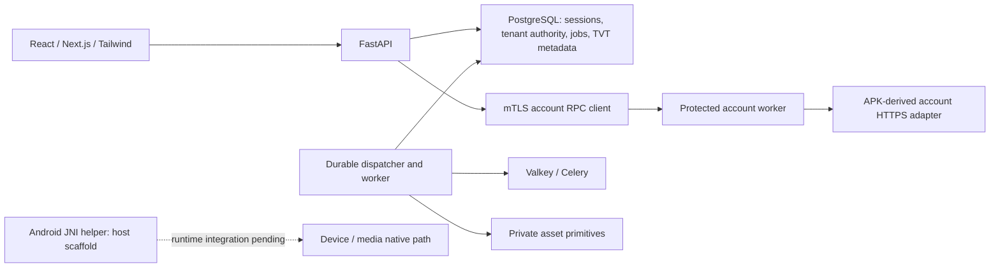

# Service implementation and remaining work

Analysis date: **2026-10-03 (Asia/Seoul)**.

## Latest implementation continuation — 2026-10-03

Current published baseline: **`756946ca73cff31d7ebb23141873088b470a96b4`**,
branch `codex/superlive-web-service`. The existing managed Windows worktree is
the development environment. GitHub Actions runs separate Ubuntu 24.04 jobs;
these jobs do not imply Linux/WSL installation or local service acceptance.

- At `e216133`, reviewed W06 registration/recovery core/SQL/RPC/API/React and
  the private six-read directory adapter were published. At `d1ce6b1`, reviewed
  browser fixture/source docs and the exact generated-protobuf lint configuration
  were published. Current `756946c` publishes the reviewed61-file directory
  protected core/RPC/API/UI/navigation/CI/browser-source integration and private
  profile/contact/password adapter, including three explicit consumed-preimage
  overrides. Every task has a clean final C0/I0/M0 source review.
- Six directory reads are reachable through explicitly opted-in /tvt/devices:
  device list/channel list/device detail/channel detail/sent shares/received shares.
  Current SQL actor/session/member/consent/profile/USER-generation authority,
  committed one-use tickets, shared verified mTLS, contained HTTPS, safe presence
  projection and UI denial/context/generation ownership are implemented. The
  source-derived fields never grant commands or assert inventory completeness.
- [Current foundation at `756946c`](https://github.com/himangga01/wisdom-super-observer/actions/runs/37083395408)
  succeeded: **4,930 Python passes and one optional private source-vector skip**,
  10 actual recovery passes,315 frontend passes and26 HTTPS authentication browser
  passes. Selected PostgreSQL has zero skips. Static/type/build/contract/evidence
  checks, actual Valkey persistence smoke and owned database cleanup pass. Expected
  outage messages and existing development-certificate/color warnings are retained.
- [Current account-browser run](https://github.com/himangga01/wisdom-super-observer/actions/runs/37083395314)
  succeeded after the two stale source pins were corrected:45 host passes,
  desktop1 pass16.6s and mobile1 pass15.8s in separate owned lifetimes. It uses
  synthetic accounts/precreated session entrance and the real account API/RPC/
  HTTPS path. It does not establish real vendor/APK equivalence or direct root
  GPT-controlled Chrome testing. Current directory Chrome coverage is still pending.
- Private W06 security adapter8 Fix1 provides exact profile/contact/password/
  inventory/dynamic-code protocols, SID/native AES helpers and typed private results.
  Original83 passes include eight contained verified HTTPS methods; malformed
  JSON-text review defect has causal4 failures then29 focused passes and clean
  re-review. No public security routes or current protected SID/key persistence
  are implemented by that private slice. Successful login/renewal SID capture5
  is now under implementation; protected write/vault/API/React integration follows.
- Current Windows directory browser runtime5 is under implementation. It must
  use a signed synthetic issuer and normal browser OIDC entrance with actual API
  sessions, an independently owned0011 database and the real six-read pipeline.
  The older account fixture had precreated sessions, rather than a signed issuer;
  the coordinator extension is explicitly scoped. No fake public API or security
  interstitial/certificate-trust bypass is allowed.
- Root connected GPT web-control to Chrome and inspected the design reference
  only. Current Windows directory servers and root direct Chrome acceptance have
  not run. Targeted APK device-access/NAT-bootstrap source completion is in
  progress before native device/media session implementation. The same original
  APK hash remains the source authority; vendor-document acquisition is not required.

Remaining W07 enrollment/sharing writes, W06 protected security/provider/avatar/QR/
removal, native device/media and later W08–W25 domains remain incomplete. Earlier
full14/native failures and the canceled d1 automatic asset run remain historical
open evidence. **MATCHED=0**, six G-P1 families blocked, `release_ready=false`.

### Earlier 2026-10-03 integration snapshot (preserved history)

This snapshot precedes `756946c`; its pending states are superseded above.

- Reviewed account-flow core/SQL, eight-method RPC, authenticated API/proxy,
  registration/recovery React forms, the exact lost-lease test actor correction
  and six-method private directory adapter were published together at `e216133`.
  The UI Fix2 review closed stale/uncertain-final-state regressions; its 48
  focused tests pass. API evidence includes one actual restricted PostgreSQL →
  verified mTLS → contained verified HTTPS fixture, using synthetic upstream data.
- Two successive source-guard reviews corrected the Linux fixture inventory:
  exact canonical0010 roster65, plus only the structurally validated optional
  recovery table. Partitioned/foreign/extra tables fail before any row read.
  Guard Fix2 was published at `b25df5`; the new uncommitted directory0011 extends
  the canonical roster to66. The unchanged local source remains Windows36 at
  `0003a_assets`; acceptance databases are independently owned and removed.
- [Actual foundation at `b25df5`](https://github.com/himangga01/wisdom-super-observer/actions/runs/37024579799)
  passed **4,462 ordinary PostgreSQL cases and 10 actual Linux recovery cases**,
  with the required zero-skip guard passing. It then failed Ruff on the pinned
  generated protobuf pair (UP009/I001/F401). Owned database cleanup passed;
  later static/frontend/browser/Valkey gates did not execute. A narrowly scoped
  generated-pair discovery exclusion was independently approved and published
  at `d1ce6b1`. This older run is not a passing overall CI result.
- [Actual foundation at `d1ce6b1`](https://github.com/himangga01/wisdom-super-observer/actions/runs/37078288152)
  completed successfully: **4,487 PostgreSQL cases,10 actual recovery cases,213
  frontend tests and26 HTTPS authentication browser cases**; strict skip gates,
  static/type checks, contract/evidence checks, build and real Valkey persistence
  smoke passed. Owned database cleanup passed. Expected outage-test messages and
  existing development-certificate/color warnings remain in the logs. This is
  the published source baseline; uncommitted W07/security work is not covered.
- W07 protected directory10 Fix1 is independently approved C0/I0/M0 and root
  custody accepted, but unpublished. Historical evidence includes 20 owned
  database attempts with preserved source36; overlapping SQL selections are not
  summed. Fix1 records two causal terminal-race failures followed by39 worker
  passes. Current authority is checked again at publication; source projection
  never grants device operations.
- Directory RPC9 Fix1 and API/proxy9 are independently approved C0/I0/M0 and
  root accepted, unpublished. RPC canonical UTF8→ASCII size rejection is fixed
  with two causal failures then19 focused passes. The API's single actual
  six-read restricted PostgreSQL→verified mTLS→contained verified HTTPS case
  passed18.63s; subsequent real session revocation rejected a seventh call.
  Root verified the owned database absent, current source36 identity unchanged,
  131 paired readsets,191 packet artifacts and21 deterministic exports.
- Readonly React own8 Fix1 retains denial/recovery above tab disposal after a
  review found ordinary navigation reset the guard. Causal15 failures then63
  focused passes, typecheck/lint clean; same-reviewer follow-up is pending.
  A separate startup/navigation author is adding only a trusted third exact
  menu tuple and guarded /tvt/devices route composition; final frozen verification
  waits for UI Fix1 approval. The accepted API generated pair is its consumed
  preimage; only startup-menu schema evolution is permitted.
- W06 post-login source docs2 Fix1 is independently approved and root accepted,
  and published at `d1ce6b1`, with124 frozen source snapshots and12 precisely
  bound inherited captures.
  It resolves SID/AES derivation, profile/contact/password/provider payloads,
  multipart avatar and user QR contracts. These are implementation references;
  the remaining security workflows are not implemented merely by documenting them.
  A separate private profile/contact/password protocol/crypto/client author is
  implementing exact source-derived methods; that candidate is not yet accepted.
- Browser fixture6 Fix1 and the exact two-byte workflow EOF correction were
  independently approved and published at `d1ce6b1`. Historical desktop/mobile
  proof used older consumed frontend checkpoints. [Dedicated browser run at
  `d1ce6b1`](https://github.com/himangga01/wisdom-super-observer/actions/runs/37078288088)
  passed25 host contracts then failed coordinator startup; no browser case ran.
  Inspection confirms current source does not match the fixture's old main/RPC-fixture
  pins. Current-source pin integration and runtime validation remain required.
- The root pyproject lint change automatically triggered the unchanged private
  asset workflow. Root canceled exact-head run37078288075; cancellation reached
  the execute14 step, so partial execution is possible. Owned database cleanup
  passed; the result checker was skipped. This is neither a new full14 acceptance
  nor proof the workflow never started. Earlier accepted failure history remains.
- Root connected GPT web-control to Chrome and inspected the public design
  reference only. Current Windows servers and direct Chrome service acceptance
  have not run. A remote automated browser result does not replace that requirement.

Remaining work includes W07 route/UI/composition and device enrollment/sharing
writes, W06 security workflows, working Android device/media transport, and the
later W08–W25 feature domains listed below. Unchanged native/full14 failures remain
open. **MATCHED=0**, six G-P1 family gates blocked, `release_ready=false`.

### Historical continuation — 2026-10-02

The following continuation is preserved as a dated historical record; its pending
statuses are superseded by the 2026-10-03 section and refreshed current tables.

The earlier assessment below is a dated snapshot at `4df15be`. The current
published source is **`850e19692f15efd6bc6531dbeebdaf7ae2a22c8c`**. Four reviewed
batches published the account-flow APK reference, strict native-test selection,
private registration/recovery adapter and public models, account-menu opt-in,
the closed test-selection inventory correction and forward asset read-denial
migration, source-country phone login, two runtime activation flags and strict
Windows/Git-LF migration identity checks, and an operation diagnostic callback
repair. None declares the full service complete.

- A fresh handset extraction is saved privately as
  `C:/wso-private/superliveplus/1.18.1-2026-10-02-handset/base.apk`, 170,064,551
  bytes. Version 1.18.1/code 20267 and SHA-256 exactly match the original analyzed
  APK. Static evidence therefore uses the same source; runtime equivalence is
  still unexecuted.
- Source comparison found an actual phone-login gap: APK country code plus `+`
  plus local number was rejected by the old web input. Ten-file correction adds
  separate inputs, all 196 source countries and private native `userName` binding.
  Original 64 Python/91 frontend results are retained. Independent review found
  late aborted cleanup could erase replacement inputs; Fix1 has eight meaningful
  RED cases and 57 passing account tests. Fix1 re-review is clean and the ten
  files are published at `1e9cd00`.
- Protected registration/recovery worker/SQL integration is independently
  source approved, with
  current session/actor/consent checks, key commitments, durable uncertain-final
  holds and private registry ownership. Its final original checkpoint records
  64 focused passes. Review found post-lock ticket expiry checks were missing;
  Fix1 adds them and records two meaningful expired-lock RED cases plus 14
  focused PostgreSQL passes and offline emission. Re-review is clean. Eight-method
  RPC/worker composition has a clean independent source review, 59 owned and 57
  affected bridge passes with synthetic verified TLS proof. Both remain unpublished.
- API/proxy/typed client implementation has a frozen nine-file review packet:
  73 Python passes / one explicit opt-in skip, 71 proxy passes, type/lint checks,
  21 deterministic exports and 19 unchanged exports. One actual restricted SQL
  issuer → verified mTLS worker → verified loopback HTTPS case passed, including
  shutdown key/config cleanup. The original incorrect test-clock attempt is
  retained; the same case was repeated for clock synchronization and cleanup.
  Three owned databases were dropped and source36 stayed unchanged. These are
  synthetic upstream results, not vendor acceptance. Independent API review is
  clean; the separately owned Register/Recover React forms are in progress.
- Parent read-denial migration Fix1 is independently approved at SHA-256
  `3a2fc52bb33a86058d5f13d36f6112986f1ef4117032c64cc268e2e88f61572e`.
  Offline SQL emission, actual emitted SQL execution, exact roundtrip, ordinary
  revalidation and 16 drift rejections are captured. Native HTTP/provider
  acceptance remains separate.
- [Linux foundation at `1e9cd00`](https://github.com/himangga01/wisdom-super-observer/actions/runs/37003051975)
  produced **10 failures / 4,060 passes**. Activated account RPC/operation cases
  now run. The operation error callback attempts to write to an absent ignored
  evidence directory; FileNotFoundError replaces expected permission-denial SQL
  errors. The narrow callback fix has 16 focused passes and a clean independent
  review; it is published at `850e196`. Changed-source Linux run37008112989 is
  in progress, with no passing conclusion yet. Cleanup of the earlier run passed;
  downstream gates did not run. Earlier `93f8183` produced 4,004 passes / 32 skips
  then failed the strict skip guard. Historical failed results remain retained.
- Pending W06 SQL/API acceptance is locally guarded to the approved Windows
  source database. Linux CI portability is being implemented with the existing
  managed container guard and exact platform-specific source metadata before
  activating those cases. Actual inspection confirms all four parent/protected
  source raw hashes already equal their Git LF hashes; no API pin repair is needed.
- During an initial stopped-development-DB connection error, a local admin URL
  and password appeared in private tool output. The incident is retained without
  values; later captures use private files and 18-value redaction. No source DB
  reset, credential rotation or prepared account mutation occurred. This report
  does not claim all historical output was secret free.

The next integration chain remains React forms → device directory
→ live media, alongside the specific CI fixes. The user requires final server
startup and direct Chrome interaction through GPT web-control tools after
implementation. This acceptance has not yet run. **MATCHED=0** and
`release_ready=false`; source comparison and synthetic checks are not live APK
comparison. W07's six readonly source contracts are reviewed with four small
precision corrections retained for follow-up, and no directory adapter is
implemented yet. Later functional packages remain as listed below.

## Source baseline and purpose

The intended service provides the complete functional behavior of SuperLive Plus
as a React/Next.js and Tailwind frontend with Python/FastAPI backend, protected
workers and a managed gateway where the APK uses device-native communication.
The supplied APK analysis is the implementation authority. A separate vendor SDK
or API document is not a prerequisite for continuing development.

This refreshed review uses branch `codex/superlive-web-service`, published baseline
`756946ca73cff31d7ebb23141873088b470a96b4`, and the inspected uncommitted changes
in the existing `superlive-web-service` worktree. The earlier `4df15be` assessment
and subsequent failed runs remain dated historical evidence. The APK baseline is
SuperLive Plus **1.18.1**, SHA-256
`f57ff98226fcc7a0ec3587b077d5538facb57cc5b713a0938d1ee02b0f72f281`.
The [implementation plan](superpowers/plans/2026-09-27-superlive-plus-web-parity-implementation-plan.md)
contains 26 work packages, W00–W25, and a frozen seed of 77 comparison cases /
199 candidate operation boundaries. These are inventories, not completed features.

Unpublished work includes private SID acquisition5, directory browser runtime5,
targeted device-access source completion, reviewed daemon-helper9, and root
status documentation. `apps/web/next-env.d.ts` is an unowned generated change and
is excluded from reviewed publication. No unfinished file is approved by presence.

## Architecture actually present

The published API has startup, six TVT account routes and eight account-flow
routes. Six readonly directory routes and their opted-in React views are published; the full device/media/cloud API surface remains pending. Account worker
configuration and token-vault access belong to the
separate worker; API construction creates its RPC client. Database-issued authority
and current membership checks prevent a caller-supplied identity or UUID from
authorizing another user's credentials. The Android helper and frame-parser
scaffolding do not establish working device or video sessions.

## Implemented behavior and remaining work by plan package

“Implemented subset” below means code is present with recorded source or test
evidence. It does not mean production acceptance or APK equivalence.

| Package | Implemented subset / present evidence | Remaining work |
| --- | --- | --- |
| W00 evidence inventory | Frozen 77-case seed, 199-operation baseline, evidence schema/checker and desktop API preflight | Actual applicable support matrix, trusted runtime observations and comparisons; keep discovered branches in the denominator |
| W01 operation handoff | APK audits, declaration/route inventories, account source decoding, per-operation handoff structure; development routes are selected from APK evidence | Decode unresolved fields for each subsequent operation; replay working success/error/timeout behavior in the selected runtime; six family acceptance gates remain blocked |
| W02 domain and persistence | Typed identity/device/media/event/cloud/Tyco models, tenant-scoped metadata and credential boundaries, generic durable sensitive-operation engine | Actual per-feature executors and readback, public route/React/OpenAPI coverage, extending SQL role tests for new tables and the formal 42-case scoped-domain acceptance gate; a generic model/engine is not a working feature |
| W03 startup | Authenticated consent/locale/timezone shell, exact trusted settings/account/devices navigation and bundled policies; device page composed with current scope | Configure reviewed runtime profile, remaining startup/deep-link branches and direct reference-design/Chrome acceptance |
| W04 bridge | Published account6/flow8/directory6 verified mTLS paths, contained APK-derived HTTPS, native helper/frame scaffolds | Working Android JNI/device/media transport and actual model/runtime proof; device-access source completion in progress, load probe unexecuted |
| W05 login/profile | Published login/challenge/profile/USER renew/logout,196-country phone binding; current synthetic desktop/mobile account fixture passes | Configured real endpoints/profiles, direct Windows Chrome and prepared-account/APK comparison; P2P/DEVICE lifecycle |
| W06 account security | Published registration/recovery core/RPC/API/React, source handoff and private profile/contact/password/crypto adapter8 Fix1 | Successful SID capture and scoped encrypted vault/write/worker/API/React; provider/avatar/QR/removal and real account acceptance |
| W07 devices/sharing | Published six-read private/protected/RPC/API/React/menu paths, current SQL/TLS composition and selected CI pass; safe observations grant no commands | Direct Windows directory Chrome and real APK comparison; capability/permission joins, enrollment/manual/QR/LAN discovery, sorting, sharing writes/revoke/readback |
| W08 live/multiview | Media contracts and post-native frame parser | Native/gateway transport and one shared camera adapter, live lease/signaling/codec delivery, 1/2/4/6/8/9/13/16 layouts, stream quality, snapshot and local recording; verify actual bytes and cleanup |
| W09 audio/doorbell | Static APK analysis | Listen/Talk codecs, microphone delivery, busy/stop behavior, doorbell signaling and answer/reject/hangup, custom alarm audio; actual consented device results |
| W10 recording search | Static APK analysis / media models | Recorder queries, channel/date/event filters, calendar/timeline and playback controls, API/UI and returned-record checks |
| W11 playback/export | Generic job/asset infrastructure | Playback media, seek/speed/audio/frame/reverse behavior, recorder/cloud export and backup, progress/download UI, byte integrity and token-expiry recovery |
| W12 web/gateway capabilities | Limited desktop API preflight | Browser camera/microphone/notification/storage permission layer, QR scanner, managed gateway enrollment and LAN/AP/Wi-Fi onboarding, background/closed/PWA behavior |
| W13 alarms/push | Event models / APK analysis | Authenticated event ingress, replay/deduplication, messages/read/delete/detail/navigation, subscriptions/service worker and push delivery |
| W14 device controls/settings | Operation engine and APK analysis | PTZ/presets/cruise, fisheye/lens/light/siren/wiper/unlock/RS485, defense/schedule/PIR/sensor controls and remote HTML settings; capability checks and authoritative readback |
| W15 sensitive actions | Confirmation, intent holds, fencing and unknown-outcome primitives | Concrete device/account writers and reconcilers for deletion, firmware, restart/power and related actions; confirmation UI, no duplicate uncertain submission |
| W16 AI/face/plate | Domain/static evidence | Search filters/history/results, text/speech/translation/image/target/face/plate queries, enrollment/libraries, actual recorder rights/results and UI |
| W17 cloud | Cloud models / APK analysis | Entitlement/channel/date/record queries, cloud media, image/MP4 download/delete and encryption settings; byte/permission/expiry acceptance |
| W18 VAS/payment | Operation primitives / APK analysis | Catalog/eligibility/order/subscription/renewal/auto-renew/payment-return flows, authoritative order reconciliation and no double charge |
| W19 Tyco | Separate Tyco models / APK analysis | Separate login/registration, panel/device/partition/output controls, events/troubles/users/time/settings and notifications; retain independent credentials/domain |
| W20 files | Private JPEG/PNG image metadata, crypto, upload/download/image/job primitives; this is not general video-file support | User-facing image/video collection/search/view/play/download/share/delete, general media formats and retention/storage-error behavior; T05A provider acceptance remains open |
| W21 personalization | Locale/timezone preferences from W03 | Auto-connect, orientation/OSD/PTZ gesture, snapshot/record preferences, favorites/start screen/cache/Wi-Fi/domain and effect verification |
| W22 help/web content | Four bundled terms/privacy routes | Help/About/version/experience and brand/debug pages, delivered H5 action semantics, household/resident-manager flows, safe navigation and branch reachability |
| W23 security/operations | Existing tenant/credential/CSRF/mTLS and job recovery controls | Apply/test those boundaries across every new feature; device/media reconnect, expiry, audit/redaction/metrics/alerts and orphan-session reconciliation |
| W24 APK comparison | Static ledger/checker | Full APK reference/web candidate runner, trusted comparison/reporting, same-state success/denial/offline/expiry/unsupported cases and independent acceptance |
| W25 release/deployment | Generic Linux CI and existing deployment primitives | TVT gateway/service deployment, production identity/key/certificate/profile provisioning, dependency readiness, restore/upgrade/rollback, drift monitoring and release decision |

### W06 and W07 current working-tree detail

Published directory core10/RPC9/API9/UI8/navigation12/CI5/browser-source3 and
private security8 have clean final task reviews. Generated2 and API-test1 use
explicit reviewed consumed-preimage overrides. Actual selected Linux directory
acceptance and synthetic account desktop/mobile pass on756946c. Direct Windows
normal-OIDC directory runtime5, private SID capture5 and native access source1
are active unpublished work. Protected security write admission/persistence/public
routes, device/media and later domains are still required.

## Actual verification limits and current failures

| Evidence | Actual outcome | Work still required |
| --- | --- | --- |
| [Foundation at `756946c`](https://github.com/himangga01/wisdom-super-observer/actions/runs/37083395408) | SUCCESS:4930Python/1optional private-vector skip,10recovery,315FE,26HTTPSauth; selectedPGzero skips, static/type/build/contract/Valkey/cleanup pass | Published source and synthetic acceptance; real vendor/APK and direct root Chrome remain pending |
| [Account browser at `756946c`](https://github.com/himangga01/wisdom-super-observer/actions/runs/37083395314) | SUCCESS:45host,desktop1/mobile1; separate owned lifetimes and PostgreSQL cleanup pass | Synthetic precreated-session W05 flow; normal OIDC/current directory Chrome mode is a subsequent test-runtime slice |
| [Foundation at `d1ce6b1`](https://github.com/himangga01/wisdom-super-observer/actions/runs/37078288152) | SUCCESS:4487PG/10recovery/213FE/26HTTPSauth browser; static/type/build/contract/Valkey and cleanup pass | Published baseline only; uncommitted W07/security and direct GPT Chrome acceptance remain separate |
| [Account browser at `d1ce6b1`](https://github.com/himangga01/wisdom-super-observer/actions/runs/37078288088) | 25 host contracts pass; coordinator fails before browser; owned PostgreSQL cleanup pass | Replace precisely proven stale source pins with accepted current source, independently review and validate changed fixture |
| [Foundation at `b25df5`](https://github.com/himangga01/wisdom-super-observer/actions/runs/37024579799) | 4,462 PostgreSQL and10 actual recovery cases passed, zero-skip guard passed; generated protobuf Ruff failure; cleanup passed | Historical failure; exact lint config was later published and d1 foundation passes |
| [Foundation at `4df15b`](https://github.com/himangga01/wisdom-super-observer/actions/runs/36946167510) | 3,790 ordinary cases passed / 35 skipped, then the strict selected-PostgreSQL skip gate failed; owned database cleanup passed | Historical failed run; selection correction was subsequently published. This run did not execute downstream recovery/static/FE/browser/Valkey gates |
| [Private asset full14 at `9876730`](https://github.com/himangga01/wisdom-super-observer/actions/runs/36940214555) | 9 failed / 5 passed in 1,442.52 seconds; cleanup passed; authoritative result checker failed | Resolve actual upload/read/lifecycle/crash failures, then verify changed source. A successful wrapper step is not suite success |
| [Native private-asset diagnostics at `9876730`](https://github.com/himangga01/wisdom-super-observer/actions/runs/36940214600) | Parent-read and both prefork crash diagnostics failed | Historical parent-read409; reviewed forward read-specific migration is now published, but these native cases have not been rerun on changed source. Reviewed daemon-helper Fix1 is locally verified source, not Linux/native acceptance or proof of the historical first cause |
| Formal TVT domain/credential acceptance | Focused source-development proof exists; formal 42-case gate remains pending | `scripts/verify.ps1 -WithPostgres -WithTvtDomain` requires exactly 3 scope and 39 credential cases, zero skips. The ordinary Linux workflow does not select `-WithTvtDomain`; an ordinary foundation pass cannot close this gate |
| Account browser Fix1 | Desktop and mobile each passed in separate owned lifetimes, 30.7 / 29.9 seconds; owned resources removed | Fix1/EOF source published; current fixture startup fails stale source pins and direct Chrome remains pending. Runs use synthetic accounts and controlled HTTPS upstream; they do not prove prepared TVT account login or APK parity. The consumed W06 checkpoint is historical |
| APK functional parity | **0 independently accepted MATCHED cases**, six G-P1 family gates blocked; `release_ready=false` | Execute actual comparative acceptance after the corresponding web function works |

No new automated tests, device calls, vendor requests, deployments, database
migrations or acceptance runs were executed for this analysis. Evidence was read
from current code, source/review packets and retained actual run receipts. There
is no defensible service-completion percentage or fixed completion date from
these results. Zero matched cases does not mean zero code implemented.

## Priorities and execution order

1. **Finish current handoffs:** review private SID capture and current Windows
   directory browser runtime, then root starts servers and operates Chrome through
   GPT web-control. Keep ordinary synthetic CI and direct/live acceptance separate.
2. **Complete protected security:** scope encrypted SID/key lineage to current
   USER credential, add durable write admission/readback, API/RPC/React for profile,
   phone/email and password, then provider/avatar/QR/removal. Use exact APK source
   contracts; no missing vendor document prerequisite.
3. **Build the core surveillance path:** readonly device/channel directory and
   capability/permission state, then native/gateway session transport, live video
   and multiview. Recording search/playback/export, Talk and controls follow their
   decoded contracts, with independent local work in parallel.
4. **Repair actual storage/runtime failures in parallel:** parent-read denial,
   daemon-helper publication/POSIX proof, and remaining full14 initiating failures.
   These are needed by media/file features; unchanged failing heavy suites should
   not be repeatedly rerun without a relevant fix.
5. **Complete all remaining domains:** events/push, onboarding, AI, cloud, VAS,
   Tyco, file manager, personalization and remote/help/household pages. Local UI
   work need not wait for a separate vendor document.
6. **Close comparison and deployment:** all reachable applicable cases, role
   isolation/expiry/offline/permission variants, production runtime/restore and
   final independent release review.

## Risks and product questions

- The previous implementation ledger's broad “W03–W25 pending” row is stale.
  W03–W05 have substantial implemented subsets; this report separates those from
  the still-missing user flows. Old test counts remain dated historical evidence.
- APK-only static evidence can establish a request contract without proving the
  working server response, native callback ordering, codecs or deployment ABI.
  Resolve each remaining field through targeted decode and actual use; do not
  invent constants or treat `/sdk/*` dispatch labels as web endpoints.
- Native binary deployment rights/runtime compatibility and provider/merchant
  configuration are release questions for applicable paths. They are not an
  excuse to suspend unrelated APK-derived development.
- Production identity provider, gateway placement, device/model/firmware and
  account role/entitlement matrix need explicit deployment evidence. The user has
  stated that equipment and logged-in accounts are ready for testing; their
  preparation does not itself establish a completed web path.
- Payments, unlock/alarm, firmware, deletions and other live side effects retain
  the existing scoped authorization/readback requirements. UNKNOWN outcomes must
  not be silently retried or counted as success.
- [The supplied design reference](design/2026-09-30-dashboard-reference.md) is
  available. Remaining screens and final visual acceptance still need it applied;
  development screenshots are not final production design acceptance.

## Evidence references

- [Implementation ledger and historical milestones](implementation/ledger.md).
- [Frozen APK parity ledger](integrations/tvt-parity-ledger.md).
- [Current account runtime deployment](integrations/tvt-account-runtime.md),
  [account session and token-kind boundaries](integrations/tvt-session-contracts.md),
  [account UI scope](integrations/tvt-account-ui.md),
  [registration/recovery APK source](integrations/tvt-account-flows-source.md),
  [private flow adapter](integrations/tvt-account-flow-adapter.md).
- Actual route wiring: `services/api/src/wso_api/main.py`,
  `services/api/src/wso_api/tvt/{startup,account}.py`; actual menu/screen boundary:
  `apps/web/src/features/tvt/shell/{FeatureMenu,TvtShell}.tsx`.
- RPC exposes six account methods in `packages/contracts/proto/tvt_bridge.proto`;
  registration/recovery/device methods are not connected there yet.
- Two independent read-only audits checked functional remaining work and the
  foundation/verification/deployment inventory. Their USER-only renewal,
  image-only asset foundation and separate formal-domain-gate clarifications are
  incorporated above. These audits did not execute acceptance or approve drafts.
- Current source/review custody and actual CI receipts are retained locally under
  the ignored plan-specific `.superpowers/sdd/` and `.superpowers/verification/`
  directories. This public report contains no raw logs, credentials or key values.
