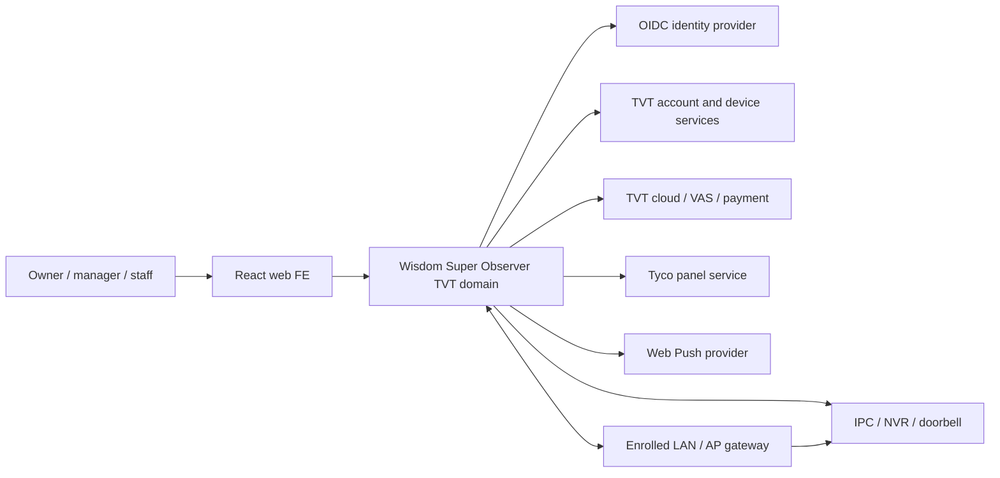
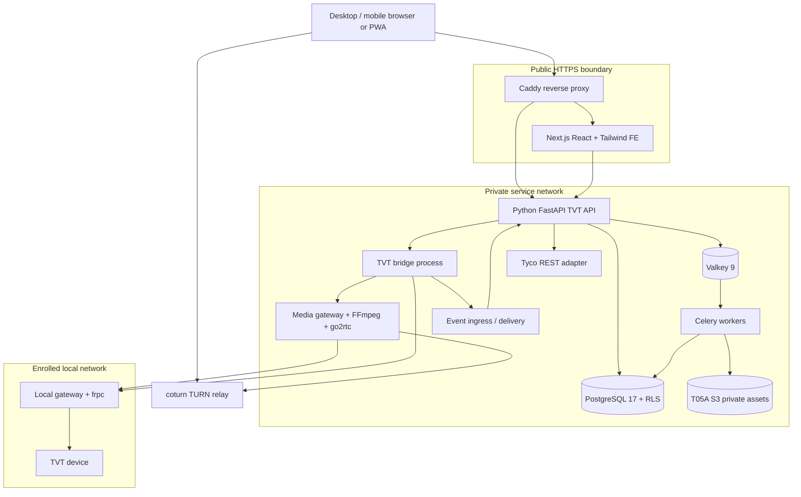
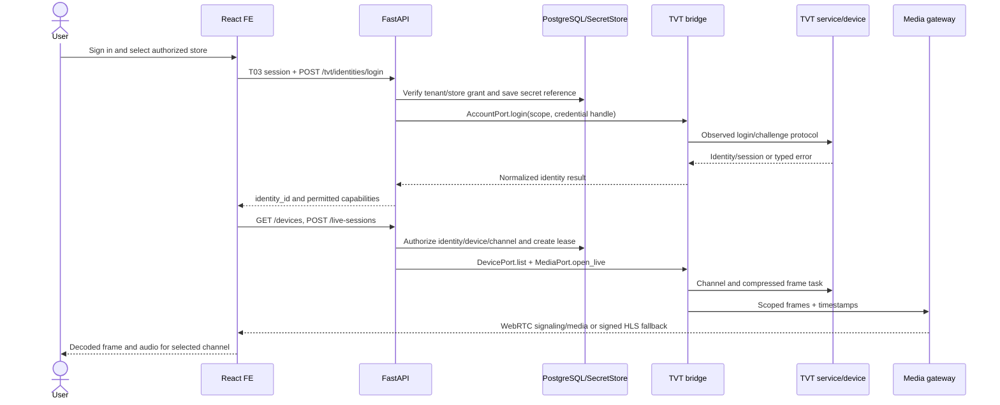
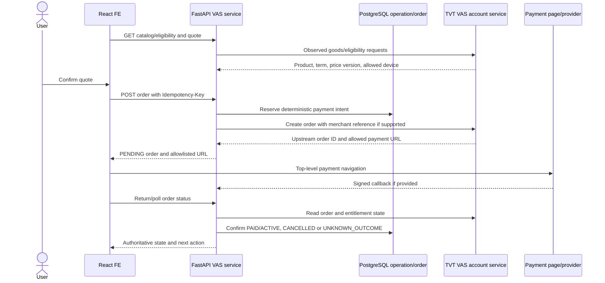
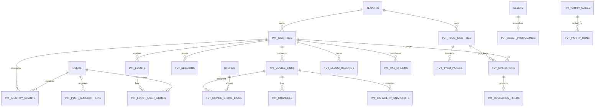

# SuperLive Plus 1.18.1 Web Functional Parity Implementation Plan

> **For agentic workers:** REQUIRED SUB-SKILL: Use `superpowers:subagent-driven-development` or `superpowers:executing-plans` to implement this plan task by task. Steps use checkbox (`- [ ]`) syntax. This document is a plan, not approval to log in, change a device, purchase a service, broadcast audio, delete data, deploy, or commit.

**Goal:** Reproduce every reachable, user-visible function of the installed SuperLive Plus 1.18.1 APK in the Wisdom Super Observer web service, for each supported account, region, brand, device, firmware and entitlement combination, with measured parity against the original app.

**Current evidence status (2026-09-27): implementation contracts partly unverified.** The architecture, 77-case inventory and task ownership are specified, but static APK inspection has not established the working TVT wire responses, permitted bridge runtime, closed-client doorbell behavior, payment/Tyco/provider access or all dynamic H5 actions. §3.5 and W01 prescribe the exact capture, adapter decision and contract handoff that fill those gaps before dependent production code. The objective remains 100% functional parity; a `MATCHED` result requires runtime comparison, and an unresolved operation stays visible in the ledger until its implementation route and evidence are established.

**Architecture:** Implement a full FE/BE TVT service domain. The Python/FastAPI backend owns account, device, cloud, Tyco, payment, alarm and operation workflows; an authenticated TVT bridge owns protocol sessions; media and event services handle conversion, delivery and persistence. The React frontend (Next.js under the existing service plan) presents those functions with Tailwind CSS. A local gateway is used only where physical LAN/AP access is required. Select each upstream adapter after its vendor-SDK/protocol feasibility gate; frontend and API contracts remain independent of that choice.

**Tech Stack:** Node.js 24 LTS; React 19/Next.js 16/TypeScript 5/Tailwind CSS 4; Python 3.12/FastAPI/Pydantic 2/SQLAlchemy 2/Psycopg 3; PostgreSQL 17, Celery 5.6 with Valkey 9, T05A S3 storage, WebSocket/Web Push, WebRTC/HLS with FFmpeg/go2rtc/coturn/frp as detailed in §4.4. T01/W00 pin exact compatible patch versions and distribution terms; Android `.so` files are not presumed to run in the browser or Linux server.

**Spec:** [Service goals](../../../SERVICE_PLAN.md), [existing service implementation plan](2026-09-21-wisdom-super-observer-implementation-plan.md), [APK audit index](../../integrations/apk-audit/README.md), [independent APK QA](../../integrations/apk-audit/10-completeness-review.md), and the feature contracts in §2 below. This plan expands the existing plan's T31 from core P2P integration to complete SuperLive Plus functional parity; unrelated OrderQueen and store-analysis tasks retain their own plan.

**Source artifact:** `com.tvt.superliveplus` version 1.18.1 (code 20267), base APK SHA-256 `f57ff98226fcc7a0ec3587b077d5538facb57cc5b713a0938d1ee02b0f72f281`. Raw APK and decompilation stay outside Git at `C:\wso-private\superliveplus\1.18.1-2026-09-27`. All `J:`, `M:`, `R:`, and ELF offsets in the audit refer to that exact artifact.

## Global Constraints

- “100% 동일 기능” means the same observable user action, successful result, failure state and durable side effect for every **reachable** feature under an equivalent account/device/brand/region/entitlement configuration. It does not mean identical Android implementation or pixel-identical layout. A declaration alone is not a reachable feature; a gated feature is tested when its gate is satisfied.
- The target is an integrated frontend, backend and, only where physical LAN/AP access requires it, a local gateway. The user explicitly allowed server/gateway execution on 2026-09-27. Functional coverage is judged across the complete service, never by what browser JavaScript can do alone. Client OS permissions and lock-screen behavior remain separate acceptance cases where the user action occurs on that handset.
- FE implementation uses React and Tailwind CSS; BE implementation uses Python. The existing service plan already names Next.js/FastAPI, so Next.js is the React framework here. The user will provide a website design reference later; W03 records and applies that reference before visual acceptance, without letting an unavailable reference block API and functional-contract work.
- The APK audit is a static inventory, not proof of working server calls. For each feature, distinguish `DECLARED`, `REACHABLE`, `CAPTURED`, `IMPLEMENTED`, `MATCHED`, `BLOCKED`, and `NOT_APPLICABLE` with evidence. Only `MATCHED` counts toward parity.
- Do not call internal `/sdk/...` route names public REST URLs. Do not assume the APK's `TVTOpenSDK` is a redistributable SDK or that a third-party `NET_SDK_*` library is equivalent. Confirm vendor permissions and actual platform support before selecting an adapter.
- Preserve all 23 user-feature areas in [UI inventory](../../integrations/apk-audit/01-ui-feature-inventory.md), all 281 request classes, 299 `TVTOpenSDK` native declarations, and 25 packaged ELF files as traceable inventory inputs. The goal is user-visible functional parity, not invoking every unused or broken symbol.
- TVT, Tyco, OAuth providers, cloud/VAS checkout and Android/browser permission systems are distinct trust domains. A failure in one must not silently fall back to a different account or change another system.
- Reproduce outcomes, not insecure implementation details. Do not copy the APK's fixed local AES key/IV, trust-all Glide image client, cleartext allowance or token logging. Never commit credentials, cookies, tokens, QR/device identifiers, raw media, packet captures or APK binaries.
- Read-only investigation precedes each write capability. Account removal, device delete/firmware/config changes, sharing writes, paid purchases and audio output need explicit test cases and scoped authorization when execution begins. The plan itself authorizes no such action.
- Every backend operation checks tenant, TVT identity, device/channel permission and requested side effect. Audit writes with actor, target, input digest, outcome and correlation ID; redact credentials and media URLs.
- Do not equate a successful mock, JNI export, route registration or HTTP 200 with parity. Compare the original app and web result using the same account, device firmware, entitlement, locale/time zone and input, including failure/reconnect paths.
- Existing Wisdom Super Observer safety decisions continue to apply: no automatic audible broadcast, no unsupported identity/crime assertion, no cross-tenant access, and no direct provider-API replacement for the user's selected CLI inference path. Those are separate product capabilities, not substitutes for SuperLive Plus functions.

## Review Focus

1. A token expires during a live stream, Talk session or cloud playback: reconnect at most once per serialized refresh, preserve authorized state, and never leak one user's session into another; tests belong to W05, W08 and W11.
2. A device reports a capability that its firmware rejects: show the original app's equivalent error, roll back optimistic UI and leave remote state unchanged; tests belong to W07, W14 and W15.
3. A payment, firmware update, account removal or shared-device deletion times out after submission: resolve by server-side status/readback and idempotency key before offering retry; tests belong to W06, W07, W15 and W18.
4. A push arrives with an unknown subtype, duplicate ID or missing thumbnail: retain a readable event, deduplicate only by stable source ID and avoid rendering unsafe text/URL; tests belong to W13.
5. Browser mic/camera/notification permission is denied or revoked mid-flow: stop the affected session, release device resources and offer a recoverable state; tests belong to W09, W12 and W13.

---

## 1. Boundary, evidence and completion rule

### 1.1 What this plan covers

The web feature domain includes the APK's startup/consent, TVT and third-party account flows, account security, device enrollment and sharing, live multiview, local snapshot/recording, device playback and export, Talk/listen and doorbell calls, PTZ and hardware settings, alarm/push, AI/face/plate search and enrollment, cloud recording and paid value-added services, file manager, local/remote configuration, Tyco panel, help/About and relevant WebView pages. Conditional white-label/region features must be represented as capabilities and tested when enabled. The 300 suspicious `*ActivityPage` manifest entries are recorded as `DECLARED` until a verified entry path is found; they are not silently counted as working product features.

This plan is **not** a reimplementation of the wider Wisdom Super Observer sales, product registration, anomaly detection or multi-store dashboard. Those remain in the existing plan. TVT feature data may later be attached to stores, but the TVT parity oracle uses the APK's user/device/account behavior as its comparison target.

### 1.2 Evidence ladder and parity ledger

Store one case per atomic behavior, not merely per screen. `case_id` is the stable `Pxx.y` ID (plus a suffix for runtime-discovered branches), unique within the frozen APK baseline. `matrix_id` identifies brand/region, account role/entitlement, model/firmware/capability flags, network mode, browser/OS/PWA state, permissions and locale/time zone. `run_id` uniquely identifies a case × matrix × build × attempt. Required fields include APK version/hash, fixture/action schema and digest, starting-state proof, expected success/error/side effect, APK and web build IDs, UI/callback/network/device observations, redacted artifact digest, comparator version, reachability status, implementation status, parity status, reviewer ID/time and evidence links. Keep `DECLARED/REACHABLE/BLOCKED/NOT_APPLICABLE` reachability separate from `NOT_STARTED/IMPLEMENTED` build state and `UNTESTED/MATCHED/DIFFERENT` comparison result. `NOT_APPLICABLE` requires a proven missing gate; `BLOCKED` requires a concrete upstream/browser/vendor reason. Preserve signed, redacted run artifacts outside Git and a nonsecret digest in `docs/integrations/tvt-parity-ledger.md`.

The comparison procedure is: establish the same authorized starting state; execute an APK read-only case or a separately authorized write case; capture UI, callback, network/device readback and timing; reset state where needed; run the web case; compare semantic fields and side effects; attach evidence; assign `MATCHED` only after an independent review. Normalize locale/time-zone formatting and expected timing tolerance, but do not normalize missing errors, missing data, different authorization or irreversible changes. Include failure cases (offline, token expiry, no permission, unsupported model, partial response), not only happy paths.

`100%` is a **release gate**, not a promise inferred from the static audit. It requires every reachable case × applicable matrix row to be `MATCHED`, no critical security or data-loss defect, and documented third-party/vendor terms for each adapter. A different browser/device/account combination outside that matrix is not silently called equivalent. Freeze the candidate support matrix and comparison tolerances in W00/W01 **before** feature implementation and get product-owner review; adding a difficult discovered case expands the denominator. A blocker cannot be erased by narrowing the matrix after seeing results. If vendor access, browser constraints or protocol opacity make a row impossible, status stays `BLOCKED` and the release cannot carry a 100% claim.

### 1.3 Static baseline and known traps

The [APK audit](../../integrations/apk-audit/README.md) covers 7 DEX, 19,116 generated Java files, 513 Activity declarations, 281 TVT request classes, 299 `TVTOpenSDK` native declarations, and 13 arm64 plus 12 arm32 libraries. The [QA report](../../integrations/apk-audit/10-completeness-review.md) checked 583 explicit Java source/line references and 52 TVT package directories. It also records 391 JADX errors, 9 substantive non-`R.*` `com.tvt` method failures, only 37 selected arm64 Ghidra-decompiled functions, and unresolved native/firmware/server behavior.

Known protocol defects must become test fixtures rather than accidental assumptions: `/sdk/getDeviceLocalStorageStatus` route overwrite, the empty `VASSetInstSwitchRequest.execute`, two empty cloud callbacks, five NAT functions returning zero in both ABIs, 25 native names/31 signatures without conventional export, and an FCM token-refresh broadcast whose action/manager do not match its receiver. These do not prove the whole feature absent; they define specific paths that need a different observed working edge or must be marked blocked.

## 2. Feature coverage and proof obligations

Each row names a minimum observable contract. The detailed route/JNI evidence remains in the linked audit report; implementation must add the **observed response schema** from the original app before coding an external adapter. `Wnn` refers to the tasks in §6. This table is the requirements traceability source and may grow when runtime observation reveals additional reachable branches.

| ID / APK area | Required web behavior and comparison oracle | Gate / owner |
| --- | --- | --- |
| F01 startup/consent | First-run terms/privacy, locale, permission explanation, deep link, guided entry; compare accept/decline and re-entry state | brand/locale; W03, W22 |
| F02 TVT account | Phone/email login, image/second code, registration, password recovery/change, session expiry, logout, profile, account type and removal; compare validation, server errors and token invalidation | region/account; W05, W06 |
| F03 third-party/web login | Enabled WeChat/Facebook/Google/Vimar OAuth and TVT web QR authorization; compare provider availability, callback, cancellation and linking | provider registration/brand; W06 |
| F04 live directory | Device/channel list, online/offline, favorites, selected channel, quality/stream selection, full screen and rotation; compare ordering, capability gates and state restoration | device/role; W07, W08 |
| F05 multiview | 1/2/4/6/8/9/13/16 layouts, tile swap/close and per-tile stream identity; compare 16-view capacity and resource-release/error behavior | device/network/browser; W08 |
| F06 capture/local record | Snapshot, multiple captures, local MP4 recording, file naming/viewing, download and retention options; compare actual bytes, metadata and failed storage states | browser storage/permission; W08, W20 |
| F07 device playback | Channel/date/event search, calendar/timeline, speed, audio, seek/frame/rewind, download/backup and failure/reconnect; compare returned records and sampled frames | recorder capability; W10, W11 |
| F08 listen/Talk | Live audio receive, microphone Talk, speaker mode, session busy/stop and codec negotiation; compare audio on a consented device and resource release | mic/device/native; W09 |
| F09 doorbell | Wi-Fi onboarding, incoming push/call, answer/reject/hangup, chime/DND/time zone/leave-word; compare signaling and audible result where authorized | doorbell/notification; W09, W12, W14 |
| F10 live tools | PTZ speed/direction, preset/cruise, fisheye, lens, light/siren/wiper/unlock, manual/custom audio alarm and RS485; compare status/readback and unauthorized/unsupported responses | model/permission; W14 |
| F11 device management | QR/manual/LAN discovery, add/bind/login, sort, details, channel/record/alarm/network/users/disk, delete and firmware/power/diagnostic modes | device/role; W07, W14 |
| F12 device sharing | Sent/received shares, account lookup, permission/channel selection, modify/revoke, share QR scan/generation; compare recipient view and revocation timing | both accounts; W07 |
| F13 alarm/push | Device alarm switches/types, FCM/TVT push, message list/read/delete, detail image/face/plate/doorbell and live/playback navigation | OS/browser permission; W13 |
| F14 AI search | Text/speech/translation, attribute/event/time/device filters, picture/target/face/plate search, results/detail and history; compare recorder results, ordering, pagination and errors | recorder AI capability; W16 |
| F15 face/plate management | Local face detection for capture guidance; device face group/enrollment and plate library/addition; compare validation and remote readback | camera/recorder rights; W16 |
| F16 cloud recording | Eligible channels/dates/records, cloud player, picture and MP4 download, delete and encryption-related settings; compare bytes, permissions and token expiry | cloud entitlement; W17 |
| F17 VAS paid services | Catalog/goods/eligibility, detail, apply/buy/renew, payment H5 return, records, auto-renew and cloud switches; compare order/status without double charge | region/entitlement/explicit write; W18 |
| F18 Tyco panel | Separate login/registration, panel list/add, arm/partition/device/output controls, events/troubles/users/time/settings and notifications | Tyco-enabled brand/account; W19 |
| F19 local files | Captured image/video list, search, viewer/player, share/download/delete and storage failure; compare visible collection and media integrity | browser/device storage; W20 |
| F20 local settings | Auto-connect, orientation/OSD, PTZ gesture, snapshot/recording options, notifications, favorites/start screen/cache/Wi-Fi/domain; compare persisted values and effects | browser support; W21 |
| F21 remote settings | Brand-gated device HTML settings and WebView JS prompt commands; compare page semantics, authorization, command result and safe navigation | server page/device; W14, W21 |
| F22 help/About/web pages | Help, About, privacy/terms, experience, debug-gated pages and server-provided web content; compare displayed versions/links and navigation | brand/region/content; W22 |
| F23 defense/scheduling | Device defense configurations, recording schedule/time, sensor/PIR/line/perimeter toggles and related alerts | model/firmware; W14 |
| F24 resident/household management | Logged-in conditional menu when resident-manager total is positive, server H5 household page and every reachable read/write within it | resident account/server page; W22 |

Cross-cutting outcomes: every relevant feature must also pass role isolation, offline/reconnect, token expiry, localization/time-zone, supported FE clients, and audit/redaction checks in W23–W25. The [atomic contract addendum](../../integrations/apk-audit/12-functional-parity-contracts.md) and [route follow-up](../../integrations/apk-audit/14-reachability-and-route-gaps.md) supply per-action cases; the ledger owns final row IDs and actual runtime evidence.

## 3. Architecture and trust boundaries

### 3.1 Runtime topology

```text
Next.js web FE → Caddy same-origin HTTPS → FastAPI TVT domain → PostgreSQL + encrypted token vault
                                     ├─ TVT account/device bridge → vendor SDK OR validated protocol adapter
                                     ├─ Tyco REST adapter (separate credentials and cookies)
                                     ├─ cloud/VAS adapter → TVT account service and payment redirect
                                     └─ event ingest → durable event store → WebSocket/Web Push to FE
Web FE media player ↔ WebRTC/HLS + Talk signaling ↔ authenticated media gateway ↔ TVT bridge ↔ recorder
Local LAN/AP-only action ↔ enrolled on-site gateway ↔ TVT bridge/API (when physical proximity is required)
```

The bridge runs outside the browser and has only outbound network access to approved TVT and device endpoints. It receives short-lived, tenant-scoped commands over mutually authenticated service communication and never exposes a raw TVT token or device password to JavaScript. A selected SDK may require Linux/ARM, Android/ARM or a vendor process; record its supported runtime and license. If an Android gateway is needed, package it as a managed service with secure enrollment, update, health checks and capacity limits. A gateway being technically callable does not establish permission to redistribute its APK libraries.

Use one long-lived device connection per account/device only if the observed protocol allows it, with leased logical live/playback/Talk sessions. Prevent simultaneous incompatible Talk or firmware commands using per-device locks. Do not connect on every tile render. Browser close notifications are best effort: server heartbeats, short lease TTL, upstream stop on expiry and a reconciliation worker bound orphan lifetime even after force-kill or network loss. Freeze that maximum orphan duration from the APK baseline and a device safety test before W08/W09 release. The gateway sends typed frames/events and opaque upstream codes to the API; the API maps them to stable web errors while retaining a redacted diagnostic code.

For video, prefer browser-decodable WebRTC for low-latency live/Talk after actual codec tests; use segmented HLS for recordings/fallback if latency and browser codec support permit. Preserve stream/channel identity, timestamps, audio synchronization and chosen quality. The gateway may transcode only when needed and must enforce per-tenant bandwidth/CPU quotas. Do not claim zero-copy or support for every proprietary codec until fixture/device tests establish it. Talk is a separate upstream capture/encode session with explicit start/stop and microphone permission; video receive does not imply Talk send works.

### 3.2 Adapter choice: evidence before implementation

W01 must evaluate these paths in order, with the same parity fixtures and distribution constraints:

| Path | Required proof | Decision |
| --- | --- | --- |
| A. TVT-provided web/server SDK or documented API | Written API/SDK identity, supported OS/architecture, allowed deployment/redistribution, account/device/region feature coverage, sample login/live/playback/Talk/alarm/control and error responses | Choose if the complete required surface is supported; wrap behind W04 interfaces. |
| B. TVT-provided Android SDK in managed gateway | Same rights plus supported Android service lifecycle, headless operation, capacity and update behavior | Choose only if A is incomplete and B can serve web users reliably. |
| C. Independently implemented protocol adapter | Authorized runtime traces, packet schema/crypto/session state for every required path, repeatable fixtures and device tests, and legal/product review of intended use | Choose only for proven paths; mark unproved paths `BLOCKED` until resolved. |

The [public-source check](../../integrations/apk-audit/00-tvtopensdk-web-check.md) does **not** identify an official redistributable `TVTOpenSDK`. The APK's five NAT zero-return stubs and 31 native signature mismatches prohibit treating a symbol list as a bridge. No path may be selected by assumption. If none meets all feature contracts, the implementation may still deliver a clearly partial slice, but its status and marketing claim must stay below 100%.

### 3.3 State and error model

Define `SessionState = NEW | AUTHENTICATING | READY | REFRESHING | EXPIRED | CLOSED`, `DeviceState = UNKNOWN | CONNECTING | ONLINE | DEGRADED | OFFLINE | UNAUTHORIZED`, `MediaState = REQUESTED | NEGOTIATING | PLAYING | STALLED | RECONNECTING | STOPPING | CLOSED`, `TalkState = IDLE | REQUESTING | ACTIVE | BUSY | STOPPING | FAILED`, and `OperationState = DRAFT | CONFIRMING | SUBMITTED | VERIFYING | SUCCEEDED | FAILED | UNKNOWN_OUTCOME`. Persist only states that must survive process loss; emit idempotent transitions with timestamps and source IDs.

Map upstream failures to typed web codes: `AUTH_REQUIRED`, `TOKEN_EXPIRED`, `FORBIDDEN`, `CAPABILITY_UNSUPPORTED`, `DEVICE_OFFLINE`, `SESSION_BUSY`, `RATE_LIMITED`, `UPSTREAM_TIMEOUT`, `UNKNOWN_OUTCOME`, `MEDIA_UNSUPPORTED`, `PAYMENT_PENDING`, `BROWSER_PERMISSION_DENIED`, and `INTERNAL`. Preserve original numeric/string upstream code in restricted telemetry. Never rewrite a write timeout as a known failure until readback proves it; `UNKNOWN_OUTCOME` triggers reconciliation.

### 3.4 Isolation and sensitive actions

An identity may own, receive a share for, or administer devices; a web tenant/store assignment alone does not grant TVT device rights. A TVT credential belongs to one web user or a tenant-managed service connection. Explicit `tvt_identity_grants` delegate actions to users/roles, and `tvt_device_store_links` assign each device/channel to an authorized store; manager/staff access is the intersection of T03 store assignment, TVT identity grant, upstream share scope, channel capability and operation type. No user can add a TVT identity to a store merely by knowing an upstream ID. Bind every operation and media lease to `tenant_id`, `actor_user_id`, `store_id`, `tvt_identity_id`, `device_id` and optional `channel_id`; reject mismatches before bridge invocation and on callbacks. Test two users in one tenant with different stores and a restricted share recipient. Redact face/plate data and profile/credential fields in logs. Keep raw event images/media encrypted with short-lived signed URLs and retention settings.

W02 owns the generic operation engine before any feature writer. Use confirmation plus a server-issued operation token for account deletion, device deletion, share revocation, firmware update, alarm audio, unlock/relay and purchases. An operation token includes tenant, target domain/identity, optional store/device, action, payload hash, actor and expiry; replay becomes a status lookup. A durable **business-intent hold** blocks a second submission with a new idempotency key while the same target/action is `SUBMITTED`, `VERIFYING` or `UNKNOWN_OUTCOME`. Its key is server-derived and deterministic: payment `(TVT identity, product, device/channel, term, quoted-price-version)`, firmware `(TVT identity, device, target-version)`, Tyco action `(Tyco identity, panel, action, target, requested-state)` and delete `(domain, identity, target-kind, target-id)`; a client-supplied discriminator cannot bypass it. `prepare` creates a `CONFIRMING` draft with a five-minute confirmation-token TTL and an exclusive hold. An unsubmitted draft may be cancelled or expires, releasing only its own hold atomically; `submit` uses compare-and-set to transition the draft and committed outbox row to `SUBMITTED` before dispatch. A submitted/uncertain hold never expires on that timer. The same idempotency key with different payload returns conflict. A timed-out write is reconciled by upstream reference or authoritative readback before retry; if neither exists, retain `UNKNOWN_OUTCOME` and block resubmission. The APK may have different confirmation wording, but the web must preserve the same functional action without accidental side effects.

### 3.5 Upstream contract acquisition and implementation handoff

The static APK inventory identifies candidate entry points and call sites, but it does not specify a complete working TVT wire contract. W01 therefore produces a **per-operation implementation handoff** before W04 or any live feature adapter uses that operation. One family-wide login/frame demonstration cannot approve unrelated calls. Each reachable P case is decomposed into the upstream calls and local effects needed for its success, denial and timeout paths; each call has a transport owner, normalized request/response/error schema, observed token kind, callback completion condition, side-effect readback and legal deployment route. W00 checks that all 77 seed cases have a row; W01 changes a row from `UNMAPPED` to `CONTRACT_CAPTURED` only with a replayable fixture and independent reviewer.

| Family / P contracts | Minimum controlled observations before selecting adapter | Mandatory implementation result |
| --- | --- | --- |
| TVT account and provider, P02/P16 plus P01/P23 account entry | Email/phone challenge→login→profile→logout; expired/forced token; registration/recovery; enabled provider/QR callback under each region/brand | Exact DC/host selection, account/user/P2P/device token ownership, renewal or re-login sequence, typed challenge/error fields and browser-issued provider-code acceptance |
| Device, sharing and controls, P03/P05/P06/P10–P13/P17/P21 | List→channel/capability, owner/share recipient, add/bind/unbind, QR, remote setting and readback; IPC/NVR/doorbell plus unsupported firmware | Device/channel/share identity map, capability command schema, request correlation, definitive readback and unknown-write recovery for each command class |
| Media and Talk, P03–P05/P07/P12 | One live channel over LAN, P2P and relay where APK uses them; 16-view resource behavior; playback seek/export; listen/Talk/doorbell call with both audio directions | Actual packet source/transport, codec/timebase/key-frame/audio negotiation, task open/close, browser packaging path, session capacity and measured cleanup/reconnect bound |
| Alarm and push, P14/P15/P12 call ingress | Socket and vendor-push paths with known subtype, duplicate, unknown subtype, offline and app-closed arrival; read/delete and share revocation | Source authentication, event ID/deduplication, subtype payload schema, cursor/replay behavior and Web Push equivalence or an explicit client-platform evidence result |
| Cloud, VAS and payment, P18 | Entitled/non-entitled catalog, channel/date/record, OSS token expiry, download/decrypt, order create/return/cancel/renew, 100/101 queue boundary | Separate cloud and VAS adapters, object media integrity, merchant/order correlation, signed return validation, authoritative entitlement readback and uncertain-order query path |
| Tyco and dynamic web, P22/P23/P24 plus P21 H5 | Tyco login/panel/task polling/permission denial; provider-specific and household/remote H5 navigation, delivered actions, redirects and callback | Separate Tyco credential/session contract, action/task state and readback; exact H5 action inventory, origin/cookie/CSP policy and typed replacement for any native JS bridge |

**Capture protocol:** For each applicable account/brand/region/model/firmware/network row, start from a recorded reset state and APK hash. Record the user action and UI result, TVT/SDK call site, sanitized transport destination and method, field names/types/units, callback order/thread and terminal condition, token *kind* (never value), timeout/retry behavior, device/server readback and artifact SHA-256. Repeat success at least twice to distinguish stable fields from nonce/time fields; capture a representative authorization failure, offline/unsupported result and post-submit timeout for the call class. Use only approved test identities/devices and read-only observations by default; payment, deletion, firmware, audible output and other writes require their own scoped test authorization. Raw packet/media/credential material stays in the private audit workspace; Git receives schema, redacted example values and digests.

**Handoff record required by W04–W22:** `case_id`, `matrix_id`, `source_apk_hash`, `entry_path`, `upstream_operation`, `transport_and_endpoint_class`, `request_schema`, `response_schema`, `callback_sequence`, `token_kind`, `deadline_and_retry_rule`, `success_condition`, `error_map`, `authoritative_readback`, `media_format` when relevant, `adapter_path` (A/B/C from §3.2), `deployment_os_abi`, `rights_reference`, `fixture_digest`, `reviewer` and `status`. A field may be explicitly `NOT_APPLICABLE` with evidence, but never silently omitted. W01 validates this as a machine-readable schema; W04 rejects an operation whose handoff status is not `CONTRACT_CAPTURED`. Each later runtime discovery updates the handoff version, generated Python/OpenAPI types and parity ledger together.

**Decision rule:** A family passes G-P1 only when every reachable operation required by its seed contracts has a permitted adapter route and the representative success/error/timeout fixture can be replayed in the proposed server or managed-gateway runtime. A path A/B/C candidate fails if it only exposes symbols, cannot run on its proposed OS/ABI, has unknown redistribution rights, omits a required mode (for example P2P or Talk), or cannot identify whether a timed-out write took effect. W01 records the rejected candidate and exact missing operation, then tests the next candidate under §3.2. The first failing mandatory operation remains an explicit engineering work item and blocks that family gate; it is never replaced by a mock or a generic RTSP route. This is the point where the architecture is updated with observed facts, before production code depends on a guess.

## 4. Contract and repository map

The paths below fit the existing Wisdom Super Observer layout; no application code currently exists. The existing plan's **T01–T05A** establish the Python/Node workspaces, PostgreSQL tenant/RLS schema, OIDC web identity, secret store, durable operations/outbox and private AssetStore. They are prerequisites for W02 and the live TVT modules, while unrelated OrderQueen and vision tasks are not. If the TVT domain is built as a separate deployment, implement those foundation contracts unchanged before W02. W02 then creates TVT-specific contracts and migration. Keep API schemas generated into TypeScript; do not hand-maintain divergent copies.

| Proposed path | Single responsibility |
| --- | --- |
| `packages/contracts/src/wso_contracts/tvt/` | Pydantic identity/device/capability/media/event/cloud/VAS/Tyco models; JSON Schema/OpenAPI export |
| `services/api/src/wso_api/tvt/` | REST/WebSocket routers, authorization, orchestration and operation reconciliation |
| `services/tvt-bridge/src/wso_tvt_bridge/` | Chosen account/device/SDK/protocol adapter and callback normalization |
| `services/tvt-media/src/wso_tvt_media/` | Media leases, codec inspection, WebRTC/HLS/signaling, Talk bridge |
| `services/tvt-events/src/wso_tvt_events/` | TVT/FCM-equivalent event ingest, deduplication and browser delivery |
| `services/tvt-tyco/src/wso_tvt_tyco/` | Isolated Tyco REST session and panel operations |
| `apps/web/src/features/tvt/` | TVT account, device, live, playback, alarm, search, cloud, panel and local UI |
| `infra/migrations/versions/` | TVT identity/device/event/operation/asset schema |
| `tests/tvt_parity/fixtures/` | Redacted APK and bridge contract fixtures with artifact digests; no secrets/media in Git |
| `tests/tvt_parity/` | Adapter contracts, model/brand matrix, browser journeys and comparison harness |
| `docs/integrations/tvt-parity-ledger.md` | Nonsecret feature status, evidence links and release calculation |

### 4.1 Stable internal types

W02 defines `AccountScope(tenant_id, actor_user_id, region, brand, identity_id?)` for login/register/recovery before a TVT identity or store link exists; `TvtIdentityRef(tenant_id, actor_user_id, identity_id)` after connection; `DeviceRef(identity, store_id, device_id, channel_id?)` only after T03 store membership and TVT device/channel grant intersect; `RecordRef(device, upstream_record_id, source_kind)`; `TycoIdentityRef(tenant_id, actor_user_id, tyco_identity_id)`; `CapabilitySet(model, firmware, flags, source_time)`; `MediaLease(id, owner, device, channel, kind, state, expires_at, heartbeat_at)`; `TvtEvent(source_id, device, channel, subtype, occurred_at, payload_ref)`; and `Operation(intent_id, idempotency_key, actor, target_domain, target_identity_ref, target, kind, payload_hash, state, upstream_ref, readback_ref)`. A TVT operation references a TVT identity and a Tyco operation references a Tyco identity, never both. IDs are opaque strings and must not be parsed for meaning. Timestamps are UTC in APIs and rendered in the selected local time zone. Device-generated timestamps retain the device zone/offset when supplied.

W04 implements `AccountPort.login/challenge/logout/profile`, `DevicePort.list/get/capabilities/invoke`, `MediaPort.open_live/open_playback/seek/start_talk/send_audio/close`, and `EventPort.subscribe/ack`. `AccountPort.login/challenge` accept `AccountScope`; authenticated account methods take `TvtIdentityRef`. W17 owns `CloudPort.list_records/create_playback/download`; W19 owns `TycoPort.login/invoke` and uses `TycoIdentityRef`, never `TvtIdentityRef`. Every TVT device/media method takes `TvtIdentityRef`, `DeviceRef` or `RecordRef` as appropriate, `deadline_ms` and `correlation_id`; writes take W02's `intent_id`, while W02 consumes and validates `idempotency_key` before one bridge submission. For example, `MediaPort.open_playback(ref: RecordRef, position_ms: int, scope: TvtIdentityRef, deadline_ms: int, correlation_id: str) -> BridgeMediaHandle` rejects a record belonging to another identity/device/channel. `AccountPort` exposes the upstream login/renewal action **observed in W01**, which may be re-login rather than a generic refresh; W05 owns token vault/rotation and single-flight coordination. W04 receives short-lived credential handles through a W02 `CredentialProvider` backed by T04 `SecretStore`; it does not persist or log raw tokens. Only adapter-specific modules know whether a method maps to an SDK call, REST, XML device command or native media task. Unsupported methods return `CAPABILITY_UNSUPPORTED` with a feature ID rather than a silent success.

### 4.2 Public API families

The exact fields live in generated schemas; these paths and semantics are fixed for implementers. All responses carry `request_id`; list APIs use opaque cursors and explicit `next_cursor`; writes accept `Idempotency-Key` and return an `operation_id` with status. The API never returns TVT token, password, OSS secret or private device address.

| API family | Minimum endpoints / semantics |
| --- | --- |
| Identity | `POST /api/v1/tvt/identities/login`, `POST .../refresh`, `POST .../logout`, `GET .../me`, registration/recovery/verification subroutes; provider OAuth start/callback with state; sensitive account delete is an operation |
| Devices/shares | `GET /devices`, `GET /devices/{id}`, `GET /devices/{id}/channels`, `GET /devices/{id}/capabilities`, add/discover/QR and share CRUD operations with readback |
| Live/media | `POST /live-sessions`, `GET /live-sessions/{id}`, `DELETE /live-sessions/{id}`, `POST /live-sessions/{id}/webrtc-offer`, `POST /live-sessions/{id}/webrtc-candidates` when trickle ICE is negotiated, signed HLS fallback; tile layout is local UI state |
| Talk/doorbell | `POST /talk-sessions`, `DELETE /talk-sessions/{id}`, authenticated duplex signaling; doorbell call `answer/reject/hangup` operations and state stream |
| Playback/files | `GET /recordings/dates`, `GET /recordings`, `POST /playback-sessions`, `PATCH /playback-sessions/{id}` for seek/speed, `POST /exports`, signed completed download |
| Device controls | `POST /devices/{id}/commands` with discriminated command schema and capability check; `GET /devices/{id}/settings`; `PATCH`/operation for settings/firmware/delete |
| Alarm/events | `GET /events`, `GET /events/{id}`, `POST /events/{id}/read`, `DELETE /events/{id}`, `GET /events/stream` WebSocket/SSE token; push subscription CRUD |
| AI/cloud/VAS | Search endpoint with typed query mode; face/plate enrollment operations; cloud record/player/download endpoints; VAS catalog/status/order and payment-return reconciliation |
| Tyco | Separate `/tyco/identities`, `/tyco/panels`, partition/device/output/user/event/trouble routes; no TVT session reuse |
| Local/settings | Browser asset metadata/download/delete, local preferences, remote-settings page bootstrap/command bridge, Help/About/content metadata |

### 4.3 Minimum persistent schema and ownership

`tvt_identities` stores tenant/user or tenant-managed connection ownership, provider, region, brand and T04 encrypted secret references; `tvt_identity_grants` delegates roles; `tvt_device_store_links` maps a device/channel to T02 stores; `tvt_device_links` and `tvt_channels` store upstream/share scope, model, firmware, ordering and last capability observation; `tvt_capability_snapshots` records exact flags and time. `tvt_sessions` stores leases and reconnect counters, not raw media. `tvt_events` stores stable source ID, subtype, dedupe key and T05A private asset reference; `tvt_event_user_states` stores each recipient's read/deleted state. `tvt_operations` and `tvt_operation_holds` extend T05's durable outbox/idempotency for both TVT and Tyco target domains, including payload digest, upstream reference, unknown outcome and authoritative readback. `tvt_cloud_records`, `tvt_vas_orders` and `tvt_tyco_panels` store normalized remote references with distinct identities. `tvt_asset_provenance` extends T05A's AssetStore metadata; it does not create a second byte store or retention lifecycle. `tvt_parity_cases/runs` store redacted comparison metadata. Operational rows include tenant scope and creation/update timestamps; the global parity case baseline and scoped parity runs follow §4.8. Server-side authorization is tested with a non-owner DB role.

Derived lists are caches, not source of truth. A TVT account/device/share mutation is confirmed by remote readback before the cache advertises success. Avoid caching passwords, face embeddings or cloud OSS credentials in ordinary tables. Asset bytes are encrypted in object storage with short-lived access and a deletion job; local browser files may remain on the device only if the original behavior requires it and user explicitly chooses local export.

### 4.4 Concrete technology specification

These are **selected implementation lines**, not packages already installed. T01 pins exact patch versions, platform images and hashes in `uv.lock`, `pnpm-lock.yaml` and `docs/engineering/dependency-lock.md` after a combined install/build/test smoke; W00 adds TVT-specific packages to that lock. No `latest` dependency or floating container tag is permitted in production. As of 2026-09-27, Node 24 is an LTS line, PostgreSQL 17 is supported, and Next.js 16 requires Node 20.9+ and TypeScript 5.1+; the selected lines below fit those requirements. See [Node release policy](https://nodejs.org/en/about/previous-releases), [PostgreSQL support policy](https://www.postgresql.org/support/versioning/), and [Next.js 16 requirements](https://nextjs.org/docs/app/guides/upgrading/version-16).

| Layer | Selected technology / baseline | Exact role and implementation rule | Lock / owner |
| --- | --- | --- | --- |
| Runtime and package tools | Node.js 24 LTS, `pnpm`; Python 3.12, `uv` | Next.js build/runtime and Python API/workers; Windows developer shell with Linux containers for parity with deployment | Matches existing T01 Python/Node baseline; W00 verifies new TVT dependencies |
| FE framework | React 19, Next.js 16 App Router, TypeScript 5 | `apps/web` renders the TVT shell/routes; Next route handlers retain only T03's existing same-origin auth/session plumbing. TVT business rules, device writes, payment state and persistent data live in Python. Personalized responses have request-scoped caches. | T01/T03, W03 |
| CSS and components | Tailwind CSS 4, `@tailwindcss/postcss`, PostCSS, unstyled Radix Primitives | CSS-first `@import "tailwindcss"` and `@theme` tokens in `tvt.css`; Radix supplies dialog/menu/tooltip/focus behavior; G-P8 reference brief determines actual look. Do not rely on Tailwind v3 `@tailwind` directives or implicit `tailwind.config.ts`. | W03/W21/W22; [Tailwind Next.js guide](https://tailwindcss.com/docs/installation/framework-guides/nextjs), [Radix](https://www.radix-ui.com/primitives/docs/overview/introduction) |
| FE data and forms | TanStack Query 5, React Hook Form, Zod, `openapi-typescript` 7, `openapi-fetch` | Generate TS path types from FastAPI OpenAPI; `openapi-fetch` is the typed HTTP client. TanStack Query owns server-state caching, invalidation and pagination, keyed by tenant/identity/store/device; clear it on account/store switch. React Hook Form + Zod handle immediate UI validation, while Pydantic remains the server authority. Keep media tile/call state in React reducers rather than a second server-state store. | W02/W03–W22; [TanStack](https://tanstack.com/query/latest/docs/framework/react/overview), [OpenAPI TS](https://openapi-ts.dev/openapi-fetch/api) |
| FE media | Native `RTCPeerConnection`/`MediaDevices`/`MediaRecorder`, `<video>`, `hls.js` 1 | WebRTC receives live video and carries Talk after permission; HLS is a capability-tested fallback using `hls.js` where MSE is supported and native HLS where appropriate. Snapshot/download uses signed API URLs and T05A assets. A displayed tile without decoded frame/audio is not a pass. | W08–W12/W20; [hls.js guidance](https://github.com/video-dev/hls.js/blob/master/README.md) |
| Python API | FastAPI 0.141 line, Pydantic 2, Uvicorn, HTTPX | `services/api` owns `/api/v1/tvt` REST, WebSocket events/signaling, request/response validation, authorization, readback and OpenAPI. HTTPX performs allowlisted vendor/Tyco/cloud REST calls; no generic arbitrary URL proxy. T03's existing Next auth routes may forward session context, but Python validates principal and all TVT permissions. | T01–T03, W02/W05/W06/W19; [FastAPI versioning](https://fastapi.tiangolo.com/deployment/versions/) |
| SQL and migrations | PostgreSQL 17, SQLAlchemy 2.0, Psycopg 3, Alembic | `postgresql+psycopg` sessions, `timestamptz`, composite tenant/store foreign keys, RLS under a non-owner role, explicit migration revision chain. PostgreSQL is authoritative for identities, events, operations, outbox, leases and parity metadata. | T02, W02; [SQLAlchemy Psycopg dialect](https://docs.sqlalchemy.org/en/20/dialects/postgresql.html) |
| Jobs/cache/locks | Celery 5.6 with Valkey 9 through Redis transport | Queue alarm fan-out, media export, cloud download, token renewal, cleanup and reconciliation. PostgreSQL outbox/operation rows are the source of truth; broker delivery is at-least-once. Automatic retries are for idempotent reads, while writes use W02 holds/readback. Cache/lock keys carry tenant/identity/device and finite TTL. | T05, W02/W13/W17/W18/W23; [Celery broker docs](https://docs.celeryq.dev/en/stable/getting-started/backends-and-brokers/) |
| Identity and secrets | OIDC authorization code + PKCE, Keycloak test realm, T04 SecretStore | T03 web login and session cookies; subordinate TVT and distinct Tyco connections hold encrypted token/credential references server-side. `HttpOnly`, `Secure`, same-site cookies, CSRF/origin checks and short-lived internal handles; never persist tokens in React state or ordinary SQL columns. | T03/T04, W02/W05/W19 |
| Private assets | T05A S3 `AssetStore` using `boto3`; SeaweedFS S3-compatible local/staging backend, managed S3-compatible endpoint if validated | Server-retained snapshot, export, alarm image, cloud download and biometric fixture bytes use one encrypted private lifecycle, checksums, MIME checks, retention and scoped signed access. Browser-only captures use W20 IndexedDB until explicitly uploaded. The S3 adapter must pass put/get/head/delete, multipart, presign and cleanup tests before production selection. | T05A, W08/W11/W13/W16/W17/W20; [Boto3 S3 client](https://boto3.amazonaws.com/v1/documentation/api/latest/reference/services/s3.html) |
| TVT bridge | W01-approved vendor API/SDK or proven protocol adapter behind W02 Python ports | Account/device/media/event port contracts are fixed now; the proprietary transport, binary/ABI and licensing are selected only from W01 evidence. If native code needs a separate process, use versioned Protobuf/gRPC over mTLS between that worker and `services/tvt-bridge`; an in-process Python REST adapter uses the same ports without the extra hop. No assumption that `TVTOpenSDK` Android `.so` runs on Linux. | W01/W02/W04; `packages/contracts/proto/tvt_bridge.proto` for a separate worker |
| Media/relay | FFmpeg, go2rtc where its ingest/codec path is proven, coturn, frp | W04 emits scoped compressed frames/audio with timestamps; W08/W11 normalize and package H.264/compatible audio for WebRTC and FFmpeg-based HLS when needed. go2rtc routes compatible streams but is **not** treated as a TVT protocol adapter; its legacy HLS output alone must not be assumed to preserve audio. coturn supplies short-lived TURN credentials; frp exposes only the private edge gateway through outbound tunnels. | T17, W08–W11/W25; [go2rtc formats](https://github.com/AlexxIT/go2rtc/blob/master/pkg/README.md), [coturn](https://github.com/coturn/coturn/blob/master/README.md) |
| Deployment edge | Docker Compose for the first production deployment as well as development/staging, Caddy 2 HTTPS reverse proxy, separate Linux API/worker/media/bridge containers | Caddy routes `/` and `/api/auth/*` to Next's T03 OIDC handlers, `/api/v1/*` and TVT WebSocket upgrades to Python. Bridge/media/DB/Valkey/object store remain private. Build the native bridge for its proven OS/ABI, pin image digests, and keep local/AP gateway as a separately enrolled node. A later orchestrator change requires a reviewed ADR and W25 load/failover evidence. | T01/T17, W25; [Caddy reverse proxy](https://caddyserver.com/docs/caddyfile/directives/reverse_proxy) |
| Telemetry and tests | OpenTelemetry + Prometheus; Pytest/pytest-asyncio/HTTPX, Vitest/Testing Library, Playwright, Ruff, TypeScript typecheck/ESLint | Correlate `request_id`, `intent_id`, media lease and upstream pseudonym without recording secrets/media. Run contract, migration/RLS, browser, device fixture and APK parity suites; collect traces, metrics and sanitized logs. CI executes the exact §7.3 commands plus lint/build/secret scan. | T01, W00/W23–W25; [OpenTelemetry Python](https://opentelemetry.io/docs/languages/python/getting-started/) |

**Package contract:** T01/W00 record the exact compatible versions in each workspace manifest and lockfile rather than copying the major lines above directly into deployment images. Required web dependencies are `next`, `react`, `react-dom`, `tailwindcss`, `@tailwindcss/postcss`, `postcss`, `radix-ui`, `@tanstack/react-query`, `react-hook-form`, `zod`, `openapi-fetch`, `hls.js`; development dependencies include `typescript`, `openapi-typescript`, `vitest`, Testing Library, Playwright and ESLint. Required Python dependencies are `fastapi`, `pydantic`, `uvicorn`, `httpx`, `sqlalchemy`, `psycopg`, `alembic`, `celery`, `boto3` and OpenTelemetry SDK/instrumentation; test dependencies include `pytest`, `pytest-asyncio`, `httpx` and `ruff`. If W01 requires a separate bridge worker, W04 adds `protobuf`, `grpcio`, `grpcio-tools` to only its Python service and generates pinned client/server stubs from `tvt_bridge.proto`; an Android/native peer uses its matching gRPC runtime. A dependency is added only to the service that runs it; the FE never imports device SDKs or secrets.

**Wire and process boundaries:** Public control is HTTPS JSON under `/api/v1/tvt` with generated OpenAPI types; live status uses authenticated WebSocket; browser notifications use Web Push and a service worker; media uses WebRTC with authenticated HLS fallback. Internal Python services share typed W02 ports, while a separate native bridge uses gRPC/mTLS only when selected. Do not carry video bytes in JSON, Celery messages or PostgreSQL. Use short-lived signed media URLs/tickets and server-side lease cleanup. The existing T17 camera path and T05A asset path are reused rather than duplicated.

**First sizing and compatibility gate:** W08 measures 1/4/9/16 live tiles, W09 one Talk slot per device, W13 peak subtype delivery, and W17 the APK-observed 100-task cloud queue boundary on the actual model/firmware/browser matrix. W25 records CPU/GPU, memory, network bandwidth, p50/p95 latency, reconnect and orphan-lease duration per profile before choosing worker replica counts. Capacity is a measured configuration value, not a claim derived from package documentation.

### 4.5 Feature-to-component implementation map

| APK feature cluster | React FE implementation | Python/backend or gateway implementation | Durable state / external boundary |
| --- | --- | --- | --- |
| Login, account and provider link | React Hook Form/Zod screens and typed `openapi-fetch` calls | FastAPI W05/W06 state machines, T03 OIDC principal, TVT `AccountPort`; provider callback and QR authorization use observed TVT acceptance contract | T04 encrypted TVT connection; `tvt_identities`; provider web registration, not Android OAuth client IDs |
| Device list, enroll, share | TanStack Query directory, QR camera/upload, forms and permission selectors | FastAPI W07 + `DevicePort`; W12 enrolled local gateway for LAN/AP-only discovery and doorbell provisioning | `tvt_device_links/channels/store_links`, `tvt_identity_grants`, W02 operation holds; TVT server/device readback |
| Live, multiview and snapshot | React tile reducer + native WebRTC `<video>`; layout/quality controls | W04 packet source; W08 media gateway, go2rtc only for compatible ingest, FFmpeg when codec conversion required; T17 `CameraAdapter` | `MediaLease`, signed stream ticket, browser-local W20 capture or T05A server-retained snapshot asset; no frame bytes in SQL |
| Playback, backup and files | React timeline/player, `hls.js`/native HLS fallback, download and file manager | W10 search via TVT port; W11 export worker/FFmpeg; W20 T05A asset index; cloud recordings route to W17, not recorder playback | Upstream record IDs plus identity/device/channel, S3 private asset and checksums |
| Listen, Talk and doorbell | Permission-gated microphone, WebRTC uplink, call state UI | W09 Talk/call state machine, TVT `MediaPort`, codec conversion and per-device lock; W12 local AP executor only for physical provisioning | Leased Talk handle, recorded invite/answer/reject/bye events; OS lock-screen path remains a client acceptance gate |
| PTZ, defense and device settings | Typed controls with capability/permission gating and remote error display | W14 `DeviceCommand` adapter; W15 sensitive W02 operation preflight/readback; remote H5 commands through typed allowlist | Capability snapshot, operation intent/hold, device readback; no arbitrary JS bridge |
| Alarm inbox and push | Event list/detail, WebSocket updates, W13-registered service-worker Web Push | W13 separate TVT socket/vendor push ingress, transactional T05 outbox, Celery fan-out, subtype mapping/deduplication | PostgreSQL `tvt_events`, `tvt_event_user_states`, `tvt_push_subscriptions`, T05A image and event cursor |
| AI text/picture/face/plate | Search forms, browser capture/crop and result views | W16 recorder-backed typed searches/commands; local detection only for capture guidance | Source result IDs, private images, confirmed face/plate write operation |
| Cloud record and VAS | Entitlement-aware player/catalog/payment return screens | W17 `CloudPort`/OSS token scope and export queue; W18 order/payment reconcile via TVT service | `tvt_cloud_records`, `tvt_vas_orders`, T05A assets, deterministic payment hold |
| Tyco panel | Separate panel routes/forms/status/events | W19 isolated HTTPX Tyco REST client and `TycoPort`, task polling and W02 write reconciliation | `TycoIdentityRef`, `tvt_tyco_panels`, separate cookie/token vault; no TVT credential reuse |
| Help, settings and household H5 | Tailwind/Radix pages, preferences, safe external navigation and gated diagnostic controls | W21 preference scope/API; W22 content allowlist and captured household action contract; W04/W25 apply approved diagnostic endpoint profiles | Versioned preferences/content metadata; downloaded H5 actions added to parity ledger; P23.2 effect must be matched or `BLOCKED` |

For each row, the React code consumes generated W02 contracts; Python enforces the same actor/tenant/store/TVT identity scope at ingress and before the upstream call. An upstream response is normalized once in its owning adapter and never passed through to the browser as raw SDK data. W24 compares each row's success, denial/error and durable side effect to the APK's corresponding P case.

### 4.6 System, container and deployment architecture

The following diagrams are the design baseline for the implementation tasks. They follow the [C4 model's](https://c4model.com/) system/context/container separation, but the underlying contracts in §§4.1–4.5 are authoritative if a diagram needs updating. All external endpoints are allowlisted per region/brand and selected only after W01 evidence.





| Boundary | Allowed traffic | Explicit denial and failure behavior |
| --- | --- | --- |
| Browser ↔ Caddy/FE/API | HTTPS, authenticated REST/WebSocket, WebRTC and signed HLS/download | No direct TVT SDK, database, broker or device socket; reject foreign origin, expired session and missing CSRF on writes |
| API ↔ TVT bridge | Scoped typed port call, correlation/deadline, short-lived credential handle; gRPC/mTLS if separate process | Bridge cannot choose tenant/store from untrusted upstream payload; timeout becomes typed read failure or `UNKNOWN_OUTCOME` for writes |
| Core ↔ enrolled gateway | mTLS WSS commands and private frp reverse tunnel to an allowlisted gateway service | No DVR/go2rtc admin UI or arbitrary LAN port exposed; gateway offline leaves operation pending/blocked and releases media lease |
| Core ↔ TVT/Tyco/cloud/provider | Allowlisted TLS endpoints and per-service credentials | No cross-service token reuse, arbitrary URL proxy or fallback account; distinct external failure codes retained |
| Core ↔ PostgreSQL/Valkey/S3 | Private network and service-specific identities | PostgreSQL RLS and W02 holds enforce state; broker/S3 cannot grant TVT authority on their own |

**Deployment specification:** Development uses Docker Compose with Caddy, Next, FastAPI, PostgreSQL, Valkey, SeaweedFS candidate, Keycloak test realm, Celery, mock TVT/Tyco servers and the media relay. Staging replaces mocks with scoped test accounts/devices. The first production release uses pinned Compose services for Caddy, Next, FastAPI, Celery, media and the bridge on private networks, plus PostgreSQL/Valkey/S3 and OIDC endpoints with separately managed backups and credentials; it runs immutable Linux images for FE/API/workers and the proven OS/ABI for the TVT bridge. Caddy terminates public TLS; `/api/auth/*` reaches Next, while `/api/v1/*` and its WebSocket paths reach Python, verified by login/callback/logout and media signaling tests through Caddy. PostgreSQL, Valkey, object store, go2rtc administration, TVT bridge and local gateway ports stay private. frpc originates at the gateway; coturn exposes only TURN/STUN ports with short-lived credentials. The T17 `TvtCameraAdapter` in `services/edge` calls the central W04 bridge via W02 ports; it does not run a second gateway bridge. W04 emits scoped compressed frames to the central W08 media service; only physical LAN/AP access uses the enrolled local gateway as an outbound transport/executor. W25 proves upgrade, rollback, certificate rotation and restore before release; failure to meet §4.11's recovery target blocks production. A multi-node migration is a later ADR, not an untested assumption in this first release.

| Configuration group | Required nonsecret setting / secret reference | Owner and startup validation |
| --- | --- | --- |
| Public origin and identity | `PUBLIC_BASE_URL`, `OIDC_ISSUER_URL`, `OIDC_CLIENT_ID`, cookie/CSRF secret reference | T03/W25; HTTPS origin, redirect allowlist, issuer and clock skew checked at ready state |
| TVT region and bridge | Region/brand endpoint allowlist, `TVT_BRIDGE_TARGET`, bridge CA and client-certificate references, vendor binary digest | W01/W04/W25; reject unknown region, mismatched ABI/certificate or unapproved binary |
| State and queue | `DATABASE_URL`, `VALKEY_URL`, migration revision, outbox/unknown-outcome retention | T02/T05/W02; DB connectivity, non-owner RLS, migration compatibility and broker liveness checked separately |
| Media and gateway | TURN URL/credential signer reference, HLS signing key reference, lease TTL, transcoder limits, enrolled gateway CA | W08/W09/W12; reject missing signer, unbounded session or unauthorized gateway before opening media |
| Private assets and push | S3 endpoint/bucket/KMS reference, retention policy version, Web Push VAPID secret reference | T05A/W13/W25; put/get/delete/presign smoke and push subscription origin check |
| External cloud/Tyco/payment | Per-service allowlisted host, credential reference, callback verification secret and region policy | W17–W19; no default credentials or arbitrary URL fallback |

Secrets are provisioned through T04's SecretStore or deployment secret files, never committed to Compose YAML or passed to the browser. Each environment has distinct issuer, region endpoints, buckets, VAPID keys, credentials and TVT test/production account scopes. W25's runbook defines rotation order, readiness failure action and sanitized configuration audit.

### 4.7 Representative end-to-end interaction flows

These five sequences cover the shared integration paths, not every atomic action in the P families named in their captions. §8 and W05–W22 enumerate and test each remaining action separately.

**A. Web login → TVT identity → device list → live frame (P02/P03/P04).** The WSO OIDC principal and the TVT upstream account are separate; selecting a store never grants TVT rights by itself.



**B. Alarm → durable inbox → foreground/closed-client notification (P14/P15).** TVT socket events and vendor/FCM-equivalent events are separately tagged at ingress; an Android app token is never repurposed for web push.

```mermaid
sequenceDiagram
    participant Source as TVT socket / vendor event
    participant Ingest as W13 event ingress
    participant DB as PostgreSQL
    participant Queue as Celery/Valkey
    participant FE as React FE / service worker
    Source->>Ingest: source_id, subtype, device/channel, time
    Ingest->>DB: One transaction: deduplicate, event, recipient states, T05 outbox
    DB-->>Ingest: Committed event_id and outbox reference
    DB->>Queue: T05 dispatcher publishes committed reference
    Queue-->>FE: WebSocket if open; Web Push if eligible
    FE->>Ingest: GET /events/{id} using current session
    Ingest->>DB: Recheck recipient/share permissions
    Ingest-->>FE: Authorized detail or revoked/removed error
```

**C. Confirmed write with timeout (sharing, firmware, device delete, VAS).** This is the common W02 operation flow; feature tasks supply action-specific preflight and authoritative readback.

```mermaid
sequenceDiagram
    actor User
    participant FE as React FE
    participant API as FastAPI operation service
    participant DB as PostgreSQL outbox/hold
    participant Bridge as Selected upstream adapter
    User->>FE: Review target and confirm action
    FE->>API: prepare(action,target,payload)
    API->>DB: Authorize and reserve CONFIRMING hold with 5-minute expiry
    API-->>FE: confirmation_token, operation_id and expires_at
    FE->>API: submit(token, Idempotency-Key)
    API->>DB: CAS draft to SUBMITTED and commit T05 outbox
    API->>Bridge: One upstream write(intent_id)
    alt Confirmed result
        Bridge-->>API: Upstream reference
        API->>Bridge: Independent status/readback
        API->>DB: SUCCEEDED or FAILED; release hold only if definitive
    else Timeout after submission
        Bridge--xAPI: No definitive result
        API->>DB: UNKNOWN_OUTCOME; keep hold across new keys
        API->>Bridge: Poll reference or authoritative state
    end
    API-->>FE: Current operation state; no blind retry
```

**D. Doorbell local AP onboarding and inbound call (P12).** A cloud backend cannot join a device's isolated AP; the enrolled executor must be physically local or on the same handset. The subsequent call travels through the server event/media path, with handset lock-screen behavior separately proven under G-P4b.

```mermaid
sequenceDiagram
    actor User
    participant FE as React FE
    participant API as FastAPI
    participant Gateway as Enrolled local/AP executor
    participant Doorbell as Doorbell AP/device
    participant Ingest as W13 ingress
    participant Bridge as TVT bridge
    User->>FE: Start Wi-Fi onboarding
    FE->>API: Provision request(device, SSID, scoped credentials)
    API->>Gateway: Authorized one-time command
    Gateway->>Doorbell: Join AP; send observed TCP/9008 frames
    Doorbell-->>Gateway: Provision ACK or error
    Gateway->>API: Restore internet; poll remote bind/readback
    API-->>FE: BOUND or typed failure
    Doorbell->>Ingest: Ring invite
    Ingest-->>FE: WebSocket/Web Push event_id
    User->>FE: Answer or reject
    FE->>API: Call action(call_id)
    API->>Bridge: Scoped call action
    Bridge->>Doorbell: Connect / Reject / Bye
    API-->>FE: Confirmed call state and media lease
```

**E. VAS checkout and entitlement reconciliation (P18).** W18 never treats a redirect as payment success; the order is joined to the deterministic W02 intent and confirmed by TVT's actual order/entitlement readback.



### 4.8 Data model, integrity and migration design

This ERD expands the ownership list in §4.3. The existing `TENANTS`, `USERS`, `STORES` and `ASSETS` are created by T02/T03/T05A; W02 owns only the TVT additions. A TVT device can be mapped to several stores only through explicit grants, and a Tyco identity is not a TVT identity.



| Table family | Primary/unique key and indexes | Mutation and retention rule |
| --- | --- | --- |
| `tvt_identities`, `tvt_identity_grants` | UUID PK; unique `(tenant_id, provider, region, upstream_account_ref)` when known; grant unique `(identity_id, user_id, role)` | T04 secret references only; revoke grants closes affected leases and cache entries |
| `tvt_device_links`, `tvt_channels`, `tvt_device_store_links` | UUID PK; unique `(tenant_id, identity_id, upstream_device_id)` and `(device_id, upstream_channel_id)`; store-link unique `(device_id, channel_id, store_id) NULLS NOT DISTINCT` on PostgreSQL 17, so a device-level `NULL` channel cannot be duplicated | Remote readback is source of truth; removed/share-revoked links tombstone then expire after active leases close |
| `tvt_capability_snapshots`, `tvt_sessions` | `(device_id, observed_at)` index; session UUID PK with `(identity_id, device_id, state, expires_at)` index | Capability changes are versioned; lease heartbeat/expiry cleanup is bounded and audited |
| `tvt_events`, `tvt_event_user_states` | Event unique `(tenant_id, identity_id, source, source_id)`; `(identity_id, occurred_at DESC, id)` inbox index; recipient state unique `(event_id, user_id)` with `read_at`/`deleted_at` | Deduplicate source IDs, preserve unknown subtype, link images to T05A asset; create event, recipient states and T05 outbox in one transaction. User read/delete is per recipient and reconciled upstream only when the observed source semantics require it |
| `tvt_push_subscriptions` | Unique `(tenant_id, user_id, endpoint_hash)` with revoked/expiry index; encrypted endpoint keys and browser/OS metadata | W13 rotates/revokes subscription on login/logout, account/store switch, 404/410 push response and permission change; never stores a TVT FCM token as a web subscription |
| `tvt_operations`, `tvt_operation_holds`, `tvt_vas_orders` | Unique `(tenant_id, actor_id, idempotency_key)` and active `(tenant_id, deterministic_intent_key)`; exactly one nullable FK of `tvt_identity_id` or `tyco_identity_id` via `target_domain` check; upstream order reference unique when non-null | Unsubmitted `CONFIRMING` hold expires/cancels after its five-minute token TTL; `SUBMITTED`/`UNKNOWN_OUTCOME` hold survives worker restart/new key and releases only on definitive readback or reviewed manual resolution; preserve audit history |
| `tvt_cloud_records`, `tvt_asset_provenance`, `tvt_tyco_*` | Opaque upstream ID always scoped by tenant/identity; optional asset FK to T05A for uploaded/private server bytes; Tyco panel FK to separate Tyco identity | Derived cloud/panel lists may refresh; browser-only files remain in IndexedDB with a local opaque ID and never create a server asset row; private server asset bytes follow T05A retention; Tyco cookie never joins TVT token table |
| `tvt_parity_cases/runs` | Stable case ID; run UUID plus `(case_id, matrix_id, apk_build, web_build)` index | Append-only run evidence/digests; a changed APK or tolerance creates a new baseline, never overwrites prior verdict |

All operational TVT tables carry `tenant_id`, `created_at`, `updated_at` and required composite scoped foreign keys. The global `tvt_parity_cases` baseline is versioned by APK build; `tvt_parity_runs` carries the scoped test tenant and matrix identity. RLS policies run under T02's non-owner app role and are tested for foreign tenant, foreign store and missing context. W02's Alembic migration uses expand/backfill/verify/contract steps, never a drop-and-recreate of active records. PostgreSQL backup plus S3/SecretStore restore use the wider plan's proposed RPO 24 hours and RTO 4 hours, verified by W25; retention periods for events/media/face samples are frozen with the product policy before live ingestion.

### 4.9 API, event and error contracts

FastAPI publishes an [OpenAPI 3.1](https://spec.openapis.org/oas/v3.1.1.html) document and `openapi-typescript` generates the React client. These examples fix external semantics now; W01 fixtures fill upstream-specific fields without changing the public IDs or error envelope. All public IDs are opaque UUID-like values; upstream serials and session tokens never appear in a URL. `X-Request-ID` is returned on every response. Mutating requests require an authenticated same-origin session, CSRF/origin validation and `Idempotency-Key` when they can change external state.

`docs/integrations/tvt-public-api-map.yaml` is the implementation index: every reachable P case lists its React route/action, FastAPI method/path, request/response schema names, authz verb and scope, idempotency requirement, operation or media state transition, WebSocket/push event, upstream handoff ID, and success/error/readback fixture IDs. Local-only behavior names its FE owner and persistence location instead of a fabricated HTTP endpoint. W02 seeds the index from §8; each W task completes its rows alongside OpenAPI changes; CI compares index case IDs, generated OpenAPI operation IDs and the parity ledger and rejects a reachable case with no callable path or untested outcome. This permits adding observed upstream fields without silently changing the FE contract.

```json
{
  "request": {
    "method": "POST",
    "path": "/api/v1/tvt/live-sessions",
    "body": {"identity_id": "opaque", "store_id": "opaque", "device_id": "opaque", "channel_id": "opaque", "quality": "main"}
  },
  "success_201": {
    "session_id": "opaque", "state": "NEGOTIATING", "media_kind": "webrtc",
    "offer_url": "/api/v1/tvt/live-sessions/opaque/webrtc-offer",
    "expires_at": "2030-01-01T00:00:00Z", "request_id": "opaque"
  }
}
```

```json
{
  "request": {
    "method": "POST", "path": "/api/v1/tvt/devices/opaque/commands",
    "headers": {"Idempotency-Key": "client-generated-opaque"},
    "body": {"identity_id": "opaque", "store_id": "opaque", "command": {"type": "set_chime", "enabled": true}}
  },
  "accepted_202": {"operation_id": "opaque", "state": "SUBMITTED", "status_url": "/api/v1/tvt/operations/opaque", "request_id": "opaque"}
}
```

| Response | Meaning and client action |
| --- | --- |
| `200/201` | Read/session created with fully authorized result; FE updates its scoped TanStack key |
| `202` | Write accepted as an operation, not yet confirmed; FE polls/subscribes until `SUCCEEDED`, `FAILED` or `UNKNOWN_OUTCOME` |
| `400/422` | Malformed or semantically invalid input; field errors are safe to display |
| `401/403/404` | Missing session, forbidden scoped action, or inaccessible/missing resource; no resource-existence leak across tenants |
| `409` | Duplicate key with different payload, active intent hold, or state conflict; FE shows status lookup rather than resubmit |
| `429/502/504` | Rate limit, upstream failure or deadline; read may retry with jitter, submitted write remains governed by operation state |

```json
{
  "code": "DEVICE_OFFLINE", "message": "Device is offline",
  "details": {"message_key": "tvt.error.device_offline", "retryable": true, "operation_id": null},
  "request_id": "opaque"
}
```

The error envelope is the existing service plan's §6.1 `{code,message,details,request_id}` shape; TVT-specific localization/retry metadata lives only in sanitized `details`. W02 contract tests assert the shared middleware and generated client agree on this shape. WebRTC offer/answer uses the authenticated `POST .../webrtc-offer` endpoint returned above; optional trickle ICE uses `POST .../webrtc-candidates`. Both paths route through Caddy `/api/v1/*` to Python and require the same media-lease authorization.

WebSocket event envelopes are `{"event_id","kind","identity_id","device_id","channel_id","occurred_at","cursor","payload_ref"}`; `kind` is an allowlisted alarm, call, operation or lease-state value. A client reconnect supplies its last cursor, the API rechecks current permission and replays persisted events after that cursor. Web Push carries only opaque `event_id` and a safe route; event images and details require a fresh authorized GET. Tyco events use a distinct source/identity namespace. W02/W13 contract tests reject cross-tenant cursor reuse, duplicate source IDs and unrecognized unsafe payload fields.

### 4.10 Authorization, data protection and threat model

The security design is verified against the current [OWASP ASVS](https://owasp.org/projects/asvs) categories for authentication, access control, input/output handling and APIs. The backend decision is an intersection of authenticated WSO principal, selected tenant/store membership, explicit TVT identity grant, current upstream device/share/channel scope, model capability and requested action. A React visibility flag is never an authorization check.

| Actor/context | Read device/event/media | Configure/share/write | Paid/destructive action |
| --- | --- | --- | --- |
| Guest or expired WSO session | Deny except public help/consent | Deny | Deny |
| Tenant owner with TVT identity grant and linked store | Allow only the granted TVT device/channel; current upstream share can further restrict | Allow only granted action and supported capability, then remote readback | W02 confirmation/intent hold plus separate test/production policy; owner role alone is insufficient |
| Manager/staff assigned to store | Allow intersection of store assignment, TVT grant and upstream scope | Require explicit command verb grant; unsupported or unassigned targets deny | Deny by default; individual action grant and confirmation needed |
| TVT share recipient | Allow only received device/channels and current share permissions | Only verbs explicitly granted by upstream share | Deny unless upstream and local grants both prove authority |
| Tyco-enabled principal | TVT access is unaffected; Tyco panel read requires `TycoIdentityRef` and panel grant | Panel actions require Tyco-specific task/permission/readback | No TVT token or TVT owner privilege is inferred from Tyco session |

| Threat / sensitive flow | Control and required negative test |
| --- | --- |
| Cross-tenant/store ID guessing and stale share | PostgreSQL RLS + API/bridge authorization on every request, callback, WebSocket replay and media segment; two-user/two-tenant tests in W02/W23 |
| TVT/OSS/Tyco credential leakage | T04 SecretStore references, short-lived bridge handles, secret redaction, no token/serial/OSS URL in logs, browser storage or push payload; W23 secret scan |
| H5/remote-settings SSRF or script bridge abuse | HTTPS origin and redirect allowlist, captured command schema, CSP/sandbox where embedded, typed W14 command API, no arbitrary proxy or session-bearing query string |
| Duplicate/uncertain write | W02 deterministic hold, committed operation before dispatch, one upstream submission, authoritative readback, timeout retained as `UNKNOWN_OUTCOME`; fault injection tests |
| Forged device/callback/push event | mTLS bridge/gateway identity, source signature or scoped credential when vendor provides it, event ID/source deduplication, safe rendering, no HTML from event payload |
| Media or biometric data exposure | Session-bound media tickets/leases, signed short-lived asset URL, encryption at rest, MIME/length/hash checks, bounded retention and access audit |
| Browser CSRF, XSS and session fixation | T03 PKCE/state/nonce, secure `HttpOnly` cookie, CSRF + origin checks for mutation, strict output encoding and CSP; reject foreign WebSocket origin |
| Native bridge crash or hostile packet | Separate least-privilege process/container, bounded frame parser and callback registry, health restart without replaying uncertain writes, pinned binary digest |

Wi-Fi password for AP provisioning is sealed to the enrolled local executor and held only for the transaction; it is not returned in API responses, included in queue messages or retained in ordinary logs. Audit records keep actor, target pseudonym, action, correlation ID, payload digest and outcome, with access limited by tenant and operations role. Event and face/plate media follow T05A's private asset retention and deletion; consent and jurisdiction-specific periods are a product policy input before live capture.

### 4.11 Nonfunctional requirements and acceptance budgets

These are proposed engineering targets for the **supported matrix** in §7, not measured claims or vendor SLAs. W00 freezes the values before implementation; W01 records the APK's timing/quality baseline and may propose a reviewed versioned amendment before web results are seen. W24/W25 report actual distributions, hardware and network conditions.

| Quality attribute | Concrete acceptance target and measurement |
| --- | --- |
| Functional parity | Every reachable P case × applicable matrix row has matched success, denial/error and side effect; 77 initial cases are all classified, with H5-discovered cases added rather than silently excluded |
| Tenant and write safety | Zero cross-tenant/store/share/media access and zero duplicate payment/firmware/delete side effect in fault-injection matrix; `UNKNOWN_OUTCOME` never auto-retries |
| FE accessibility | WCAG 2.2 AA target for React workflows: keyboard access, visible focus, accessible authentication, labels/errors, target sizing and screen-reader dialog/menu behavior; audit with automated and manual checks ([W3C](https://www.w3.org/TR/wcag/)) |
| API performance | Internal `GET /bootstrap` and authorized cached directory p95 ≤500 ms under 50 concurrent synthetic sessions in staging, excluding external TVT latency; measure full upstream time separately and report both |
| Video/call behavior | 1/4/9/16-view correctness and no channel swap; decoded audio/video, seek and Talk measured against APK baseline/tolerances. One active Talk slot per device unless W01 proves otherwise; stream starts/reconnects reported as p50/p95 by network mode |
| Alarm delivery | No persisted event loss in broker/API restart tests, stable deduplication, source-to-inbox and source-to-Web-Push p50/p95 measured separately; closed-client cases require actual OS/browser evidence |
| Session/resource lifecycle | Media lease ≤5 minutes without authorized renewal; force-close/network-loss leaves no upstream task after the frozen orphan bound; W08/W09/W23 fault tests count handles before/after |
| Recovery | Preserve existing service pilot targets RPO ≤24 hours and RTO ≤4 hours for PostgreSQL/object/secret restore; W25 timed isolated drill proves these values and reconciles in-flight operations |
| Operational observability | 100% of external writes and media leases carry request/intent/lease correlation; alerts cover callback backlog, event lag, reconnect storms, unknown-outcome age, worker queue and storage cleanup without raw secrets |

**Load profile:** W25 runs a repeatable synthetic 50-user API profile plus real-device 1/4/9/16-view media profiles, one Talk per device, alarm bursts and a 100-task cloud queue boundary. Record exact camera count, resolution/FPS, codec, model/firmware, browser/OS, LAN/P2P/relay path, CPU/GPU and network. The media profile is not declared supported from tile rendering alone; frame/audio validity and upstream handle cleanup must pass.

### 4.12 Architecture decisions, operations and document readiness

| Decision ID | Chosen design | Reason / change trigger |
| --- | --- | --- |
| ADR-TVT-01 | React/Next FE, Python/FastAPI TVT backend, generated OpenAPI client | Matches the existing WSO foundation and user's FE/BE stack; change only if T01 cannot support the locked build |
| ADR-TVT-02 | PostgreSQL 17 + RLS authoritative state; Celery/Valkey only delivery | Tenant isolation and uncertain-write recovery require durable DB state; broker replacement does not change W02 operation semantics |
| ADR-TVT-03 | T05A S3 AssetStore for all TVT private bytes | One retention/access lifecycle; alternate S3 service requires capability smoke, not API redesign |
| ADR-TVT-04 | TVT bridge selected **per family** after W01 SDK/rights/runtime proof | Android `TVTOpenSDK` is not a known deployable server library; no unofficial symbol-only implementation |
| ADR-TVT-05 | WebRTC primary, FFmpeg-packaged authenticated HLS fallback, coturn/frp for off-site paths | Low latency for live/Talk, HTTP fallback for restricted networks; codec and audio behavior require W08/W09 tests |
| ADR-TVT-06 | W02 deterministic operation holds for all external writes | A retry with a new key cannot duplicate a payment or destructive action after timeout |
| ADR-TVT-07 | Separate TVT and Tyco identities; cloud/VAS are separate adapter families | Different upstream credentials, entitlements, hosts and error semantics cannot be merged safely |
| ADR-TVT-08 | Tailwind v4 CSS tokens + Radix primitives after G-P8 reference capture | Lets supplied website determine visual design without changing functional API contracts |

**Operational runbook baseline:** (1) verify locked image/SDK hashes, certificates and region endpoint allowlists; (2) run backward-compatible Alembic expansion and check non-owner RLS; (3) start PostgreSQL/Valkey/S3/Keycloak dependencies, API, bridge, media/event workers, then FE; (4) run `/health/live`, `/health/ready`, TVT family contract and a scoped login/frame/alarm smoke; (5) canary one tenant/store and watch operation uncertainty, media lease, alarm lag and auth failures; (6) roll back FE/API/bridge image together on regression without replaying writes or downgrading data destructively; (7) restore DB/object/secret backups in isolation and prove RPO/RTO. W25 owns executable commands, dashboards and escalation contacts for these steps.

| Standard pre-implementation document content | Where it is fully specified here | Remaining evidence that implementation must collect |
| --- | --- | --- |
| Product scope / functional requirements / acceptance | §§1–2, §7 and §8 with F01–F24 and P01–P24 traceability | Gated/remote H5 actions and APK runtime success/error captures |
| Technology decision / architecture / deployment | §§3, 4.4–4.7, ADR table above; §3.5 per-operation upstream handoff | W01 captured wire contracts, bridge family identity, OS/ABI/license and W25 capacity measurements |
| Data model / migration / API / events | §§4.1–4.3, 4.8–4.9 with ERD, keys and example envelopes | Observed upstream field schemas, callback timing and exact optional fields |
| User, device, alarm, write and payment flows | §4.7 sequences and W05–W22 task contracts | Actual server/device responses and browser/OS edge cases |
| Security/privacy/threat model | §§3.4 and 4.10; W23 tests | Vendor terms, retention policy, scoped test credentials |
| NFR, accessibility, test and release strategy | §4.11, §§5–7 and W24/W25 | User design reference G-P8, measured latency/capacity and restore drill |

This plan therefore contains the decision content an implementer needs before coding. Separate generated OpenAPI, Alembic revisions, Tailwind tokens and runbooks are **implementation artifacts** produced by the named tasks, not missing plan sections. Unknown proprietary fields and H5 actions remain explicit evidence gates because inventing them would make a “100%” plan unexecutable.

## 5. Dependency and capability gates

| Gate | Required evidence and exit condition | Blocks |
| --- | --- | --- |
| G-P0 APK baseline | Hash/version/ABI verified; 23 areas and 281 request/299 native inventory mapped to atomic cases, including declared-only entries | all parity claims |
| G-P1 family bridge | Six separate records: TVT account; device/media/control; alarm/doorbell ingress; cloud/VAS; Tyco; provider/remote web. Each needs §3.5 operation-coverage rows for every reachable P action, a permitted deployment path, observed request/response/error/readback contract and repeatable success/error/timeout proof in the proposed OS/ABI. W01 may approve one family while another stays blocked. | Live adapter for that family only; no global all-or-nothing block on independent local work |
| G-P2 account/region | TVT test identities, second factor, region/DC URL, token expiry/forced logout, role/share test accounts | W05–W07, W13 |
| G-P3 device matrix | Model/firmware/capabilities for IPC, NVR, doorbell; at least one supported and one unsupported condition per cluster | Device-backed W07–W11 and W13–W17 live tests; not W12 platform groundwork |
| G-P4a browser preflight | Candidate OS/browser/PWA matrix, secure-origin lab, feature-detection and permission/codec/Push feasibility probes recorded before W12 | W12 implementation design and browser-specific work |
| G-P4b browser acceptance | W12 gateway/browser integration proves foreground/closed-client, permission, codec and fallback results on the frozen matrix | Release acceptance of W08–W13 and W20–W22 |
| G-P5 optional-service rights and fixtures | Separate authorization/terms and server-side credentials for cloud OSS, VAS/payment, Tyco REST, third-party provider web clients and dynamic H5 content; entitled test account/sandbox path for each | Only the corresponding W06/W17–W19/W22 live service |
| G-P6a write-test preparation | Scoped test authorization, disposable target where feasible, upstream readback/status endpoint and reset procedure observed; no web implementation needed to close this gate | Live write test/production enablement in W06/W07/W09/W14–W19/W21 |
| G-P6b write recovery acceptance | W02 operation engine plus owning task prove same-key conflict, active intent hold across new keys, unknown-outcome readback and no duplicate side effect | Production write enablement and 100% release claim |
| G-P7 release parity | Every reachable case in supported matrix `MATCHED`, accessibility/security/performance/regression gates passed | 100% release claim |
| G-P8 visual reference | User-provided reference website, accessible screen/state samples, typography/color/spacing/image guidance and responsive examples captured as a versioned design brief; identify what may be reproduced and any missing assets | Final FE styling and visual acceptance only; API and functional-contract tasks proceed |

Existing T01 creates the test workspaces before W00–W01's automated checks; vendor research may begin earlier. Existing T02–T05A then precede W02. W03 and mock UI can proceed while an upstream family gate is pending; reference styling waits for G-P8. That live adapter remains disabled and visibly `BLOCKED`, never replaced with mock results in production. The current [APK QA](../../integrations/apk-audit/10-completeness-review.md) proves G-P0's static inventory but not the runtime cases, so G-P0 stays open until the atomic ledger is reviewed. Every G-P1 family and G-P2–G-P8 status is unproven at planning time.

## 6. Detailed implementation tasks

Each task ends with a reviewable artifact and a test or evidence gate. `Run` commands assume the Python `uv` and JavaScript `pnpm` workspaces established by existing T01; the web package is `@wso/web`. If that foundation changes a package name or lockfile, update this plan and the lock together. Every implementation task uses a red/green test cycle: write the named failing test, run it and observe the stated failure, implement the exact interface, run the named test, then run its neighboring contract tests. A live W04–W22 adapter operation must name its §3.5 `CONTRACT_CAPTURED` handoff row, exact fixture digest and G-P1 family decision in its PR/test report; mock UI can proceed without that claim. Commit only when the user has authorized repository commits for that execution phase. Live APK/device/vendor tests require their own scoped authorization and must not be silently run by an implementation worker.

### W00 — Freeze parity cases and evidence tooling

**Depends on:** static audit and existing T01 workspace bootstrap. **Produces:** atomic feature ledger, immutable comparison rules, §4.4 TVT dependency lock and G-P4a platform preflight. **Files:** Create `packages/contracts/src/wso_contracts/tvt/parity.py`, `scripts/check_tvt_evidence.py`, `tests/tvt_parity/test_ledger_status.py`, `tests/tvt_parity/e2e/platform-preflight.spec.ts`, `docs/integrations/{tvt-parity-ledger,tvt-browser-preflight}.md`; update T01 manifests `pyproject.toml`, `services/api/pyproject.toml`, `packages/contracts/pyproject.toml`, `apps/web/package.json`, plus new TVT service `pyproject.toml` files as needed, `docs/engineering/dependency-lock.md`, `uv.lock`, `pnpm-lock.yaml` and [audit index](../../integrations/apk-audit/README.md).

**Interfaces:** `ParityCase(case_id, feature_id, gate, input_digest, apk_evidence, expected_success, expected_error, expected_side_effect, reachability_status)`, `ParityRun(run_id, case_id, matrix_id, apk_build, web_build, environment, artifact_digest, observed, implementation_status, parity_status, reviewer)`; `calculate_parity(cases, runs, support_matrix) -> ParitySummary` counts only `MATCHED` reachable cases and returns explicit blocked/untested IDs. A case may move to `NOT_APPLICABLE` only with a proven missing gate and reviewer reason. Stable case IDs cannot be reused; run IDs and artifact digests make comparisons reproducible.

- [ ] **Step 1: Write failing tests.** `test_declared_only_not_counted_as_matched`, `test_missing_runtime_evidence_cannot_match`, `test_blocked_case_prevents_100_percent`, `test_na_requires_gate_proof`, and `test_duplicate_case_id_rejected`; assert the exact status transitions described in §1.2.
- [ ] **Step 2: Run** `uv run pytest tests/tvt_parity/test_ledger_status.py -v`; expect failures because the parity models/checker are absent.
- [ ] **Step 3: Implement** the models, parser/checker and ledger. Seed all 77 `Pxx.y` cases from the [atomic contract audit](../../integrations/apk-audit/12-functional-parity-contracts.md) and [reachability addendum](../../integrations/apk-audit/14-reachability-and-route-gaps.md), link each to F01–F24 and its owning task, and add cases for runtime-discovered branches and flagged protocol/native anomalies; link source evidence without copying binaries or secret data.
- [ ] **Step 4: Verify** the named tests, then `uv run python scripts/check_tvt_evidence.py docs/integrations/tvt-parity-ledger.md`; expect 0 duplicate IDs, 0 missing source links and 0 status rows without evidence.
- [ ] **Step 5: Install and pin** §4.4's FE/BE package set on T01's workspaces, save exact versions/image digests in the dependency lock, and run Next build, Python import, PostgreSQL/Psycopg migration, Celery–Valkey and S3 smoke tests. Run `pnpm exec playwright test tests/tvt_parity/e2e/platform-preflight.spec.ts` on the proposed OS/browser/PWA lab and record secure-origin, camera/mic, MediaRecorder codec, WebRTC, Web Push, storage and background/closed-client results in `tvt-browser-preflight.md`; this closes G-P4a before W12. Review every `NOT_APPLICABLE`/`BLOCKED` entry; freeze APK hash, case schema, support matrix and comparison tolerances before feature implementation consumes fixtures. Changes require a versioned ledger amendment and reviewer sign-off.

### W01 — Resolve bridge feasibility, rights and runtime contract

**Depends on:** W00/T01 for fixture automation and scoped test access for live probes. Vendor research may start earlier. **Produces:** family-specific G-P1 decisions, an operation-by-operation handoff for all 77 seed cases, recorded upstream contract fixtures, and a concrete bridge architecture. **Files:** Create `docs/integrations/{tvt-bridge-decision,tvt-runtime-contracts,tvt-vendor-questions}.md`, `docs/integrations/tvt-operation-contracts.yaml`, `docs/integrations/tvt-adapter-coverage.csv`, `tests/tvt_parity/fixtures/README.md`, `tests/tvt_parity/test_runtime_fixture_schema.py`; keep raw traces outside Git.

**Interfaces:** Implement §3.5's machine-readable handoff schema. `tvt-adapter-coverage.csv` has one row per reachable case × required upstream operation and columns `case_id`, `family`, `operation`, `adapter_path`, `fixture_digest`, `rights_reference`, `runtime_proof`, `status`, `owner`; no family G-P1 decision is `PASS` while a mandatory row is unmapped. The decision file selects A/B/C from §3.2 for **each feature family**, not one global winner without coverage proof, and states deployed OS/ABI/licensing, capacity and rejected candidate reasons. `tvt-vendor-questions.md` requests official SDK/API identity, allowed server/gateway redistribution, callback/thread model, user/P2P/device token lifetime, NAT/relay support, media codec and Talk paths, event delivery, cloud/VAS/payment, region and brand rules, and support/update terms; answer, refusal or no response is recorded with date and source.

- [ ] **Step 1: Write failing fixture tests** rejecting any of the 77 case rows without an owning family and required upstream-operation mapping; reject a captured login/live/playback/Talk/control/alarm/cloud/VAS/Tyco/H5 fixture lacking `apk_hash`, matrix, entry path, model/firmware when applicable, account role, request/response/error schema, callback terminal condition, token kind, rights/runtime reference, readback or outcome digest. Require explicit `UNMAPPED`/`BLOCKED` status instead of a missing row.
- [ ] **Step 2: Run** `uv run pytest tests/tvt_parity/test_runtime_fixture_schema.py -v`; expect missing-schema failures.
- [ ] **Step 3: Obtain vendor evidence** using the named question file; map all 281 route classes and 299 native declarations to a reachable contract, unused declaration, broken stub or still-unknown edge. On the authorized APK/account/device matrix, follow §3.5's capture protocol for account, device/control, LAN/P2P/relay media/Talk, alarm, cloud/VAS, Tyco and dynamic H5 paths. Record the exact app call edge and actual alternate working path for unresolved JNI names/stubs; never infer a wire protocol from a symbol list. Keep raw media and credentials outside Git.
- [ ] **Step 4: Populate and review sanitized fixtures** for success, expired token, offline, unsupported model, permission denied and post-submit timeout for every applicable operation class. Repeat successful observations, document variable fields, callback order, readback and failure recovery; fill `tvt-operation-contracts.yaml` and the adapter-coverage CSV. Run schema and coverage tests; expect zero missing case ownership, zero unsupported `CONTRACT_CAPTURED` status, and no embedded credential/serial/media bytes in Git.
- [ ] **Step 5: Execute A/B/C proof pilots** for each family: route A uses an official server/web SDK or API, route B proves managed Android gateway lifecycle/restart/capacity, and route C proves each required packet/state/crypto/relay path from authorized evidence. Run the same representative fixtures in the proposed deployment OS/ABI, measure concurrency and cleanup, verify rights and version/update terms, then record G-P1 `PASS`/`BLOCKED` per family. A failed candidate leads to the next documented pilot and a revised operation handoff; no production adapter task consumes an unmapped row.

### W02 — Scaffold TVT contracts, persistence and service boundaries

**Depends on:** W00 and existing service-plan T01–T05A; may use mock ports before W01. **Produces:** typed, tenant-scoped TVT domain skeleton. **Files:** Create `packages/contracts/src/wso_contracts/tvt/{identity,device,media,event,operation,cloud,tyco}.py`, `services/api/src/wso_api/tvt/{models,authz,errors,router,operations}.py`, `services/tvt-bridge/src/wso_tvt_bridge/ports.py`, `infra/migrations/versions/*_tvt_domain.py`, `docs/integrations/tvt-public-api-map.yaml`, `tests/tvt_parity/test_contracts.py`, `tests/tvt_parity/test_operations.py`, generated `packages/contracts/generated/tvt.ts` and `apps/web/src/lib/tvt/api-client.ts`.

**Interfaces:** Implement §4.1 types and ports; `authorize_tvt(actor, identity, store, device, channel, action) -> AuthorizedScope` fails closed through T03 assignments and TVT grants, while pre-login `AccountScope` has no invented store/identity. `TvtError(code, upstream_code?, request_id)` serializes to the shared top-level §4.9 error envelope and redacts context. `CredentialProvider.with_handle(identity, purpose, deadline) -> CredentialHandle` wraps T04's SecretStore without returning secrets to the browser. `OperationService.prepare/submit/reconcile` wraps T05 outbox for TVT or Tyco target domains, computes deterministic business-intent hold keys in §3.4 server-side, atomically expires/cancels unsubmitted drafts, returns 409 for same idempotency key with a different payload, and refuses any new key while a matching submitted intent is unresolved. Migrations match §§4.3/4.8 with tenant/store foreign keys, per-user event states and T05A asset references.

- [ ] **Step 1: Write failing tests** for pre-login account scope without store/TVT identity, cross-tenant and cross-store identity/device access (including two users in one tenant), shared-channel restriction, duplicate device-level `NULL`-channel store links, separate Tyco operation target without TVT identity FK, same-key/different-payload 409, expired/cancelled `CONFIRMING` draft releasing its own hold, a second key blocked by an `UNKNOWN_OUTCOME` submitted intent hold, authoritative reconciliation releasing the hold, per-user event-state isolation, UTC roundtrip, opaque IDs and shared error-envelope redaction. Run `uv run pytest tests/tvt_parity/test_contracts.py tests/tvt_parity/test_operations.py -v`; expect missing models/migration.
- [ ] **Step 2: Implement** contracts, migration, non-owner RLS policies, API dependency, T04 credential handles, T05-backed operation engine and mock ports. Seed `tvt-public-api-map.yaml` with all 77 case IDs and local/remote owner, then require each owning W task to fill its method/schema/authz/state/evidence fields. Generate TypeScript from FastAPI OpenAPI with `openapi-typescript`, wrap it with `openapi-fetch` in `api-client.ts`, and fail CI on stale generated types or a reachable API-map row without a matching OpenAPI operation ID; reuse T05A's private AssetStore rather than creating another lifecycle.
- [ ] **Step 3: Run** contract/operation tests and migration up/down in a disposable PostgreSQL database; assert tenant A cannot select tenant B rows, a staff user cannot reach a different assigned store or signed asset, and an `UNKNOWN_OUTCOME` firmware/payment intent cannot be resubmitted under a new key.
- [ ] **Step 4: Run** `pnpm --filter @wso/web typecheck` against generated TVT types and verify the schema generator produces a clean diff on a second run.
- [ ] **Step 5: Review** schema ownership, encryption references and media/secret exclusions before downstream tasks write state.

### W03 — Recreate startup, consent, locale and navigation

**Depends on:** W02; G-P8 before final visual sign-off. **Produces:** F01 React shell with real feature gating and Tailwind design tokens. **Files:** Create `apps/web/src/features/tvt/shell/{TvtShell,ConsentGate,FeatureMenu,DeepLinkResolver}.tsx`, `apps/web/src/app/tvt/[[...path]]/page.tsx`, `apps/web/src/lib/tvt/query-provider.tsx`, `apps/web/src/styles/tvt.css`, `apps/web/postcss.config.mjs`, `apps/web/tests/tvt-shell.test.tsx`, `tests/tvt_parity/e2e/startup.spec.ts`, `docs/design/tvt-reference-brief.md`.

**Interfaces:** `GET /api/v1/tvt/bootstrap` returns brand, region, locale, consent version, identity state and capability-menu entries. `DeepLinkResolver` accepts only allowlisted TVT routes and an authorized target; unknown paths open the safe shell with an error. Consent is versioned per user and does not imply Android permission grants. Tailwind v4 tokens use CSS `@theme` in `tvt.css` (`color`, `font`, `spacing`, `radius`, `breakpoint`, `focus/disabled/error` states) rather than an automatically discovered JavaScript config; the user-provided reference brief maps each screen/state to F01–F24 and records responsive and accessibility decisions.

- [ ] **Step 1: Write failing tests** for first-run consent accept/decline, changed consent version, signed-out menu, hidden Tyco/remote settings under brand flags, unknown deep link and return from login.
- [ ] **Step 2: Run** `pnpm --filter @wso/web test -- tvt-shell`; expect missing components/routes.
- [ ] **Step 3: Implement** React shell, Tailwind-based accessible menu, locale/time-zone formatting and bootstrap API through W02's generated `openapi-fetch` client. Install a request-scoped TanStack Query provider, key server state by tenant/identity/store/device, invalidate on confirmed mutations and clear scoped caches on logout or tenant/identity/store switch. Model APK gating from [01](../../integrations/apk-audit/01-ui-feature-inventory.md); do not expose routes only because they exist in Manifest. Once the reference site arrives, capture desktop/mobile screenshots and interaction states, freeze `tvt-reference-brief.md`, derive Tailwind tokens/components and apply them across W03–W22 without changing API semantics.
- [ ] **Step 4: Run** component tests and `pnpm exec playwright test tests/tvt_parity/e2e/startup.spec.ts`; compare menu/entry state with APK fixture for each brand profile. After G-P8, review desktop/mobile screenshots against the supplied reference for typography, spacing, color, focus, error and loading states and record accepted deviations.
- [ ] **Step 5: Record** F01 cases and permission-dependent menu differences in the parity ledger.

### W04 — Implement selected TVT bridge with callback and session discipline

**Depends on:** W01, W02 and the relevant approved G-P1 family. **Produces:** production adapter slices satisfying W02's TVT account/device/media/event ports. **Files:** Create `services/tvt-bridge/pyproject.toml`, `services/tvt-bridge/src/wso_tvt_bridge/{selected,callback_registry,session_pool,client}.py` or an isolated native/Android worker behind the same RPC contract; create `packages/contracts/proto/tvt_bridge.proto`, `packages/contracts/generated/grpc/` and `scripts/generate_tvt_bridge_stubs.py` only for a separate worker, `tests/tvt_parity/test_bridge_contract.py`, `tests/tvt_parity/test_bridge_reconnect.py`, `tests/tvt_parity/test_bridge_mtls.py`; document selected binary/image digest in `docs/integrations/tvt-bridge-decision.md`.

**Interfaces:** `BridgeClient.invoke(scope: TvtIdentityRef, device: DeviceRef | None, action: str, payload: bytes, deadline_ms: int, correlation_id: str, intent_id: str | None) -> BridgeResult`; `open_media(scope, device, kind, deadline_ms, correlation_id) -> BridgeMediaHandle`; `subscribe_events(scope, cursor) -> async iterator[TvtEvent]`. Callback keys are unique, time-bound and removed on completion/cancel. Session pool key is `(tenant_id, identity_id, device_id, adapter_version)`; W05, not W04, serializes observed token renewal. W04 obtains short-lived handles from W02's CredentialProvider and reports expiry to W05. A cancelled HTTP request does not erase an already-submitted write operation.

- [ ] **Step 1: Write failing contract tests** only for the G-P1 family approved in W01; use its fixtures for account login, device enumeration/control, media live/playback/Talk, or alarm as applicable, plus timeout and callback-after-cancellation for that family. Other families remain `BLOCKED` and do not fail the approved slice's unit gate.
- [ ] **Step 2: Run** `uv run pytest tests/tvt_parity/test_bridge_contract.py tests/tvt_parity/test_bridge_reconnect.py -v`; expect missing adapter/incorrect callback lifecycle.
- [ ] **Step 3: Implement** only the W01-selected adapter family. Verify OS/ABI and library load in the chosen deployment image; for an Android bridge, verify process restart, app update and headless service lifetime. If the worker is separate, add locked `protobuf`/`grpcio`/`grpcio-tools` dependencies to its service manifest, version the Protobuf service, generate and commit matching Python/client stubs through `scripts/generate_tvt_bridge_stubs.py`, require mTLS and propagate scope, correlation ID, deadline and operation intent across gRPC; test old/new client compatibility and certificate rotation/revocation. Normalize callbacks to W02 types, store native handles solely in the bridge, and bound in-flight operations.
- [ ] **Step 4: Run** adapter contract tests with recorded fixtures, then one scoped end-to-end test per approved family on the authorized device/account. Compare original app and bridge error codes and resource cleanup; record other families as unimplemented rather than passing them.
- [ ] **Step 5: Record** every unimplemented operation explicitly as `CAPABILITY_UNSUPPORTED`/`BLOCKED`; no generic success stub, no fake media packet and no silent LAN substitute for a required P2P case.

### W05 — TVT login, token lifecycle and current profile

**Depends on:** W02, W04, G-P2. **Produces:** F02 login/session core. **Files:** Create `services/api/src/wso_api/tvt/{identity_service,session_service}.py`, `apps/web/src/features/tvt/account/{LoginForm,SessionBoundary,Profile}.tsx`, `tests/tvt_parity/test_tvt_session.py`, `tests/tvt_parity/e2e/login.spec.ts`.

**Interfaces:** `POST /identities/login` consumes region, mode, account, secret and optional verification fields under the existing T03 OIDC principal and W02 `AccountScope`; it creates a subordinate TVT connection and returns `identity_id`, never a new WSO app session or raw TVT token. `SessionService.renew(identity_id, token_kind, reason)` serializes the **W01-observed** renewal action per token kind: native refresh, device `renewDaToken`, or re-login as actually required. A PostgreSQL row lock/advisory lock with a monotonic token generation fences concurrent Python/Celery workers: only the current generation may publish a rotated secret reference; a crashed owner releases its lock and a successor rechecks the generation before renewal. Distinct user/P2P/device token references are stored separately; their expiry/rotation semantics are not presumed identical. TVT logout/password change removes or revokes only the affected TVT connection and dependent leases, while OIDC logout follows T03. Profile retrieval runs only for a valid TVT identity and preserves upstream account type.

- [ ] **Step 1: Write failing tests** for email/phone validation, image/second-code challenge, wrong password, region mismatch, two callers in separate API/worker processes producing one W01-observed renewal or re-login action, worker crash and stale-generation publication, forced logout, expired device token during stream and cross-tenant token access.
- [ ] **Step 2: Run** `uv run pytest tests/tvt_parity/test_tvt_session.py -v` and `pnpm exec playwright test tests/tvt_parity/e2e/login.spec.ts`; expect missing flow.
- [ ] **Step 3: Implement** session vault, typed login/challenge errors, token rotation, profile cache and UI. Do not copy the APK's preference encryption or log token values; keep account/P2P/device tokens separate as [09](../../integrations/apk-audit/09-auth-network.md) shows.
- [ ] **Step 4: Run** unit/E2E tests, then an authorized APK-versus-web login, refresh and logout comparison including `isLogin` stale-client-state behavior. Verify server-side revocation/readback rather than trusting a local flag.
- [ ] **Step 5: Link** F02 login/session cases and token-expiry traces in the ledger.

### W06 — Registration, recovery, third-party linking and account security

**Depends on:** W05, provider registration and the approved G-P1 provider/remote-web family for each live provider action. **Produces:** remaining F02/F03 account flows. **Files:** Create `services/api/src/wso_api/tvt/{account_flows,provider_oauth}.py`, `apps/web/src/features/tvt/account/{Register,Recover,Security,ProviderConnect,RemoveAccount}.tsx`, `tests/tvt_parity/test_account_flows.py`, `tests/tvt_parity/e2e/account-security.spec.ts`.

**Interfaces:** Registration/recovery use typed challenge states and rate limits. OAuth start binds provider, identity, state, PKCE, redirect origin and expiry; callback consumes once. Each provider needs a web-client registration **and** proof that TVT accepts its browser-issued code for login/link in that region. Web QR authorization requires a displayed UUID plus explicit account confirmation. Account removal uses W02 OperationService with preflight, active intent hold and remote readback; successful removal revokes that TVT identity and its web leases without silently deleting the separate T03 OIDC principal.

- [ ] **Step 1: Write failing tests** for duplicate registration, expired code, password update invalidating old sessions, missing provider config hiding its button, OAuth state replay/redirect mismatch, user-cancelled provider, QR deny, remove-account timeout yielding `UNKNOWN_OUTCOME` and successful removal closing sessions.
- [ ] **Step 2: Run** `uv run pytest tests/tvt_parity/test_account_flows.py -v`; expect missing state machines.
- [ ] **Step 3: Implement** the request/response schemas observed under G-P2 and each provider's **web** registration; do not reuse Android app IDs or redirect URIs. The APK's standalone `CheckImgVerifyCodeRequest.execute` is empty: validate image code on the observed dynamic-code issuance path rather than assuming a working separate check endpoint. Include profile edits, phone/email bind/modify, third-party bind/unbind, account-type change and user QR from the UI inventory.
- [ ] **Step 4: Run** backend and Playwright tests in sandbox providers/fixtures; execute irreversible account removal only in a separately authorized disposable test identity and verify remote absence plus local session revocation.
- [ ] **Step 5: Reconcile** every F02/F03 subcase, including provider unavailable and regional/brand gates.

### W07 — Device directory, enrollment, discovery and sharing

**Depends on:** W04–W05, G-P3 and G-P6a before live write tests. **Produces:** F04 directory, F11 add/bind, F12 shares. **Files:** Create `services/api/src/wso_api/tvt/{device_service,share_service,discovery_service}.py`, `apps/web/src/features/tvt/devices/{DeviceList,DeviceDetail,AddDevice,ShareManager,ShareEditor,QrFlow}.tsx`, `tests/tvt_parity/test_devices_shares.py`, `tests/tvt_parity/e2e/device-sharing.spec.ts`.

**Interfaces:** `list_devices(identity, cursor)` normalizes owned/received devices, online status, channel order and capabilities. `add_device` distinguishes QR/manual/LAN discovery and validates device credentials without exposing them to unrelated users. Share scope is a set of channel IDs and permission verbs; revoke invalidates active leases and is verified by the recipient account. Discovery runs through an authorized local gateway because a hosted browser cannot silently scan arbitrary LAN devices.

- [ ] **Step 1: Write failing tests** for empty/multi-device lists, offline device, duplicate add, invalid QR, LAN gateway absent, owner versus received-share permissions, friend request/group, batch share, channel-limited share, transfer versus local-remove/unbind, expired/revoked share and cross-tenant device ID guess. Keep the alternate `getSharedListToAccount`/`DeleteShared` callback mismatch as a separate unresolved route fixture, not proof that the visible list fails.
- [ ] **Step 2: Run** `uv run pytest tests/tvt_parity/test_devices_shares.py -v`; expect missing services/authz.
- [ ] **Step 3: Implement** typed device/share commands, QR scan/generation UI, sort/favorite and readback. Include received shares, incoming/outgoing friend requests, friend groups and batch sharing, with transfer, local-remove and unbind kept as distinct operations. The add/delete/share write paths use W02 operation IDs and never retry an unknown outcome blindly.
- [ ] **Step 4: Run** tests and Playwright, then compare APK and web owner/recipient views using two authorized test accounts and a disposable share; readback proves permission revocation.
- [ ] **Step 5: Update** F04/F11/F12 ledger rows by device model, account role and brand.

### W08 — Live video, multiview, local snapshot and recording

**Depends on:** W04–W05, W07, existing T17 `CameraAdapter`, G-P3/G-P4a; G-P4b before release. **Produces:** F04/F05/F06 live experience. **Files:** Create `services/tvt-media/src/wso_tvt_media/{live,codec,lease,signaling,hls_packager}.py`, `services/edge/src/wso_edge/tvt.py`, `apps/web/src/features/tvt/live/{LiveGrid,LiveTile,QualityControl,SnapshotControl,LocalRecorder}.tsx`, `tests/tvt_parity/test_live_media.py`, `tests/contract/test_tvt_adapter.py`, `tests/tvt_parity/e2e/live-grid.spec.ts`.

**Interfaces:** `TvtCameraAdapter` implements T17's exact `list_cameras(StoreScope)`, `get_stream(camera_id,purpose)`, `get_detection_events(camera_id,since)`, `capture_snapshot(camera_id,timestamp)` and `get_health(camera_id)` methods using its `CameraInfo`, `StreamHandle`, `Snapshot`, `CameraHealth` and `CameraEvent` models. W09 implements its `start_talk/send_audio/stop_talk` methods. The adapter maps WSO camera IDs to authorized TVT identity/device/channel/store links and composes W04; native handle ownership stays in W04. `open_live(DeviceRef, stream_profile, actor) -> MediaLease` selects the authorized channel/quality and returns WebRTC signaling plus HLS fallback capability. Tile identity is `(identity,device,channel,stream_profile)`; layout changes do not swap streams accidentally. `capture_frame` preserves frame timestamp and selected channel. `LocalRecorder` records only the user's authorized stream to a browser download or encrypted private asset, with explicit size/retention policy.

W08 is the single implementation owner of `services/edge/src/wso_edge/tvt.py` and `tests/contract/test_tvt_adapter.py` named by the older T31. T31's login/channel/frame/alarm/reconnect acceptance remains mandatory; W04/W08/W13 close its read/media/alarm portions and W09 closes Talk separately. Do not create a second adapter for T31. Before W09, the T17 Talk methods return a typed `CAPABILITY_UNSUPPORTED` result and are never advertised as working.

- [ ] **Step 1: Write failing tests** for T17 adapter contracts and all eight layouts (1/2/4/6/8/9/13/16), tile swap/close, per-tile channel isolation, unsupported codec, frame timeout, token expiry/reconnect, 16-tile resource ceiling, snapshot filename/content and forced tab close followed by lease expiry.
- [ ] **Step 2: Run** `uv run pytest tests/tvt_parity/test_live_media.py -v` and `pnpm exec playwright test tests/tvt_parity/e2e/live-grid.spec.ts`; expect missing gateway/UI.
- [ ] **Step 3: Implement** packet-to-browser path selected by codec tests, bounded leases, quality switching, grid/full-screen/orientation/OSD and capture/recording. Prefer WebRTC; use FFmpeg-packaged audio-preserving HLS only where the source codec and browser support it, with `hls.js` or native HLS selected by capability. go2rtc may relay proven compatible input, never substitute for the TVT protocol bridge. Preserve audio-video timestamps and release upstream tasks on unsubscribe.
- [ ] **Step 4: Verify** exact tests, then compare actual APK/web frames for selected device/channel, layout and quality; assert correct channel, timestamps, audio presence, reconnect time and no handle leak after repeated open/close.
- [ ] **Step 5: Record** supported codec/browser/model combinations; any untested 16-stream claim stays unverified even if 16 UI tiles render.

### W09 — Live audio, Talk, doorbell call and audible clips

**Depends on:** W04, W08, W12, G-P3/G-P4a; G-P6a before live writes and G-P4b before release. **Produces:** F08/F09 audio and F10 alarm-clip paths. **Files:** Create `services/tvt-media/src/wso_tvt_media/{listen,talk,doorbell,audio_codec}.py`, `apps/web/src/features/tvt/audio/{ListenControl,TalkControl,DoorbellCall,AudioAlarmEditor}.tsx`, `tests/tvt_parity/test_talk_doorbell.py`, `tests/tvt_parity/e2e/audio-call.spec.ts`.

**Interfaces:** `start_talk(DeviceRef, actor, codec_offer) -> MediaLease` reserves the device's Talk slot; W04 `MediaPort.send_audio(lease_id, frame, timestamp)` accepts bounded real-time encoded chunks from W09's WebRTC uplink; `stop_talk` is idempotent. Map T17's `CameraAdapter.start_talk(camera_id)` and `stop_talk(talk_id)` to this lease. T17's existing file-oriented `send_audio(talk_id,audio_path)` is a separate adapter: validate a private T05A asset path and decode/chunk it through the same W04 send port only when the model supports that mode; it is never used as the browser live microphone transport. Doorbell has `RINGING → ANSWERED | REJECTED | MISSED → CLOSED`, with upstream `Connect/Bye/Reject` readback. Audible alarm clip upload validates the APK's PCM WAV 8 kHz constraint before an explicit authorized command; clip audition, selection/delete and actual device speaker output are separate effects from Talk.

- [ ] **Step 1: Write failing tests** for listen stopping Talk, Talk stopping listen where the APK does so, microphone denial, busy session, interrupted call, answer/reject/hangup ordering, codec mismatch, speaker return audio, real-time chunks versus T17 file-path input, invalid/non-8 kHz WAV, duplicate clip submission, clip list/selection/readback, audition, delete and authorized device-speaker output.
- [ ] **Step 2: Run** `uv run pytest tests/tvt_parity/test_talk_doorbell.py -v`; expect no audio/call implementation.
- [ ] **Step 3: Implement** gateway codec negotiation and browser mic signaling, call state stream and UI. Use the [audio audit](../../integrations/apk-audit/06-audio-talk.md) to keep live listen, Talk, doorbell and stored audible alarm distinct; do not invent an independent “broadcast” path.
- [ ] **Step 4: Run** unit/E2E tests and a separately authorized short audio trial; compare both ends' audible output, errors, mute/stop and handle cleanup against the APK. Record latency and browser permission behavior.
- [ ] **Step 5: Record** F08/F09/F10 and P06.3 cases by device model, codec and browser; permission-denied and no-speaker gates remain visible.

### W10 — Recording search, timeline and playback controls

**Depends on:** W04, W07. **Produces:** F07 search/control contract independently of media rendering. **Files:** Create `services/api/src/wso_api/tvt/recording_service.py`, `apps/web/src/features/tvt/playback/{RecordingSearch,Calendar,Timeline,PlaybackControls}.tsx`, `tests/tvt_parity/test_recording_search.py`, `tests/tvt_parity/e2e/recording-search.spec.ts`.

**Interfaces:** Search inputs are identity/device/channel, local date range with explicit time zone, recording/event filter and cursor. Results carry upstream record ID, start/end UTC, device-zone offset, type and capability flags. A timeline seek targets a timestamp, but the adapter reports actual key-frame start and playback state. Speed/step/rewind controls are exposed only when the selected device reports support.

- [ ] **Step 1: Write failing tests** for DST/offset boundary, empty recording day, mixed event types, pagination, unsupported frame step, offline device, search timeout and token expiry.
- [ ] **Step 2: Run** `uv run pytest tests/tvt_parity/test_recording_search.py -v`; expect missing service/schemas.
- [ ] **Step 3: Implement** search normalization, timeline UI and control commands using G-P1 response fixtures; do not infer a calendar day from UTC alone or treat unregistered request classes as usable.
- [ ] **Step 4: Run** unit/E2E tests and compare APK/web dates, result counts, displayed times and actual seek position on an authorized recorder.
- [ ] **Step 5: Link** F07 search/timeline rows, including empty/error cases, to ledger evidence.

### W11 — Playback media, cloud/recorder export and backup

**Depends on:** W08, W10, G-P3/G-P4a; G-P4b before release. **Produces:** F07 playback and export bytes. **Files:** Create `services/tvt-media/src/wso_tvt_media/{playback,export}.py`, `services/api/src/wso_api/tvt/export_service.py`, `apps/web/src/features/tvt/playback/{PlaybackPlayer,ExportDialog,ExportJobs}.tsx`, `tests/tvt_parity/test_playback_export.py`, `tests/tvt_parity/e2e/playback-export.spec.ts`.

**Interfaces:** `open_playback(scope: TvtIdentityRef, ref: RecordRef, position_ms, deadline_ms, correlation_id) -> MediaLease`, `seek(scope, lease_id, position_ms, deadline_ms, correlation_id) -> actual_position_ms`, `create_export(scope, ref, range, format, intent_id, idempotency_key, deadline_ms, correlation_id) -> Operation`. `RecordRef` includes device/channel/upstream record identity, preventing cross-account collisions. Export completion requires valid duration, file hash, playable video/audio and authorized signed URL; an interrupted export resumes or expires without orphaned native tasks.

- [ ] **Step 1: Write failing tests** for seek before/after bounds, speed/audio toggles, key-frame fallback, stream stall/reconnect, concurrent live/playback lease, invalid export range, duplicate export key and token expiry during download.
- [ ] **Step 2: Run** `uv run pytest tests/tvt_parity/test_playback_export.py -v`; expect missing player/export modules.
- [ ] **Step 3: Implement** recorder playback bridge, browser media path, progress/status and backup/download; use the W08 WebRTC/HLS codec decisions and `hls.js`/native HLS capability path, with FFmpeg output that retains audio, timestamps and seek alignment. Segregate device recording from cloud storage and local file copies.
- [ ] **Step 4: Run** unit/E2E tests, then compare APK/web sampled frame timestamps, audio, speed and exported media hash/duration on authorized fixtures. If transcoding changes bytes, compare decoded frames/audio within recorded tolerance and explain the transformation.
- [ ] **Step 5: Reconcile** F07 and related F19 rows; never mark export matched from a completed HTTP response without a playable file.

### W12 — Browser capability layer and local gateway onboarding

**Depends on:** W02, G-P4a; supports W07/W09/W13/W20/W21. **Produces:** explicit web platform behavior instead of hidden Android assumptions. **Files:** Create `apps/web/src/features/tvt/platform/{capabilities,permissions,qr_camera,storage,notifications}.ts`, `services/api/src/wso_api/tvt/gateway_enrollment.py`, `apps/web/tests/tvt-platform.test.ts`, `tests/tvt_parity/e2e/browser-permissions.spec.ts`.

**Interfaces:** `detectBrowserCapabilities() -> BrowserCapabilities` reports secure context, camera/mic, MediaRecorder codec, WebRTC, notification/push, file storage and online state. `requestPermission(kind)` is user-gesture initiated and returns granted/denied/unavailable. `GatewayProvisioner.discover/connect_ap/send_config/poll_bind` is an authenticated, device-scoped interface for local discovery and doorbell Wi-Fi setup; its frame schema, local TCP endpoint and network handoff come from the W01 runtime fixture. Browser capability detection alone must never claim those native operations.

- [ ] **Step 1: Write failing tests** for insecure origin, denied/revoked mic/camera/notification, unavailable MediaRecorder codec, no gateway for LAN/AP provisioning, QR camera absent, wrong provisioning device/SSID, AP handoff timeout, duplicate config frame, bind failure and tab closure during active media.
- [ ] **Step 2: Run** `pnpm --filter @wso/web test -- tvt-platform` and the Playwright browser-permission suite; expect missing adapter/fallback state.
- [ ] **Step 3: Implement** capability checks, permission UX, QR scan/file upload option, encrypted gateway enrollment and validated local discovery/provisioning commands. The AP executor must be on the same handset or a physically local node that can join the doorbell AP, reach its raw TCP/9008 endpoint while offline, then restore internet and poll bind status; a remote cloud gateway alone cannot do this. Use best-effort page release plus server heartbeat/lease expiry for forced close. Persist server events for closed-tab delivery; do not attempt a persistent native TVT socket in a service worker.
- [ ] **Step 4: Test** the declared browser matrix on secure origins, including foreground/background, force-closed and locked handset modes. Prove doorbell answer/reject and audible ring with the browser/PWA; if OS restrictions prevent equivalence, specify and test an authorized on-handset companion. A field gateway cannot create Android lock-screen UI or capture mic on the phone. Record the APK-versus-web timing and action outcome.
- [ ] **Step 5: Mark** browser-impossible cases `BLOCKED` until gateway or alternative user flow proves the same function; no silent “supported” label.

### W13 — Alarm ingestion, messages, push and navigation

**Depends on:** W04–W05, W07, W12. **Produces:** F13. **Files:** Create `services/tvt-events/pyproject.toml`, `services/tvt-events/src/wso_tvt_events/{ingest,dedupe,delivery,subscriptions}.py`, `services/api/src/wso_api/tvt/event_service.py`, `infra/migrations/versions/*_tvt_push_subscriptions.py`, `apps/web/public/tvt-sw.js`, `apps/web/src/features/tvt/events/{EventInbox,EventDetail,PushSettings}.tsx`, `apps/web/src/features/tvt/platform/push_registration.ts`, `tests/tvt_parity/test_alarm_pipeline.py`, `tests/tvt_parity/e2e/alarm-inbox.spec.ts`.

**Interfaces:** The bridge separately ingests TVT socket and vendor/FCM-equivalent upstream events into `TvtEvent` with stable source ID, subtype, device/channel, occurred time and source provenance; no Android FCM token is reused. Event ingest is at-least-once and idempotent by `(identity, source, source_id)`; do not deduplicate different alarms sharing a timestamp. In one PostgreSQL transaction, persist the event, per-user recipient states and T05 outbox reference; the dispatcher publishes after commit and retries until acknowledged. Browser push contains only a short opaque event ID and opens an authorized detail route; images require signed retrieval. `tvt_push_subscriptions` stores tenant/user, endpoint hash and encrypted subscription material with rotation/revocation. Read/delete state is scoped per recipient and, where source semantics require it, reconciled upstream.

- [ ] **Step 1: Write failing tests** for the 58 legacy and 68 Push2 subtype mappings, every mandatory subtype with a live source fixture, unknown subtype, duplicate delivery, missing image, revoked share, token rotation, browser notification denial, deep link to removed event, offline catch-up, APK-inactive arrival and the APK's broken specific FCM refresh-broadcast branch. Crash the process after event commit but before broker publish and require the outbox dispatcher to deliver exactly one visible event after restart; test subscription replacement/revocation and per-user read/delete isolation.
- [ ] **Step 2: Run** `uv run pytest tests/tvt_parity/test_alarm_pipeline.py -v`; expect missing pipeline.
- [ ] **Step 3: Implement** adapter normalization, transactional T05 outbox and durable inbox, user/device switches, per-user read/delete, thumbnails, live/playback/doorbell navigation, service-worker registration/subscription CRUD and WebSocket/Web Push delivery. Do not rely on the APK's actionless platform broadcast reaching its LocalBroadcastManager receiver; establish a working token registration path under G-P1.
- [ ] **Step 4: Run** tests and compare a consented device alarm's receipt, content, unread count, details and navigation in APK/web under foreground and closed-tab conditions. Measure delay and duplicate rate.
- [ ] **Step 5: Record** F13 per alarm subtype and permission gate; unknown subtype remains visible with safe generic detail.

### W14 — Device controls, defense, schedule and remote configuration

**Depends on:** W04, W07 and G-P3; G-P6a before live writes. **Produces:** F10/F11/F21/F23 configurable paths. **Files:** Create `services/api/src/wso_api/tvt/{control_service,settings_service,remote_page_service}.py`, `apps/web/src/features/tvt/controls/{PtzPad,PresetEditor,HardwareControls,DefenseSettings,RecordingSchedule,RemoteSettings}.tsx`, `tests/tvt_parity/test_device_commands.py`, `tests/tvt_parity/e2e/device-controls.spec.ts`.

**Interfaces:** A discriminated `DeviceCommand` schema covers PTZ direction/speed/stop, preset/cruise/fisheye/lens, light/wiper/alarm/unlock/RS485 and defense/schedule values. Each command has capability, role and expected readback rules. Doorbell chime, DND, time zone, leave-word, activation and reprovisioning are explicit commands/state machines. Before any remote-settings proxy choice, W01 captures the dynamic HTML, allowed origins, cookie/session behavior and exact WebView `prompt` command schema; W14 then reconstructs typed settings or proves a restricted allowlisted page path. Arbitrary JavaScript cannot access a device session.

- [ ] **Step 1: Write failing tests** for PTZ press/release/timeout stop, unsupported control hidden, firmware-rejected command rolling back UI, command crossing devices, schedule time zone and DST, sensor/PIR toggles, untrusted remote-page URL, invalid JS command and duplicate operation ID. Cover P12.3/P12.4 chime, DND, doorbell time zone, leave-word selection, activation and reprovisioning with save→remote readback→actual effect plus denial/offline/timeout/reset failure.
- [ ] **Step 2: Run** `uv run pytest tests/tvt_parity/test_device_commands.py -v`; expect missing command schema/authorizer.
- [ ] **Step 3: Implement** capability-driven UI and bridge commands; classify each as read, reversible write or sensitive write. Expose exact upstream errors and status readback. Keep camera model-specific XML/HTTP command differences inside the adapter. The duplicate `DeviceRecordInfoActivity` annotation resolves to `DeviceChannelInfoActivity` in the generated ARouter map; do not create a second route until a real entry path is observed.
- [ ] **Step 4: Run** tests, then scoped APK/web comparisons for representative PTZ, preset, defense and remote page actions on supported and unsupported firmware. Verify actual device state, not button animation alone.
- [ ] **Step 5: Update** F10/F11/F21/F23 rows and mark untested hardware controls `BLOCKED`, not complete.

### W15 — Sensitive device and account-adjacent operations

**Depends on:** W02, W07, W14; G-P6a before live writes. **Produces:** safe firmware, power, delete, storage, encryption and access-control writes. **Files:** Create `services/api/src/wso_api/tvt/{sensitive_operations,firmware_service}.py`, `apps/web/src/features/tvt/devices/{FirmwareUpdate,StorageActions,DangerZone}.tsx`, `tests/tvt_parity/test_sensitive_operations.py`, `tests/tvt_parity/e2e/sensitive-operations.spec.ts`.

**Interfaces:** W15 uses W02 `OperationService` and adds sensitive-action preflight: `prepare_operation(actor,target,action,payload_hash) -> confirmation_token`; `submit_operation(token,intent_id,idempotency_key) -> Operation`; `reconcile_operation(operation_id) -> OperationState`. Firmware verifies model/version, package source, power/storage preconditions and post-update reconnect. Device/account/share deletion never retries an `UNKNOWN_OUTCOME` until remote readback. Unlock/relay and audible alarm use short-lived, actor-bound approvals.

- [ ] **Step 1: Write failing tests** for wrong firmware model, interrupted update, duplicate submit, timeout after accepted write, stale confirmation token, cross-device token replay, delete/re-add race, SD formatting/power action and cloud-encryption key change.
- [ ] **Step 2: Run** `uv run pytest tests/tvt_parity/test_sensitive_operations.py -v`; expect missing state machine.
- [ ] **Step 3: Implement** preflight, confirmation, upstream submit, polling/readback, reconciliation and audit. Gate irreversible scenarios behind explicitly authorized disposable devices/accounts in test configuration.
- [ ] **Step 4: Run** unit/E2E simulations; execute only approved live actions, confirm device-side state after restart and compare APK error/recovery. Never test an irreversible command on a production device to satisfy a plan checkbox.
- [ ] **Step 5: Record** each sensitive F10/F11/F23 outcome and its test scope; unresolved model cases remain `BLOCKED`.

### W16 — AI search, face and plate workflows

**Depends on:** W04, W07, W12 and recorder AI capability. **Produces:** F14/F15. **Files:** Create `services/api/src/wso_api/tvt/{ai_search_service,face_plate_service}.py`, `apps/web/src/features/tvt/search/{TextSearch,SearchHistory,AttributeSearch,PictureSearch,ResultDetail,FaceEnrollment,PlateLibrary}.tsx`, `tests/tvt_parity/test_ai_search.py`, `tests/tvt_parity/e2e/ai-search.spec.ts`.

**Interfaces:** `SearchQuery` is discriminated text/event/attribute/picture mode with device/channel/time filters, similarity and cursor; preserve source result ID, timestamp, image reference and score. Search history/recommendations have a separately observed persistence scope (`browser-local` or TVT account), ordering, selection effect and empty/delete behavior; W01 runtime capture resolves unknown scope before implementation. Speech input uses the APK-observed fixed phrase and denial/error states; browser transcription must produce the same query or explicitly block that case. Local face detection and crop guide capture, while face group create/delete and face/plate enrollment/removal are separate confirmed recorder writes with readback. Local detection alone does not imply biometric matching.

- [ ] **Step 1: Write failing tests** for text translation, fixed speech phrase, speech denial, locale, empty results, P08.4 search history/recommendation order and selection after restart/account switch, paginated/sorted event and attribute results, face detection/crop/size, unsupported recorder command, similarity bounds, face-group missing, duplicate face/plate, enrollment/delete readback, plate owner fields and denial of camera permission.
- [ ] **Step 2: Run** `uv run pytest tests/tvt_parity/test_ai_search.py -v`; expect missing typed queries/adapter.
- [ ] **Step 3: Implement** recorder-backed search paths from [07](../../integrations/apk-audit/07-ai-cloud-services.md), browser capture/crop, result UI and confirmed enrollment operations. Treat the APK's JADX-failed coroutine/search methods as targeted runtime cases; do not infer cancellation behavior from incomplete decompilation.
- [ ] **Step 4: Run** tests; compare APK/web query payloads, returned result IDs/order/images and device enrollment readback for an authorized AI-capable recorder. Keep sensitive face/plate samples out of Git.
- [ ] **Step 5: Record** F14/F15 by recorder model, AI license and browser camera availability.

### W17 — Cloud storage, cloud media and encryption settings

**Depends on:** W04–W05, W08/W11 media interfaces, approved G-P1 cloud/VAS family and G-P5. **Produces:** F16. **Files:** Create `services/api/src/wso_api/tvt/cloud_service.py`, `services/tvt-media/src/wso_tvt_media/cloud.py`, `apps/web/src/features/tvt/cloud/{CloudRecordList,CloudPlayer,CloudDownload,CloudSettings}.tsx`, `tests/tvt_parity/test_cloud_storage.py`, `tests/tvt_parity/e2e/cloud-records.spec.ts`.

**Interfaces:** W17 owns `CloudPort` and `list_cloud_channels/dates/records` with account entitlement and opaque upstream IDs. A cloud playback/download lease binds a short-lived OSS token to one identity/record; renewal follows the observed upstream contract and URL/secret never reaches general logs. Delete and record-switch/encryption writes are W02 operations with remote readback. Cloud media and recorder media remain distinct sources and errors. Preserve the observed 100-task queue ceiling and distinguish pending, running, cancelled, failed and retryable tasks.

- [ ] **Step 1: Write failing tests** for no entitlement, empty day, multi-channel list, expired OSS token, wrong identity/record, seek, picture download, MP4 integrity, task 100/101 admission, cancellation/retry, duplicate delete, motion/AI/sensor record switches including the duplicated `swSensorOpen` field, cloud switch status and account logout during playback.
- [ ] **Step 2: Run** `uv run pytest tests/tvt_parity/test_cloud_storage.py -v`; expect missing cloud adapter.
- [ ] **Step 3: Implement** [07](../../integrations/apk-audit/07-ai-cloud-services.md) cloud routes and the `CloudStorageSDK` equivalent through the selected authorized integration; validate actual encryption/decryption behavior rather than copying native names.
- [ ] **Step 4: Run** tests and compare APK/web channel/date/record lists, sampled frames, downloaded media and post-delete/readback on an entitled test account.
- [ ] **Step 5: Record** F16 by entitlement, model and token-expiry behavior; cloud SDK callbacks with empty APK bodies remain targeted runtime questions.

### W18 — VAS catalog, subscription and payment lifecycle

**Depends on:** W05, W17, approved G-P1 cloud/VAS family and G-P5; G-P6a before live payment writes. **Produces:** F17. **Files:** Create `services/api/src/wso_api/tvt/{vas_service,payment_reconcile}.py`, `apps/web/src/features/tvt/vas/{ServiceCatalog,GoodsDetail,Checkout,Orders,CloudStoreSettings}.tsx`, `tests/tvt_parity/test_vas.py`, `tests/tvt_parity/e2e/vas-checkout.spec.ts`.

**Interfaces:** `VASGoods` includes product, eligible device/channel, term, currency, amount and renewal policy from actual upstream schema. `create_vas_order` requires actor confirmation and W02's deterministic payment-intent hold; submit a server-issued merchant reference if the observed upstream contract accepts it. Payment redirects only to allowlisted HTTPS origins, validates signed return/webhook where provided, and reconciles by upstream order ID or a proven merchant-reference/status lookup. If create times out before any queryable reference exists, keep `UNKNOWN_OUTCOME` and block resubmission until authoritative account/order readback resolves it. A redirect or success page alone does not mark entitlement active. Auto-renew switches require state readback and the account service's actual cancellation rules.

- [ ] **Step 1: Write failing tests** for ineligible device, missing goods/price, stale price at submit, double click, payment cancel, browser return before server confirmation, unknown outcome after timeout, renewal of expired/active item and service-switch executor that is empty in the APK.
- [ ] **Step 2: Run** `uv run pytest tests/tvt_parity/test_vas.py -v`; expect missing order state machine.
- [ ] **Step 3: Implement** catalog/status/eligibility and review UI first; enable paid submit only after G-P5 sandbox or authorized test-payment evidence. Mirror user-visible service status, purchase/renewal record and cloud-setting behavior with remote readback.
- [ ] **Step 4: Run** contract/E2E tests with sandbox payment, then compare APK/web price, order, payment return and entitlement activation under approved test conditions. Never make a real charge for a test by implication from this plan.
- [ ] **Step 5: Record** every F17 paid/free branch; any unverified checkout/auto-renew path remains `BLOCKED` and prevents 100% parity.

### W19 — Tyco/Visonic panel as a separate service domain

**Depends on:** W02, approved G-P1 Tyco family, G-P5 and a Tyco-enabled account/panel. **Produces:** F18. **Files:** Create `services/tvt-tyco/src/wso_tvt_tyco/{client,session,panels,events}.py`, `services/api/src/wso_api/tvt/tyco_router.py`, `apps/web/src/features/tvt/tyco/{TycoLogin,PanelList,PanelHome,Partitions,Outputs,Users,Events,Settings}.tsx`, `tests/tvt_parity/test_tyco.py`, `tests/tvt_parity/e2e/tyco-panel.spec.ts`.

**Interfaces:** W19 owns `TycoPort` with `TycoIdentityRef`; credential/token/cookie lifecycle is isolated from TVT `keychain_token`. Session uses server-side cookie storage and URL allowlist. Typed REST operations cover the 35 APK-declared methods with reachability evidence, panel ID authorization and task-status polling. Registration, panel add/unlink, notification/email/token settings, arm/disarm, timed output and user-code changes are distinct flows. Writes use W02 `Operation` reconciliation; events/troubles/notifications are read independently of TVT alarm inbox.

- [ ] **Step 1: Write failing tests** for brand-hidden Tyco menu, registration, wrong password, expired cookie, panel add/unlink and access denied, partition state transition, timed output retry, event/trouble pagination, notification/email/token configuration, user-code update validation and timer coroutine/error outcomes that JADX did not recover.
- [ ] **Step 2: Run** `uv run pytest tests/tvt_parity/test_tyco.py -v`; expect missing isolated client.
- [ ] **Step 3: Implement** REST client and UI from observed Tyco response contracts; do not assume the default host applies to every brand or that all 35 declarations are reachable.
- [ ] **Step 4: Run** tests and compare APK/web panel status, action readback, events and auth renewal on an authorized Tyco panel; leave irreversible/armed-state tests gated by explicit test scope.
- [ ] **Step 5: Record** F18 and all reachable Tyco subcontracts with brand/panel firmware evidence.

### W20 — Local file manager and browser asset semantics

**Depends on:** W08/W11/W12/W17. **Produces:** F19 plus F06/F07/F16 downloaded assets. **Files:** Create `services/api/src/wso_api/tvt/asset_service.py`, `apps/web/src/features/tvt/files/{FileManager,FileSearch,ImageViewer,LocalPlayer,ShareImage,DeleteFiles}.tsx`, `apps/web/src/features/tvt/platform/file_store.ts`, `tests/tvt_parity/test_local_assets.py`, `tests/tvt_parity/e2e/file-manager.spec.ts`.

**Interfaces:** Server-side private bytes reuse T05A `AssetStore` with TVT provenance and required asset FK. Browser-only captures have a local opaque ID, IndexedDB metadata/blob and no server asset FK; they are visible only in that browser profile until explicitly uploaded/exported. Both metadata shapes record owner, source (snapshot/live record/device backup/cloud download/import), channel/time, MIME/container, content hash, byte size and retention/location. Search/filter/sort and delete operate only within the selected owner/location. For pre-existing APK-private files, prove an explicit export/import or on-handset migration path with user-selected media and matching metadata; if inaccessible, P19.3 remains `BLOCKED`. The browser never claims to scan Android private folders. `download` serves the original media or a documented converted file with distinct name/MIME. P19.4 image share uses the [Web Share API's file path](https://www.w3.org/TR/web-share/#sharing-a-file) with a real `File` only when `canShare({files})` and a user gesture pass on that client, and an explicit equivalent download/send flow elsewhere; verify recipient-visible bytes, cancellation and permission errors against APK behavior.

- [ ] **Step 1: Write failing tests** for BMP/PNG/JPEG/MP4/AVI display, no access to another user, corrupt media, duplicate filename, browser quota exceeded, interrupted long recording, pre-existing APK-private file migration/import, user-selected import, P19.4 share target/bytes/MIME/cancel/unsupported browser and delete/cancel/readback.
- [ ] **Step 2: Run** `uv run pytest tests/tvt_parity/test_local_assets.py -v` and `pnpm exec playwright test tests/tvt_parity/e2e/file-manager.spec.ts`; expect missing metadata/UI.
- [ ] **Step 3: Implement** file index, viewer/player, search, image share and explicit browser/private storage choice. If Web `MediaRecorder` cannot produce APK-equivalent MP4, use gateway/server muxing and compare decoded content; never rename a WebM blob `.mp4`.
- [ ] **Step 4: Run** tests and compare APK/web file count, metadata, playback, image pixels/format, delete and storage failure using equivalent generated assets.
- [ ] **Step 5: Record** F19/P19.4 and related F06/F07/F16 asset cases, including browser-only storage limitations from [13](../../integrations/apk-audit/13-web-platform-constraints.md).

### W21 — Local preferences, remote settings and personalization

**Depends on:** W03, W07, W12/W14. **Produces:** F20/F21 and remaining F04 preference branches. **Files:** Create `services/api/src/wso_api/tvt/preferences_service.py`, `apps/web/src/features/tvt/settings/{LocalSettings,FavoriteEditor,LaunchSettings,RemoteSettingsShell}.tsx`, `apps/web/tests/tvt-settings.test.tsx`, `tests/tvt_parity/e2e/settings.spec.ts`.

**Interfaces:** A versioned `TvtPreferences` schema covers auto-connect, start page, grid/snapshot count, OSD/rotation, PTZ gesture/direction, recording loop/retention, notification lead time, favorites, cache and Wi-Fi/domain options. Each field records `local-only`, `account-synced`, `diagnostic-endpoint-profile` or `device-write` scope as proven by APK/runtime trace. P23.2's NAT/NAT2/HTTP/log/H5 overrides are separate diagnostic profile values: W21 persists the selected profile, W04 applies connection overrides, and W25 validates allowlisted destinations/certificates and rollback. Unknown APK default stays `UNOBSERVED`; do not invent a behavior. Remote device settings calls go through W14's typed API and share its permission checks.

- [ ] **Step 1: Write failing tests** for default values, refresh/new browser persistence, same account on second browser, device switch, invalid domain/Wi-Fi value, P23.2 diagnostic profile persistence and actual W04 connection-target effect, rejected non-allowlisted endpoint, cache clear with active media and remote-setting unknown outcome.
- [ ] **Step 2: Run** `pnpm --filter @wso/web test -- tvt-settings`; expect missing schema/UI.
- [ ] **Step 3: Implement** locally scoped and synchronized settings separately, with migration/versioning and explicit reset. Ensure setting effects actually reach live/playback/notification modules; a saved toggle alone is insufficient.
- [ ] **Step 4: Run** component/E2E tests and compare APK/web effect after restart and second session for each setting. Execute device-write setting tests only in scoped fixtures.
- [ ] **Step 5: Record** F20/F21 and map any app-private Android setting without a web equivalent to a gateway or documented blocker.

### W22 — Help, About, agreements and external pages

**Depends on:** W03/W12; provider/remote page contracts from W06/W14/W18 and approved G-P1 provider/remote-web family before live H5 actions. **Produces:** F22/F24 and web-content portions of F01/F17/F21. **Files:** Create `services/api/src/wso_api/tvt/content_service.py`, `apps/web/src/features/tvt/content/{Help,About,Agreement,ExternalPage,HouseholdManagement,DebugSettings}.tsx`, `tests/tvt_parity/test_external_content.py`, `tests/tvt_parity/e2e/content.spec.ts`.

**Interfaces:** `ContentLink` includes purpose, region/brand, HTTPS URL, allowed origin, open mode, locale and observed version. F24 household/resident management is a conditional route exposed only after the observed logged-in state query reports a positive total; W22 captures its served `/plusapp/#/household/management` content, auth handoff and all reachable actions before implementing it. About's reachable hidden debug controls and Experience screen are P23.2/P23.3; capture every control, persistence effect and error, even if labeled diagnostic. W22 owns hidden entry/navigation and diagnostic form, W21 owns saved values, W04 owns bridge target effect, and W25 owns destination validation/rollout. If an APK diagnostic action cannot be safely and functionally reproduced in a controlled profile, P23.2 stays `BLOCKED`, not excluded from the 100% denominator. External payment/account/help pages use top-level navigation unless an embed is explicitly allowed by their CSP and cookie policy. Never pass session tokens in a query string or provide a generic proxy to arbitrary URLs. The remote WebView JS bridge is owned by W14; this task handles safe content navigation and the proven household actions.

- [ ] **Step 1: Write failing tests** for missing/changed content URL, non-HTTPS/malicious redirect, CSP frame denial, locale fallback, privacy decline, About version, debug tap count/control persistence, Experience screen navigation, household menu total 0/positive, household auth/return and return from payment/external login.
- [ ] **Step 2: Run** `uv run pytest tests/tvt_parity/test_external_content.py -v`; expect missing allowlist/content contract.
- [ ] **Step 3: Implement** typed content catalog and safe external navigation using actual runtime page inventory. Keep legal text and purchase content sourced from their owner; APK URL references alone do not establish the served page content.
- [ ] **Step 4: Run** tests and compare APK/web pages, hidden debug control effects, Experience content/link destinations, back navigation and errors for each configured brand/region.
- [ ] **Step 5: Record** F22/F24 and H5-related cases; unavailable pages and unknown household actions remain `BLOCKED` rather than blank shells.

### W23 — Cross-cutting security, observability and recovery

**Depends on:** W02–W22; apply checks continuously, not only at the end. **Produces:** secure operation under multi-user load. **Files:** Create `services/api/src/wso_api/tvt/{audit,rate_limits,health,telemetry}.py`, `services/tvt-bridge/src/wso_tvt_bridge/health.py`, `infra/observability/{tvt-alerts.yaml,tvt-dashboard.json}`, `tests/tvt_parity/test_security_recovery.py`, `tests/tvt_parity/test_secret_scan.py`.

**Interfaces:** Emit structured events keyed by `request_id`, `operation_id`, `identity_id` pseudonym and device pseudonym; redact secrets, QR codes, OSS URLs and media. Health checks cover session pool, callback backlog, native/gateway process, token refresh, media leases, alarm lag and Tyco/cloud availability. Retry only idempotent reads automatically; writes use W02 operation reconciliation. Rate limits bind actor, identity, device and action.

- [ ] **Step 1: Write failing tests** for cross-tenant REST/WebSocket/media URL access, SSRF through remote pages/OSS URL, forged callback/operation token, secret in logs, gateway crash during write, queue redelivery, callback after logout and browser tab close with active Talk.
- [ ] **Step 2: Run** `uv run pytest tests/tvt_parity/test_security_recovery.py tests/tvt_parity/test_secret_scan.py -v`; expect missing guards.
- [ ] **Step 3: Implement** authorization at all entry/callback paths, redaction, rate limits, recovery and OpenTelemetry traces/Prometheus metrics for request/intent/lease correlation, callback backlog, alarm lag and unknown-outcome age. Keep metric labels bounded and pseudonymous. Preserve the source app's user-visible error semantics while using stronger web-side credential storage/TLS.
- [ ] **Step 4: Run** tests, failure injection and a secret scan over generated logs, fixtures and Git changes; expect no raw token/password/serial/media URL.
- [ ] **Step 5: Review** threat model and per-tenant boundary before parity sign-off.

### W24 — Full APK-versus-web parity harness

**Depends on:** W00–W23 and scoped runtime access. **Produces:** reproducible parity evidence, not a self-attested checklist. **Files:** Create `tests/tvt_parity/runner/{apk_reference,web_candidate,compare,report}.py`, `tests/tvt_parity/e2e/parity-smoke.spec.ts`, `docs/integrations/tvt-parity-results.md`; update `docs/integrations/tvt-parity-ledger.md`.

**Interfaces:** `run_case(case_id, environment) -> Observation` records setup, action, UI state, network/device readback, timestamps and artifact digests. `compare(apk, web, tolerance_profile) -> Differences` lists every semantic difference; tolerances apply only to documented nondeterminism such as media timing, not missing fields/side effects. A reviewer can replay a case from its fixture and target matrix entry.

- [ ] **Step 1: Write failing tests** that detect mismatched channel, missing alarm subtype, wrong timezone, changed share permission, stale payment status, truncated video, and falsely `MATCHED` cases with no APK run.
- [ ] **Step 2: Run** `uv run pytest tests/tvt_parity/runner -v`; expect comparator/report failures.
- [ ] **Step 3: Implement** case runner, signed artifact references and summary calculation. Join every one of the 77 [atomic APK contracts](../../integrations/apk-audit/12-functional-parity-contracts.md) to its §3.5 adapter-coverage row or evidenced local-only declaration and §4.9 public API/FE map row, evaluate reachability, execute every reachable contract for each applicable support-matrix combination, and keep declared-only cases explicit until an entry path is proven or a reviewed `NOT_APPLICABLE` decision is recorded. A `MATCHED` result requires the captured upstream contract version and actual APK/web readback; add runtime-discovered cases before release.
- [ ] **Step 4: Run** full controlled comparison, browser/device matrix and negative-path suite. Have a reviewer check any tolerance override, `NOT_APPLICABLE` or blocked feature.
- [ ] **Step 5: Publish** sanitized results with exact tested APK/web build, account role, region/brand, model/firmware, browser/OS, failures and coverage denominator. Do not convert partial coverage into 100% by excluding hard cases after testing.

### W25 — Operations, rollout, drift detection and release gate

**Depends on:** W24 and completed G-P6b runtime comparison prerequisites. **Produces:** deployable, supportable web feature domain and the G-P7 release decision. **Files:** Create `infra/tvt/{compose.yaml,Caddyfile,bridge-image.Dockerfile,runbook.md,restore-runbook.md}`, `docs/integrations/tvt-release-gate.md`, `tests/tvt_parity/test_upgrade_rollback.py`; update the wider service plan's T31 status only after observed evidence.

**Interfaces:** Pin SDK/gateway/image versions and hashes, configure credential rotation, encrypted backup/restore, media/event quotas, monitoring/alerts and rollback. `ReleaseDecision` is `PASS | PARTIAL | BLOCKED`, with all case IDs and an independent reviewer signature. New APK version, server contract, firmware or provider-policy changes invalidate affected cases until rerun.

- [ ] **Step 1: Write failing tests** for Caddy-routed `/api/auth/login|callback|logout`, `/api/v1/tvt` and media WebSocket/offer paths, gateway restart during live/Talk, deployment rollback with in-flight operations, expired cert/secret, non-allowlisted P23.2 diagnostic endpoint, missing cloud/Tyco dependency, APK version change and old browser cache against a new schema.
- [ ] **Step 2: Run** `uv run pytest tests/tvt_parity/test_upgrade_rollback.py -v`; expect missing operational controls.
- [ ] **Step 3: Implement** immutable deployment artifacts, Caddy `/` and `/api/auth/*` → Next plus `/api/v1/*` → Python HTTPS/WebSocket routing, private Compose service networks, diagnostic endpoint allowlist, health thresholds, staged rollout, rollback, secret rotation and support/restore runbooks. A bridge that depends on an Android runtime must document device count, lifecycle, update and disaster recovery.
- [ ] **Step 4: Run** timed PostgreSQL/object/secret restore and recovery drills, then a W24 parity subset after deployment to staging; verify §4.11 RPO/RTO, no write repeats, lost alarms or cross-user stream leakage.
- [ ] **Step 5: Close G-P7** with `PASS` only if W24 evidence and §7 acceptance hold. Otherwise publish `PARTIAL`/`BLOCKED` with exact missing cases and never advertise 100% functional parity.

## 7. Test matrix and release acceptance

### 7.1 Matrix construction

At minimum, W00/W12 enumerate: unsigned guest, ordinary TVT account, device owner, restricted share recipient, Tyco-enabled account and VAS-entitled account; default and alternate region/brand profiles visible in the installed APK; IPC, NVR and doorbell models with recorded firmware; online/offline/unsupported capability; LAN, P2P and relay when the APK supports them; normal/expired/revoked tokens; foreground/background/closed web client; camera/mic/notification permission granted and denied. Candidate FE clients are desktop Chrome/Edge, Android Chrome/PWA and iOS Safari Home Screen web app; W12 records exact OS/browser versions and capability results. W00/W01 freeze the **candidate matrix before feature implementation**; product-owner review is a precondition of work that claims 100% parity, and changes are versioned. Other clients are not silently labeled supported.

Evaluate all [77 atomic contracts](../../integrations/apk-audit/12-functional-parity-contracts.md) for reachability, then run each reachable contract once per applicable matrix row, not a naive Cartesian product of impossible combinations. A case needs one success and its representative error/denial condition for each distinct upstream or FE-client behavior. Device-writing cases use dedicated resettable test fixtures and separately authorized operations. Account removal, firmware, storage formatting, payment and actual audible alarm are never inferred from mocks. If a test fixture is unavailable, record `BLOCKED` with its dependency and keep the 100% gate open.

### 7.2 Objective acceptance rules

| Dimension | Evidence required for `MATCHED` |
| --- | --- |
| Reachability and gate | APK entry path actually reachable under recorded role/brand/model/entitlement, or documented `NOT_APPLICABLE` with source and test evidence |
| Inputs and validation | Same accepted/rejected values, required fields, units, range, locale and effective time zone; no silent truncation or guessed defaults |
| Read result | Same device/channel/record/event identities, semantic values, ordering/pagination and entitlement visibility; formatting may adapt to web without changing meaning |
| Write result | Explicit confirmation, one remote side effect, remote readback, recovery from unknown outcome and equivalent permission/capability errors |
| Media | Correct source/channel/time, decodable frame/audio, seek/speed/talk/capture/export behavior, bounded leases and no cross-user leakage; codec conversion documented with comparison tolerance |
| Alarm/call | Correct subtype, content, unread/read/delete state, timing and navigation; closed-client delivery and answer/reject/timeout behavior measured on each supported browser/OS combination |
| Security | Tenant/identity/share isolation, secret redaction, safe external origins, no indefinite raw token in client, no skipped permission check and no duplicate paid/destructive action |
| Resilience | Offline, token expiry, gateway restart, app/browser resume and upstream timeout produce recoverable status without silently lost media/event or repeated write |
| FE design | React screens use Tailwind tokens and match the user-provided reference brief for navigation, responsive layout, typography, color and interaction states; accessibility and functional results remain independently checked |

For numeric media latency, image similarity, audio timing and push delay, W01 captures the APK baseline distribution and W00/W01 freeze task-specific tolerance profiles **before feature implementation**. A tolerance is a reviewed, user-visible quality threshold, not a way to waive wrong content. Security and authorization have zero-tolerance failures. Every `MATCHED` claim includes the original and web build IDs, sanitized run digests and reviewer.

### 7.3 Full-plan verification commands

These commands are the intended integrated gate after W02 establishes the workspace; keep the actual installed tool/version output with the run:

```text
uv run pytest tests/tvt_parity -q
uv run ruff check services packages tests/tvt_parity
pnpm --filter @wso/web test -- tvt
pnpm --filter @wso/web typecheck
pnpm --filter @wso/web lint
pnpm --filter @wso/web build
pnpm exec playwright test tests/tvt_parity/e2e
uv run python scripts/check_tvt_evidence.py docs/integrations/tvt-parity-ledger.md
```

W02 also runs OpenAPI-to-TypeScript generation twice and requires a clean second diff, and runs Alembic upgrade/downgrade plus non-owner RLS tests in a disposable PostgreSQL instance. W25 runs the Compose integration smoke, backup/restore drill and secret scan. T01 may adjust exact package scripts when it creates the workspace, but must preserve these checks in CI and record the final commands. A passing fixture test does not replace the W24 APK-versus-web run. The release report names every command, exit status, skipped case and reason; no skipped test is counted as passing parity.

## 8. Traceability and task ownership

The additional [contract audit](../../integrations/apk-audit/12-functional-parity-contracts.md) uses `Pxx.y` IDs. The table maps **all 77** to implementation owners; W24 tests each individually and W00 checks that every ID has an owner and status. The original [23-area UI table](../../integrations/apk-audit/01-ui-feature-inventory.md) plus the conditional resident branch remain the source for visible navigation and conditional exposure.

| Contract group | Atomic IDs | Implementation owner | Extra dependency |
| --- | --- | --- | --- |
| Start/consent/deep link | P01.1–P01.2 | W03, W22 | browser permission/content |
| Login/register/recovery/provider | P02.1–P02.5 | W05, W06 | account/region/provider registration |
| Live channel/quality | P03.1–P03.2 | W07, W08 | media bridge |
| Multiview/listen/Talk | P04.1–P04.2 | W08, W09 | browser mic/codec |
| Snapshot/PTZ/fisheye | P05.1–P05.3 | W08, W14 | device capability |
| Favorites/manual controls and alarm clips | P06.1–P06.3 | W07, W09, W14, W15 | account/device side effects; P06.3 WAV upload, playback and speaker output |
| Recording/playback/backup | P07.1–P07.2 | W10, W11 | recorder media |
| AI text/speech/attribute/picture/history | P08.1–P08.4 | W12, W16 | AI-capable recorder; P08.4 persistence scope proof |
| Face/plate | P09.1–P09.2 | W16 | privacy/device write |
| Device discovery/bind/remove | P10.1–P10.3 | W07, W12, W15 | LAN/AP gateway |
| Device info/settings/firmware | P11.1–P11.4 | W07, W14, W15 | model/firmware and scoped writes |
| Doorbell/provision/call/chime | P12.1–P12.4 | W09, W12, W14 | local gateway and push |
| Defense/scheduling | P13.1 | W14 | device capability |
| Alarm inbox/detail/navigation | P14.1–P14.3 | W13 | event bridge/browser push |
| Push configuration | P15.1–P15.2 | W13 | device/account notification gates |
| Profile/security/remove | P16.1–P16.4 | W05, W06 | identity and sensitive operation |
| Shares/friends/QR | P17.1–P17.6 | W07 | owner/recipient accounts |
| Cloud/VAS/payments | P18.1–P18.9 | W17: P18.1–P18.2, P18.5, P18.7–P18.9; W18: P18.3–P18.6 | Entitlement/sandbox payment; W17/W18 coordinate P18.5 setting state; each alternate route callback proven independently |
| Local file manager and image share | P19.1–P19.4 | W20 | browser file scope and P19.4 recipient-visible bytes |
| Local preferences | P20.1–P20.2 | W21 | local/account scope |
| Remote settings | P21.1 | W14, W21 | dynamic HTML/JS contract |
| Tyco panel | P22.1–P22.5 | W19 | separate Tyco identity/panel |
| Help/About/web | P23.1–P23.3 | W04, W21, W22, W25 | dynamic content/brand; P23.2 diagnostic state and network effect; Experience separate |
| Resident/household H5 | P24.1 | W22 | logged-in `total > 0` menu gate and downloaded page/actions |

W00 and W24 own the completeness check; W23 owns cross-cutting security. The 281 `/sdk` request classes remain a **protocol inventory**: W01/W04 map each to a reachable UI/API contract or classify it as unreferenced/broken/conditional. A request count is not a feature count. W01 also records which JNI names are actually called and whether the selected bridge offers an equivalent path; it must not treat the 31 unresolved signatures or five stubs as implementation work completed by declaration.

## 9. Open questions, no-go conditions and change control

| Unknown from the static APK | Closing evidence and owner | Consequence until closed |
| --- | --- | --- |
| Exact official `TVTOpenSDK` identity, license and supported server runtime | Vendor response plus pilot, W01; [web check](../../integrations/apk-audit/00-tvtopensdk-web-check.md) | Relevant G-P1 family blocked until its approved adapter path is proven |
| User/P2P/device token wire flow and NAT/relay protocol | Redacted login→frame→logout traces across network modes, W01/W04; [feasibility note](../../integrations/apk-audit/11-protocol-feasibility.md) | No 100% connection/media claim |
| Native internals and JADX failures | Targeted instrumentation or alternate observed app path, W01/W04/W16/W19 | Affected case stays `BLOCKED`; no symbol-only assertion |
| Actual server response schemas, region/brand flags and device/firmware options | Golden fixtures and capability matrix, W01/W05/W07 | Typed upstream adapter for that branch disabled |
| Doorbell closed-client/lock-screen call and Wi-Fi AP provisioning on web | Browser/OS and local gateway test, W12; [platform note](../../integrations/apk-audit/13-web-platform-constraints.md) | Functional parity row blocked if the alternative cannot deliver the same action/outcome |
| Cloud object encryption, VAS checkout/auto-renew and Tyco task polling | Entitled/sandbox test accounts, W17–W19 | Paid/panel rows blocked; no guessed order success |
| Dynamic WebView/remote-settings HTML and provider registrations | Captured page/command inventory, CSP/cookie/redirect tests, W06/W14/W18/W22 | Page/function row blocked, not replaced by an empty iframe |
| Resident/household management H5 actions | Logged-in `total > 0` account, delivered HTML/API/action inventory and state readback, W22; [route follow-up](../../integrations/apk-audit/14-reachability-and-route-gaps.md) | P24.1 menu/page can be tested, but each undiscovered H5 action expands the ledger and stays `BLOCKED` until captured |
| User-provided website design reference | Reference URL/screens and W03 versioned design brief with Tailwind token mapping | Final FE visual sign-off waits for G-P8; backend and functional tasks are unaffected |
| Declared-only QR, generic alarm list, alternate share list and FileSync routes | Real UI/call trace or evidence-backed exclusion, W01/W06/W07/W13/W20 | Do not claim successful behavior from a registered request alone |

When a new APK, firmware or server behavior differs, open a new ledger version and invalidate affected `MATCHED` cases. Review source and runtime evidence before changing an internal DTO; regenerate the TypeScript client and run its contract tests. Preserve old fixture hashes for regression, scrub raw traces, and document any intentionally changed user behavior as a **scope decision**, not as unnoticed parity. The broader Wisdom Super Observer plan can consume the TVT bridge only after this plan's relevant gates pass; its T31 cannot substitute a standard RTSP/Tapo camera for the required TVT behavior.

## 10. Plan review record and execution handoff

The requested full review uses three independent passes: APK feature coverage, FE/BE engineering coherence and upstream/browser feasibility. Their findings were checked against [static follow-up](../../integrations/apk-audit/14-reachability-and-route-gaps.md) and incorporated into W00–W25. The document is ready for **feasibility work and gated foundation implementation**, not an unconditional full-scope build: existing T01 first, then W00/W01; existing T02–T05A before W02, then W03 and mock UI. Production adapters and live feature tasks wait on their family gates. G-P1 and 100% implementation feasibility remain unproven. Implementation begins only upon a separate user request.

| Independent review | Finding | Plan correction / remaining evidence |
| --- | --- | --- |
| APK coverage review and targeted source reinspection | Conditional resident/household menu omitted; defense and About entries misclassified; four cloud routes grouped despite different call paths; search history, custom alarm clip and image share needed standalone cases | [12](../../integrations/apk-audit/12-functional-parity-contracts.md) now has 77 unique IDs, [14](../../integrations/apk-audit/14-reachability-and-route-gaps.md) records source citations, F24/P24.1 and W22 own H5 capture. Dynamic page actions remain open. |
| Engineering review, then second pass | T01–T05A prerequisites, T17/T31 adapter integration, W02 operation ownership, deterministic intent holds, typed scope, token owner, Tyco/asset duplication and inconsistent evidence schema | §§1/3/4/5 and W00/W02/W04/W08/W15/W17/W19/W20 corrected. The second pass found family-wide bridge tests, G-P4a ownership, idempotency signature and T31 overlap; those are now assigned to W00/W02/W04/W08. |
| Feasibility review and plan-owner recheck | Circular G-P4/G-P6 gates; handset lock-screen call and AP provisioning; FCM/socket ingress, OAuth code acceptance, private-file migration, dynamic HTML rights | Gates split into a/b; W06/W12/W13/W14/W20 and G-P5 require separate proof. These remain runtime or vendor gates, not assumed working from APK code. |
| User stack and design direction | FE React, BE Python, CSS Tailwind; reference website to follow | Header, G-P8, W03, §7 and §9 now bind React/Next.js, FastAPI and Tailwind while keeping visual acceptance open until the supplied reference is captured. |
| Pre-implementation document and technology-spec pass | Architecture, deployment, interaction flows, persistence, API/events, threat model, NFR, operations and exact package responsibilities were missing from the task-only view | §§4.4–4.12 now specify these contracts and decisions; W00/W02–W04/W08/W11/W23/W25 and §7.3 link implementation artifacts and verification to them. Proprietary TVT fields and runtime-only H5 behavior stay evidence-gated. |
| Latest engineering re-review | T01 Python version, Next auth proxy route, Tyco operation FK, event outbox, pre-login scope, per-user inbox state, offer endpoint, draft hold expiry, NULL-channel uniqueness, gRPC/Web Push ownership, Talk streaming type and browser-local asset schema were inconsistent | §3.4, §§4.1–4.9 and W00/W02/W04/W05/W09/W13/W20/W25 now define and test the corrected contracts. |
| Latest atomic-coverage re-review | Search history, custom audible-alarm clip and local image share lacked standalone cases; hidden debug endpoint effects and doorbell settings needed explicit task tests | [12](../../integrations/apk-audit/12-functional-parity-contracts.md) gained P06.3/P08.4/P19.4, bringing the seed to 77; W09/W14/W16/W20/W21/W22 and §8 own their effects and evidence. |
| Implementation-readiness strengthening | A family-wide pilot and broad API family list still left individual operations without an executable handoff or public route/evidence owner | §3.5 now requires operation-level capture, adapter/rights/runtime decision and schema; W01 produces coverage and fixture artifacts for every seed case; §4.9/W02 require a case-to-React/FastAPI/OpenAPI map that CI verifies. |

**Review verdict:** The document gives a gated FE/BE work plan with explicit files, interfaces, test commands, owners and a 77-case seed ledger. §3.5, §4.9 and W01 now specify exactly how each unknown upstream contract becomes an implementable and testable handoff. The six bridge families, reachability of every case and final 100% parity still require the named runtime evidence and G-P1–G-P7 acceptance; no document review can substitute for those results. No service code, login, device command or payment was performed for this planning review.
